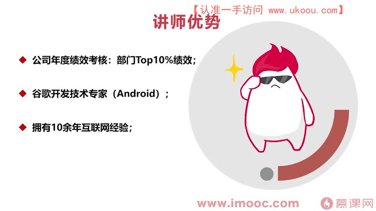
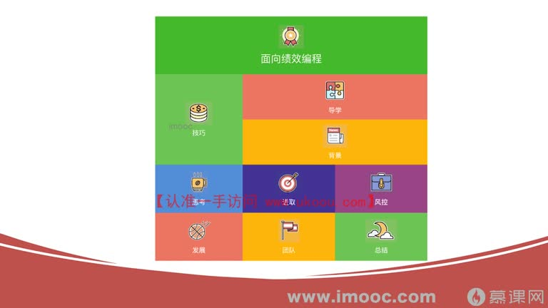
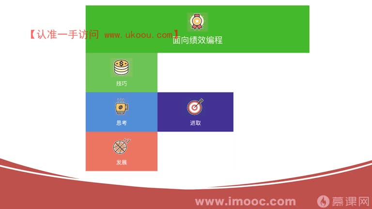
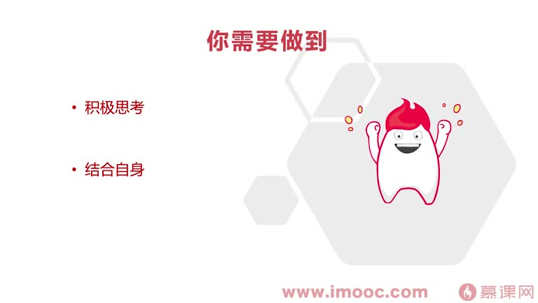
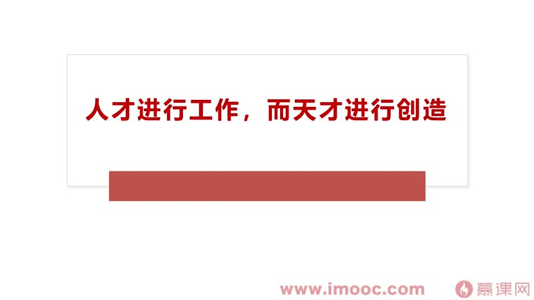
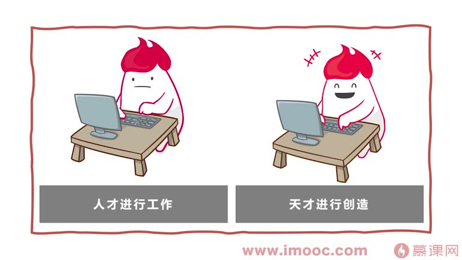
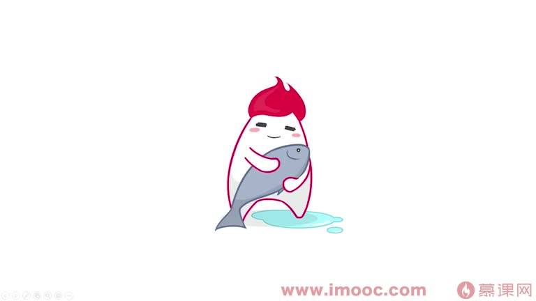

# 1-2 面向绩效编程——课程导学

> 来源视频:第1章课程介绍与学习指南 / 1-2面向绩效编程--课程导学.mp4
> 转写方式:本地 Whisper(small 模型)语音转写,已人工校对部分识别误差

## 本节要解决的问题

这一节课围绕“面向绩效编程——课程导学”展开。先别急着记结论，大家可以带着一个问题来听：**这件事为什么会影响我们的绩效，以及我能不能把它用到自己的工作里？**
## 一、本课定位

本节课是整门课程的**导学课**,主要解决三个问题:

1. **这门课程会带给大家哪些知识点**
2. **大家通过学习这门课程能得到哪些收获**
3. 让大家在正式学习前,对整个课程的**全貌与重难点**有一个整体认知

## 二、讲师背景(为什么有资格讲这门课)

- **李老师**:Google Android 开发者专家
- 近几年**每年的年度绩效考核都拿到部门 TOP10% 的绩效成绩**
- 课程内容源于李老师多年职场打拼的经验总结,形成了一套**绩效方面的体系**
- 本次课程会分享这套体系,并从他自身角度讲解"每一年是如何拿到部门 TOP10% 绩效成绩"的

> 期望:大家能结合自身情况做全面规划,拿到一个好的绩效成绩,最终达到"面向绩效编程"。

## 三、课程结构:九大块

课程 PPT 将整门课程概览为九个模块:

1. **技巧**
2. **导学**
3. **背景**
4. **思考**
5. **进取**
6. **风控**
7. **发展**
8. **团队**
9. **总结**

课程基本分为**九大块**,占比与学习顺序按照每一届课程的安排排布。课程的重难点环节中,需要大家**反复演习、反复思考**来克服困难。

## 四、课程重难点概览

### 1. 技巧环节(重难点)
- 探讨很多**职场中真实的案例**,并提问给出解决思路
- 需要大家多动脑思考:
  - 自己是否把技巧当成了"考试"?
  - 自己是否喜欢一味的"埋头苦干"?

### 2. 进取环节
需要大家更多了解自己身处职场的大环境、背景体系,让自己"有地方使"。
- 第一点:了解职场大环境的背景体系
- 第二点:学习一些**心理方面的知识与技巧**
  - 例子:**近因效应**(原文语音为"静音效应",应为近因效应)
  - 什么是近因效应:在绩效考核评估的前一阶段,让自己表现得非常积极,领导就会觉得你这一阶段表现非常积极,进而误以为你整个考核周期都特别积极——这利用了人的近因心理。

### 3. 发展环节
- 探讨如何通过 **TRIZ** 这个工具解决问题、创造发明
- 什么是 TRIZ:一个**创新方法论**
- 例子:很久以前铅笔和橡皮是分开的,用铅笔写字时想擦字却发现橡皮不见了,很苦恼。通过 TRIZ 的组合方法,把铅笔和橡皮组合在一起,成为创新发明——**带橡皮的铅笔**就是 TRIZ 发明的技巧
- 金句:**"把时间用在思考上,是最能节省时间的事情"**,积极思考非常重要

### 4. 思考方式:结合自身
- **结合自身来思考是重中之重**
- 引用:自己这个东西是看不见的,撞上一些别的什么反弹回来,才会了解自己(认识自我需要外部碰撞)
- 学习本课程,要为自己"修篇",找到自己在绩效考核中不合理的地方并去改善
- 很多同学都是"撞南墙"了才能知道痛,希望大家多多回忆自己撞墙的经历,才知道自己是否需要针对此方面进行改善

### 5. 核心思想
- 金句:舒曼说"**人才进行工作,而天才进行创造**"
- 希望大家看这门课前是一个"人才",看完后能努力让自己成为"天才"
- 成为天才最重要的工具:**围绕 TRIZ 体系**(原文语音"吹死",即 TRIZ)
- 中间的技巧也是围绕 TRIZ,它特别重要,能带来:
  - 更多的创新灵感
  - 更多的专利
  - 用更多创新思路解决工作中遇到的问题

## 五、学习方法建议

- 看每一届课程时**积极做笔记**
- **定期回溯这些笔记**
- 当在职场中遇到突发事故、不知道怎么解决的情况时:
  - 通过笔记溯查
  - 通过课程目录迅速找到对应的知识点
  - 取出关键知识点,马上找到对应解决方案

## 六、本课总结

- 希望大家在最后真正拿到属于自己理想的**绩效考核成绩**
- 后续章节李老师会展开讨论整门课程的全貌与细节点

## 整理者补充：可以马上做什么

这部分不是老师原话，是为了方便复习而加的行动提示：

1. 回到正文，圈出一个与你当前工作最相关的观点。
2. 用这个观点检查最近一次项目、汇报或绩效记录，找出一个可以改进的地方。
3. 把改进动作写成一句具体的话，并安排在今天或本绩效周期内完成。
