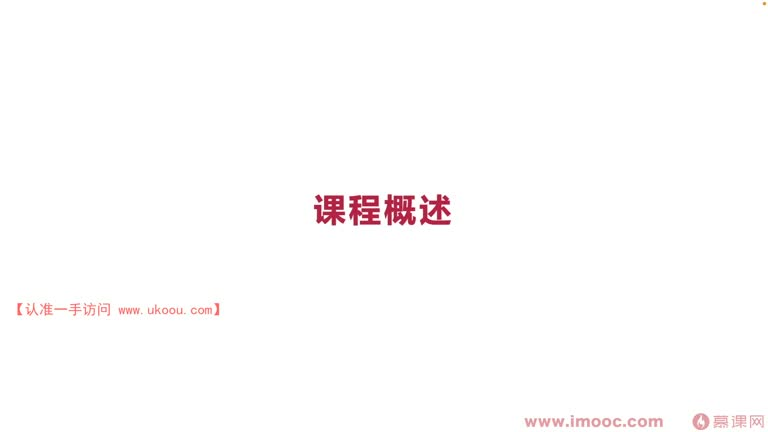
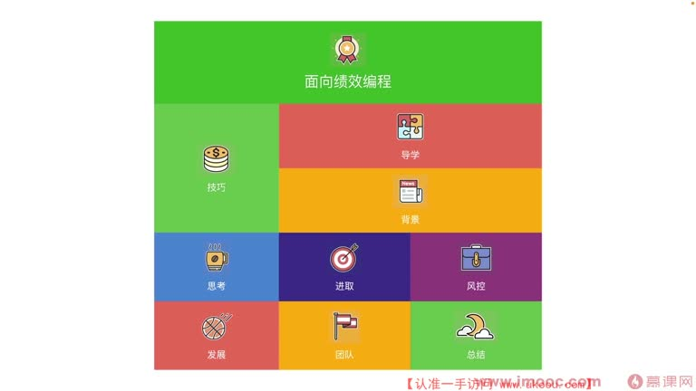

# 1-3 课程整体概述

> 来源视频:第1章课程介绍与学习指南 / 1-3课程整体概述.mp4
> 转写方式:本地 Whisper(small 模型)语音转写,已人工校对部分识别误差

## 本节要解决的问题

这一节课围绕“课程整体概述”展开。先别急着记结论，大家可以带着一个问题来听：**这件事为什么会影响我们的绩效，以及我能不能把它用到自己的工作里？**
## 一、开场:全局观的重要性

引用(原文为"陈淡然",应为**陈澹然**):

> **"不谋万事者,不足谋一时;不谋全局者,不足谋一域"**

- 意思:想做好一件事,得从这件事的全局开始考虑,否则很难成功
- 所以这门课程的全局也需要大家认真了解,才知道自己的侧重点能否与课程的重点难点相互吻合

## 二、课程结构

课程 PPT 的总览图将课程内容拆成九个模块:

- **技巧**
- **导学**
- **背景**
- **思考**
- **进取**
- **风控**
- **发展**
- **团队**
- **总结**

- 课程基本分为**九大块**,占比与学习顺序按照每一届课程的安排排布
- 今天这一节是课程的**导学课**,通过导学可以了解课程全貌
- 通过背景章节了解**面向绩效编程的历史起源**:
  - 说到面向绩效编程一般会想到绩效,绩效起源于**西方国家的文官制度**
  - 历史上,面向绩效编程类似于"**简历驱动开发**",与绩效强关联
  - 但面向绩效编程在近代历史上**并没有太多现成资料**,课程中很多体系来自李老师**个人的总结**

## 三、课程九大块的逐一概述

### 1. 绩效方面 —— 核心围绕三点

**第一点:不要去做职场的老黄牛**
- 很多同学在职场中一直默默耕耘,但最后拿到的绩效成绩并不理想
- 这类问题应该用什么方法去解决?

**第二点:认清自己的利益**
- 很多同学在职场中做完了事情,但功劳是别人的
- 需要认清自己的利益有哪些,通过哪些技巧去实现?

**第三点:扩大影响力**
- 职场中一定要扩大影响力,获得属于你自己的机会
- 也就是扩大自己的"交集圈子",有哪些技巧可以做到?

### 2. 思考方面 —— 围绕几点讨论

**第一点:绩效考核不等于考试**
- 很多同学(包括已工作很多年的人)都误以为面向绩效编程就是考量如何拿到好的考试成绩
- 这是普遍误区:**一定不能把绩效考核当成考试**,否则会陷入"为自己服务"的泥潭
- 也不可一味的埋头苦干
- 职场中要**善用发散思维**,才能更好地思考如何拿到好的绩效

### 3. 进取方面 —— 三点

- **第一点**:了解我们公司现有的绩效体系
- **第二点**:分享一些技巧,包括一些**心理效用**等
- **第三点**:探讨如何**提升汇报水平**
  - 大厂中汇报是非常重要的能力,汇报决定了你能拿到什么结果
  - 会探讨职场中通过汇报拿到好绩效的案例,这些案例都源自真实职场

### 4. 发展方面

- 分享一个工具:**TRIZ**(语音识别为 "trace")
- 探讨如何用 TRIZ 去解决问题
- 探讨如何向世界分享你的想法——可以用**写**的方式,也可以用**录**的方式

### 5. 风控环节(语音识别"封控")

- 当在职场中出现一些事故,如何巧妙避开这些事故带来的不良影响
- 最终获得一个比较好的绩效成绩

### 6. 团队方面

- 探讨如何通过提升团队整体的绩效成绩,间接影响自己的绩效成绩
- 在团队里需要做一个**布道师**(语音识别"步道师"),互帮互助、传递能量
- 能量可以是正能量,也可以是负能量——为什么可以是负能量?后面课程会讨论

### 7. 总结环节

- 总结本次课程的全貌
- 展望未来,看未来方向应该怎样去努力

## 四、本课总结

这就是课程整体的规划,目的是让大家在正式学习前,先对"面向绩效编程"这门课的全局与各部分内容有一个整体认知。

## 整理者补充：可以马上做什么

这部分不是老师原话，是为了方便复习而加的行动提示：

1. 回到正文，圈出一个与你当前工作最相关的观点。
2. 用这个观点检查最近一次项目、汇报或绩效记录，找出一个可以改进的地方。
3. 把改进动作写成一句具体的话，并安排在今天或本绩效周期内完成。
