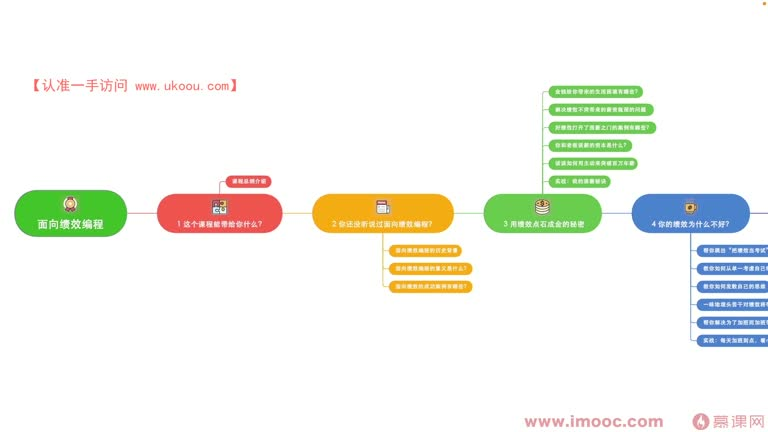
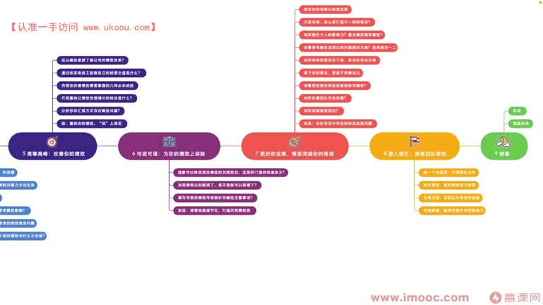
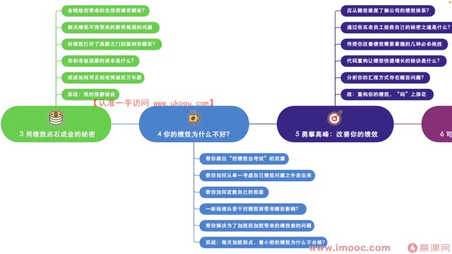
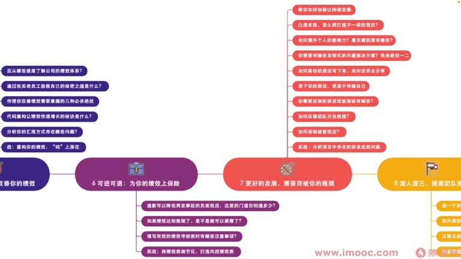
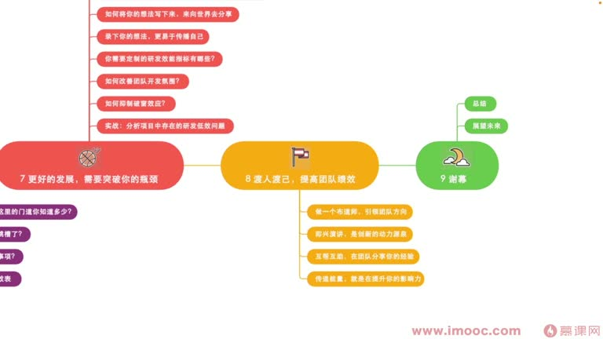

# 1-4 课程整体安排

> 来源视频:第1章课程介绍与学习指南 / 1-4课程整体安排.mp4
> 转写方式:本地 Whisper(small 模型)语音转写,已人工校对修正大量同音识别误差("技校"→绩效、"掌心"→涨薪、"心思"→薪资、"平静"→瓶颈 等)

## 本节要解决的问题

这一节课围绕“课程整体安排”展开。先别急着记结论，大家可以带着一个问题来听：**这件事为什么会影响我们的绩效，以及我能不能把它用到自己的工作里？**
## 课程整体结构

- 前面的环节探讨课程的**背景知识点**
- 中后段探讨**面向绩效编程的实践性操作与技巧性操作**,即如何通过这些技巧获得好的绩效成绩,让自己离"百万年薪"目标越来越近
- 同时探讨当职场中出现意外情况(如想跳槽、线上事故)时,如何规避这些意外带来的不良影响

> 开场引用(语音识别为"金人不见古石月,金月曾经照顾人",应出自李白《把酒问月》"今人不见古时月,今月曾经照古人",借以说明):面向绩效编程很早以前就已经"辐射"、影响了很多人,只是我们原先并不了解它源于这些体系。

## 九大章节的具体安排

### 第1章:课程介绍与学习指南(导学)
- 课程能带给你什么,即当前正在讲的课程总纲介绍、导学关系

### 第2章:面向绩效编程的历史背景与意义
- 面向绩效编程的历史背景,以及面向绩效编程的意义
- 有**管理方面**的意义,也有**企业发展方面**的意义
- 职场中有哪些真实的、成功的面向绩效编程案例

### 第3章:用绩效点石成金的秘密
- 探讨如何通过绩效影响我们的薪资
- 先探讨生活中因为金钱造成的一些困境,了解金钱这个属性对我们的重要意义
- 讨论如何解决"绩效不突出 → 影响涨薪 → 给薪资带来瓶颈"的问题
- 分享职场中通过好的绩效场景打开涨薪之门、去掉薪资瓶颈的真实案例
- 探讨一般跟老板提"谈心涨薪资"时需要掌握哪些资本、具备什么条件才能提涨薪要求
- **实战章节**:李老师这些年的涨薪秘诀,例如曾在职场中**一年涨薪三次**(未跳槽,在同一家公司)

### 第4章:你的绩效为什么不好
- 通过排查自身原因,看是否因下列原因导致绩效成绩不突出:
  - **是否把绩效当成了考试**:把绩效当成考试,会让我们单一地考虑自己的绩效;事实上在职场中需要更多考虑主管的绩效、团队的绩效、部门的绩效、乃至整个公司的绩效,从全局出发才能影响自己的绩效成绩
  - 需要**发散思维**,从更多维度看待问题,课程会给出发散思维的建议
  - **是否一味的埋头苦干**:如果一味埋头苦干,绩效会变成什么样
    - 大厂(甚至小公司)里很多同学看领导没下班就一直等领导下班后才走,这属于"为了加班而加班"
    - 如果绩效成绩非常差,一定非常不开心,怎么解决?后面课程探讨
  - **实战案例**:每天加班到比较晚,为什么"小明"同学的绩效成绩还不合格?

### 第5章:勇攀高峰:改善你的绩效
- 通过什么手段改善自己的绩效成绩:
  - 先了解**公司的绩效考核维度**有哪些,这样才能"有地方使"
  - **环评(360度评价)**:很多公司有环评,可以是显性的、可以是隐性的
    - 显性:需要其他同事给你打分
    - 隐性:领导私下调研其他同事,问你在他们心中是什么样子
    - 所以团队里的老员工、领导比较信任的员工对我们来说非常重要,如何"捕获他们的心"?相应课程会探讨
  - 改善绩效考核最终拿到的结果,有哪些**必杀技**,在职场中能真实落地
  - **代码重构**:很多程序员同学,软件开发中一定会涉及代码重构,但公司可能不认可;如何通过代码重构让领导认可并获得绩效增长?课程会探讨
  - **汇报**:汇报环节在职场中非常重要,看看现在的汇报形式可能存在哪些问题
  - **实战章节**:你的绩效成绩如何通过代码重构获得一个比较出彩的结果

### 第6章:可进可退:为你的绩效上保险(风控)
- **道歉**是职场中非常重要的一个环节:当绩效产生危机时,可以通过合理、正确的道歉来降低负面事件对绩效的影响,这里有哪一些技巧
- **跳槽时机**:有同学说职场中绩效达到瓶颈,是不是就可以跳槽了?真正比较合适的跳槽时机有哪些(困扰了很多职场同学的问题)
- **绩效考核表填写**:很多同学觉得工作内容领导心里都有数,绩效表随便互动填一下就行,真实情况是不是这样?填写绩效考核表有哪些注意事项?
  - **实战环节**:将绩效表细节化,打造"风控绩效表",通过绩效考核表填写的实战拿到好的绩效成绩
  - 并且在产生了负面线上事故的情况下,最终怎么样也能拿到一个比较好的绩效成绩

### 第7章:更好的发展,需要突破你的瓶颈
- 主要围绕:怎么样去创新、怎么样打造不一样的简历、怎么样提升个人影响力,从多方面细节展开讨论
- 涉及更多发展方向及发展方面的技巧,包括为程序员同学定制的**研发效能指标**有哪些
- 通过实现研发效能,进而影响个人绩效成绩
- 分享职场中**破窗效应**带来的不良案例,针对这些入手,让以后的职场发展方向、工作发展方向有更清晰的思路

### 第8章:渡人渡己,提高团队绩效
- 前面提到:想改变自己的绩效,需要先看整体团队的绩效、先看领导的绩效;任何时候一定不能只关注自己的绩效成绩
- 探讨如何做一个**布道师**,去改变、引领整个团队的发展方向
- 探讨**即兴演讲**(语音识别"集议演讲")这个技巧,能带来很多创新的思路
- 如何在团队里建立 **Code Review 机制**(语音识别"Color Real")来实现互帮互助,并让自己的编程技能也有所提升
- 传递**正能量和负能量**,其实也是提升你自己影响力的一个过程

### 第9章:课程谢幕
- 总结整门课程每一章节中需要大家注意的点
- 展望未来:希望大家在发展的过程中需要注意的方向与细节

## 本课总结

以上就是整个课程的**全貌**。先了解整体安排,后续才能有针对性地学习每一章的技巧与实战内容。

## 整理者补充：可以马上做什么

这部分不是老师原话，是为了方便复习而加的行动提示：

1. 回到正文，圈出一个与你当前工作最相关的观点。
2. 用这个观点检查最近一次项目、汇报或绩效记录，找出一个可以改进的地方。
3. 把改进动作写成一句具体的话，并安排在今天或本绩效周期内完成。
