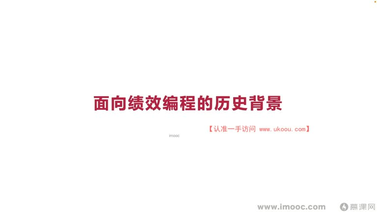
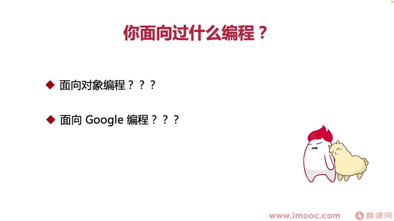
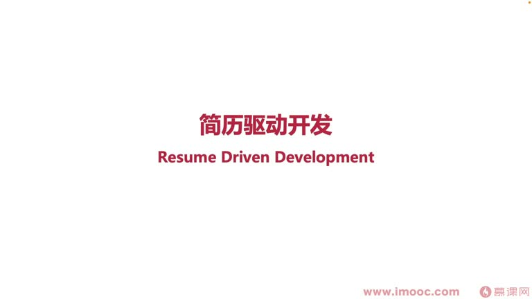
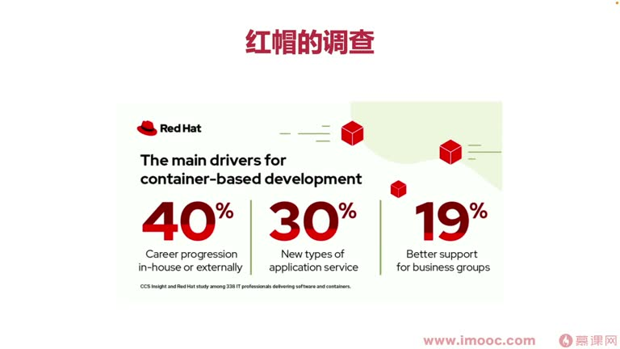
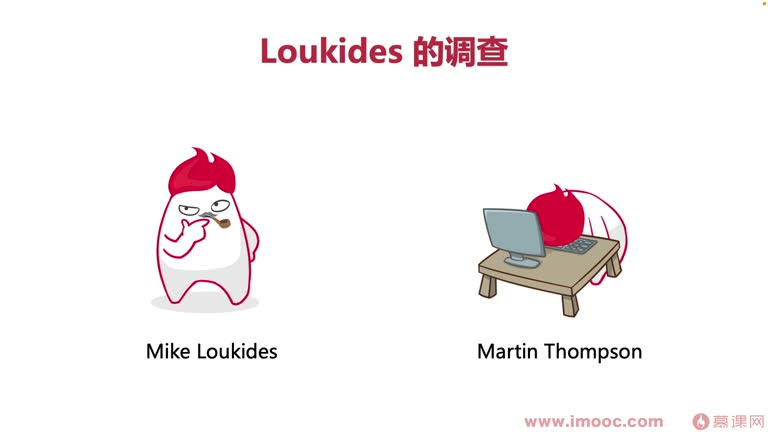
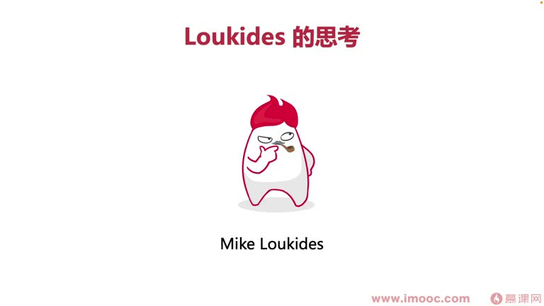

# 2-1 面向绩效编程的历史背景

> 来源视频:第2章 / 2-1面向绩效编程的历史背景.mp4
> 转写方式:本地 Whisper(small 模型)语音转写,已人工校对("计校/极编"→绩效、编程、"阿弟弟"→ADD、"减力驱动开发"→简历驱动开发 等)

## 本节要解决的问题

这一节课围绕“面向绩效编程的历史背景”展开。先别急着记结论，大家可以带着一个问题来听：**这件事为什么会影响我们的绩效，以及我能不能把它用到自己的工作里？**
## 本课内容概览

本节课讲解"你还没听说过面向绩效编程"的背景知识,主要分三方面:

1. **科普面向绩效编程的历史演变背景**
2. **了解面向绩效编程的意义**(为何"面向绩效编程"是一件有意义的事)
3. **了解面向绩效编程的成功案例**(用小明、小高两个案例,讲解如何在职场中通过面向绩效编程拿到优秀的绩效成绩)

## 一、为什么要了解历史背景?

- 有人问:我只想拿到好绩效,不想了解什么历史背景知识
- 了解历史背景的主要帮助:**从更全局的角度明白"我们究竟是在什么样的背景原因下,必须去开展面向绩效编程"**
- 这样能打开我们整个思维的认知面

## 二、从"面向 XX 编程"说起

**你都面向过什么编程?** 做开发的同学一定听过这些:

| 概念 | 含义 |
|------|------|
| **面向对象编程** | 做 Java 等开发的同学基本都会接触,方便管理代码的架构组织,在迭代中面临变更时能迅速调整代码结构,达到敏捷迭代开发 |
| **面向 Google/百度编程** | 领导交办任务、时间紧又不了解时,去网上复制粘贴找资料 |
| **面向工资编程** | 工作阶段中有多少事项是为了提升工资而去做的 |

- 历史中,国外有**面向工资编程**的概念;面向 Google 编程这类属于近期衍生出来的"搞笑"概念
- 历史中**并没有"面向绩效编程"这个词汇**的相关信息,最接近的是**面向工资编程**——它和面向绩效编程概念相似,却又并不相似
- 所以分析面向绩效编程的历史发展背景,一方面要从**面向工资编程**看起,另一方面是**简历驱动开发**

## 三、简历驱动开发(RDD)

### 与常见的驱动开发的区别

- 做开发的同学听说过**测试驱动开发**、**领域驱动开发**,这些年都比较"火"
- 但**简历驱动开发**跟这两种不太相似,它已经有很多年历史,多用于**人力资源管理**方面
- 人力资源管理里,简历驱动开发用三个缩写字母表示:**ADD**(语音识别"阿弟弟")
  - 记住:以后谁跟你提起 ADD,脑中第一个要想到的概念一定是"简历驱动开发"

### 案例1:红帽公司(Red Hat)的报告

- 提到简历驱动开发,不得不提一家非常火的公司——**红帽**
- **Marcus** 是红帽集团的 HR,针对软件开发人员对容器和 Kubernetes 的兴趣做了长时间研究
- 结论:**91% 的开发人员**将基于容器的开发视为高优先级事项
- 拆分更细粒度维度看这 91% 受访者学容器开发的动机:
  - **30%**:需要为企业的"吸引优运程序"(吸引用户/应用程序)提供服务
  - **19%**:为了自己企业业务中的发展而转向容器开发
  - **40%**:觉得容器开发在 IT 行业的未来会持续被广泛使用,能给开发者提供长期的专业发展机会,是职业发展的关键驱动力
- 红帽集团把这些受访者对容器开发的重视统称为**"容器羡慕"**

### 红帽调查图中的三项主要动机

PPT 展示的 Red Hat 调查图将容器开发的主要驱动力概括为:

- **40%**：职业发展（当前企业内部或外部）
- **30%**：新型应用服务
- **19%**：更好地支持业务团队

这张图是对前述调查数据的视觉化补充；课程讲解还提到，调查中有 **91%** 的开发人员将基于容器的开发视为高优先级事项。

- 有一家 UGC 公司,隶属一家技术写作咨询公司(国外平台),目标是通过分享创新者的思维知识来推动世界改变
- **Mike**(语音识别"麦克")是这家公司的**内容战略副总裁**,喜欢哲学、看哲学书籍、做哲学思考,也做文学创作
- 2014 年前后,Mike 开始研究分析**简历驱动开发(RDD)** 事宜,也注意到了红帽公布的那项报告,这项报告对他有促进作用
- **Martin** 是一位来自伦敦的软件开发人员,致力于研究低延迟系统,在系统软件架构中使用了 **Redis**
- Martin 和 HR 交流用人时认为:只要简历中能看到开发人员可以用 Redis 解决问题,就是他们团队需要的人
- 但很多时候招聘来的开发人员**"愿为"(事与愿违)**:很多面试者都是为了学 Redis 而学 Redis,并没有真正喜爱或精通,只是为了职业发展去学习
- 现在看这好像稀疏平常(如今已有许多求职面试者在"应试教育"),但从历史角度看,当时这件事只是刚刚起步
- **Mike 最后总结**:招聘到人容易,但招聘到"对的人"很难——这就是简历驱动开发的形象

## 四、从简历驱动开发到面向绩效编程

- 今天,简历驱动开发已逐渐演变成了**面向绩效编程**
- 简历驱动开发是一个**负面词汇**;面向工资编程、面向绩效编程很多时候也是"带贬义"的
- 本课程要教大家的是**如何正确地面向绩效编程**,而不是像 Mike 和 Martin 那样"找会 Redis 的同学,结果招聘过来的同学事与愿违"
  - 那属于错误的"简历驱动开发范式"
- 历史上有很多错误的面向工资编程范式,当我们服从这些错误的范式时,**就会让我们迷失方向**
- **正确的面向绩效编程思想:先找到明确的方向,有的放矢(具有地方使)**

## 五、绩效(Performance)的历史演变

### 起源:西方文官制度

- 面向绩效编程始终离不开"绩效"两字(performance)
- 绩效考核最早**发源于西方国家文官的考核制度**,最早起源于**英国**
- 英国实现文官制度初期,很多是凭**资历、背景关系**,而不是区分个人能力来晋升加薪
  - 导致英国出现了非常多"冗官杂官",政府执政效率非常低下
- **文官即我们现在所说的公务员**

### 英国改革:1854-1870 年

- 英国开始进行公务员制度改革,开始注重表现/才能优秀的人才
- 根据考核制度,文官每年**逐人逐项**按标准考核方法评估考核结果优劣
- 进而实施人员工资奖励、职位晋升等
- 这一举措**很高程度提高了英国政府行政管理的有效性和真实效率**,也提升了政府对于人民表现的形象(连结)
- 这种考核制度给其他国家打出了榜样

### 其他国家的考核制度

- **中国**:很早就有类似考核制度,如三国时期魏国的**陈群**向曹操提出**"九品中正制"**(语音识别"九品中政治"),与今天的绩效考核相近
- **美国**:1887 年建立考核制度,与英国相似(前后相差几十年),围绕文官任用、加薪晋级,制定工作考核依据标准,"**论功行赏**"
- 此后更多国家纷纷借鉴效仿英、美,绩效逐渐推广流行

## 六、小结

- 直到今天,**绩效已经成为大公司同学升职加薪的重要标准**
- 所以我们需要**科学地明确绩效目标,使用科学的工具和手段,达到有效的面向绩效编程**

## 整理者补充：可以马上做什么

这部分不是老师原话，是为了方便复习而加的行动提示：

1. 回到正文，圈出一个与你当前工作最相关的观点。
2. 用这个观点检查最近一次项目、汇报或绩效记录，找出一个可以改进的地方。
3. 把改进动作写成一句具体的话，并安排在今天或本绩效周期内完成。
