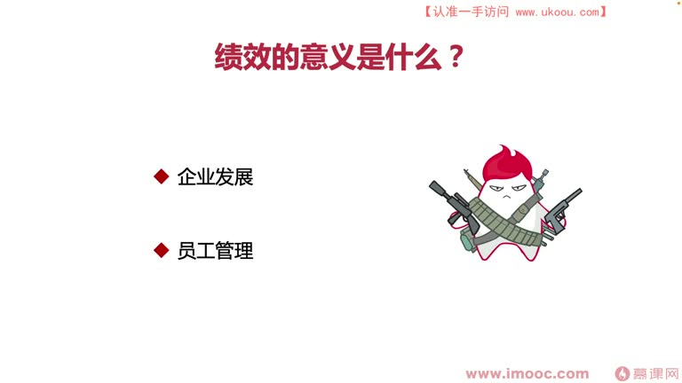
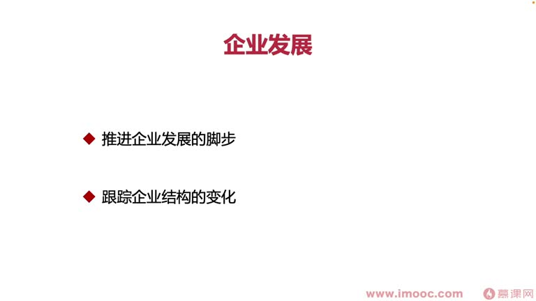
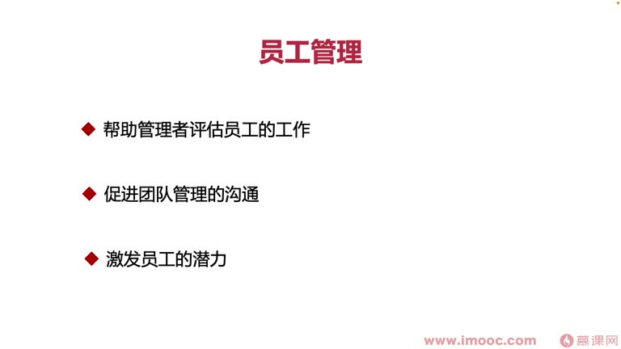
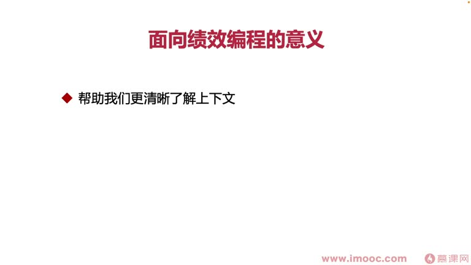
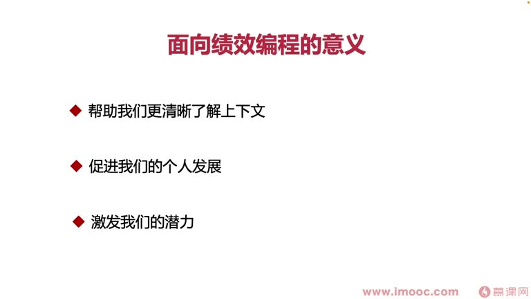

# 2-2 面向绩效编程的意义是什么?

> 来源视频:第2章 / 2-2面向绩效编程的意义是什么？.mp4
> 转写方式:本地 Whisper(small 模型)语音转写,已人工校对("技校"→绩效、"升职加薪" 等)

## 本节要解决的问题

这一节课围绕“面向绩效编程的意义是什么?”展开。先别急着记结论，大家可以带着一个问题来听：**这件事为什么会影响我们的绩效，以及我能不能把它用到自己的工作里？**
## 本课内容概览

上一节讲了面向绩效编程的历史演变,这一节探讨**学习面向绩效编程的意义**。面向绩效编程离不开"绩效"两个字,所以要理解其意义,必须知道**绩效的意义是什么**。

## 一、为什么需要通过绩效定义标准

大家学习这门课,主要想法都是想改变现阶段绩效考核自己拿到的结果。那么为什么需要通过绩效去定义一个标准?

**绩效管理主要有两方面意义:**
1. **企业发展**方面
2. **员工管理**方面

> 绩效管理是一个**双向的管理活动**:既在考核一家企业发展的方向,也是考核员工的主要手段。
> - 看一家企业的绩效标准制定得好不好,就能判断这家企业是否有长期的发展前景
> - 看一个员工的绩效,也能看出这个员工是否符合一个"高潜"(高潜能)的水准

## 二、绩效的本质特征

- 绩效是对企业或员工的行为/结果的一个**管理过程**
- 绩效是一个**周期性、长期性**的活动,贯穿职业生涯始终
  - 不是"这次绩效考核结束,就与绩效没有关系了"
- **隐形绩效**:有些公司没有明确绩效考核,每天按时上下班即可
  - 但这时绩效考核是**隐形的**,表现在领导/上级对你工作表现产生的**信任度**
  - 信任度关联着你的升职、加薪
- 企业没有明确提出绩效考核标准,**不代表**它对员工没有绩效要求——此时绩效考核是隐形的

## 三、绩效在企业发展方面的意义(两方面)

### 1. 推动企业发展的战略意义
- 有效推进企业发展定制战略计划
- 推动企业把相应计划**落地**
- 帮助企业及时**调整方向**,提升核心竞争力
- 与竞品竞争时表现出企业优势

### 2. 跟踪企业结构变化的管理意义
- 绩效是衡量企业这一阶段发展好坏的标准
- 通过长期绩效管理,企业能跟员工产生**有效沟通**,节省管理者的时间成本
- 绩效管理活动本身就是**人力资源管理活动**,对人力资源管理非常有价值

## 四、绩效在员工管理方面的意义(三方面)

### 1. 评估员工工作表现
- 有些管理者难以评估员工表现,企业通过明确的**绩效考核表**,让管理者向员工收集近期工作表现
- 通过多个维度,管理者有了标准,可以有效、公平地评估团队内每位员工的阶段表现

### 2. 促进团队沟通
- 有些管理者不擅长沟通,与团队成员关系冷淡
- 通过绩效这一手段,可以促进管理者**自上而下**找成员沟通
- 这也是双向的:员工也可以根据自己拿到的绩效评估表现,**自下而上**找管理者沟通

### 3. 激发员工潜力
- 举例:公司绩效考核表"技术人员素养"方面,如果绩效评估阶段申请了一项专利,可加附加分
- 员工看到这点,会非常积极地提创新技术表现,以获得专利审批
- 这个过程从另一层面激发员工工作潜力:为拿到优秀绩效成绩,员工会发力、创新

## 五、面向绩效编程的意义(三方面)

### 1. 帮助更清晰地了解"上下文"
- **什么是上下文**:管理者拿到的信息、其他同事拿到的信息
  - 每到绩效考核季,大家都会"交头接耳"研究这个同事绩效怎么样、那个同事怎么样
  - 这一阶段能得到非常多关于绩效考核的信息,促进交流(这是**结果方面**)
- **过程方面**:面向绩效编程时,首先需要了解**领导者的绩效目标是什么**
  - 我们的目标就是**帮助领导者实现他的绩效目标**
  - 这也属于上下文的一部分;上下文中还包括很多类型

### 2. 促进个人发展
- 知道公司绩效考核标准后,需要**针对这些标准去发力**,这些标准就是清晰的方向
- 对比:没有面向绩效编程的同学,一直在"昏昏噩噩"按时上班、按时下班、有任务就做,没有明确规划或任务主线来开展工作
- 在这一点上,没有面向绩效编程的同学**不如**面向绩效编程的同学

### 3. 激发潜力、互利共赢(员工管理)
- 有目标有方向地做事时,你的价值观/发展路线与企业要求**相互吻合**
- 在完成面向绩效编程的过程中,跟所在企业**一起成长**——这就是**互利共赢**

## 六、小结

面向绩效编程回到最终的目标,还是几个字:**升职加薪**。

## 整理者补充：可以马上做什么

这部分不是老师原话，是为了方便复习而加的行动提示：

1. 回到正文，圈出一个与你当前工作最相关的观点。
2. 用这个观点检查最近一次项目、汇报或绩效记录，找出一个可以改进的地方。
3. 把改进动作写成一句具体的话，并安排在今天或本绩效周期内完成。
