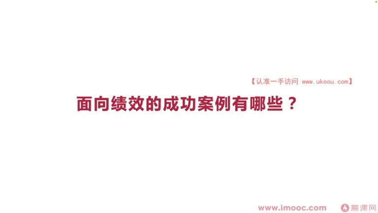
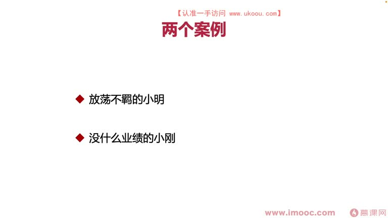
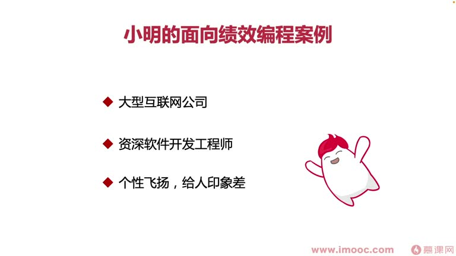
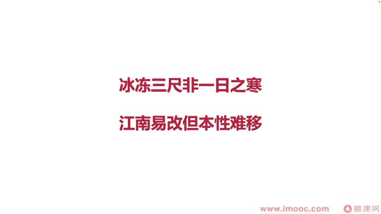
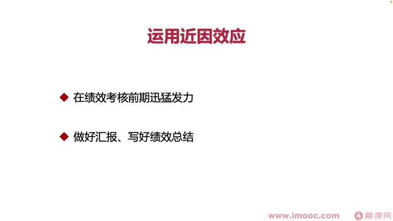
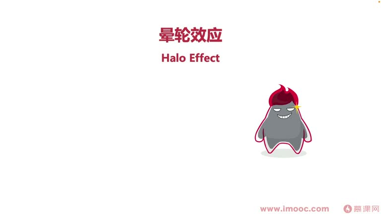
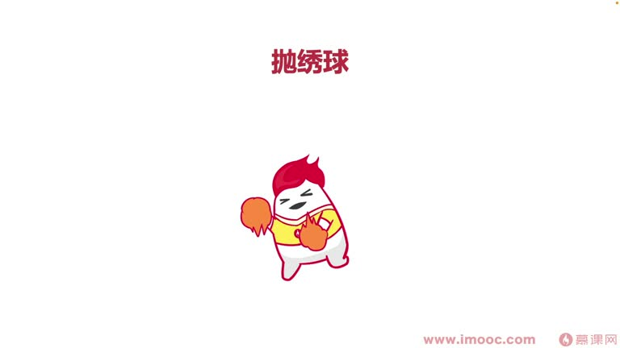

# 2-3 面向绩效的成功案例有哪些?

> 来源视频:第2章 / 2-3面向绩效的成功案例有哪些？.mp4
> 转写方式:本地 Whisper(small 模型)语音转写,已人工校对("计校/季效"→绩效、"静音效应"→近因效应、"花大饼"→画大饼、"副盘"→复盘 等)

## 本节要解决的问题

这一节课围绕“面向绩效的成功案例有哪些?”展开。先别急着记结论，大家可以带着一个问题来听：**这件事为什么会影响我们的绩效，以及我能不能把它用到自己的工作里？**
## 本课目标

通过成功案例,让大家初步了解**面向绩效编程可以带来什么样的改变**,知道在职场中很多时候**凭借更多的技巧能让我们生存得更好**。

> 职场中就是适者生存、优胜劣汰。很多人靠生硬的本事硬着头皮打打杀杀取得成绩,而掌握面向绩效编程,就是掌握**如何用软技能"不战而屈人之兵"**。

本节课分享两个真实案例(来自李老师多年的职场经历,已打马赛克):
- **放荡不羁的小明同学**
- **没什么业绩的小刚同学**

> 共同特点:看上去都不像能拿到好绩效的同学,却都拿到了令人羡慕的绩效。

**补充**:部分公司有"绩效通晒"环节,像上学时老师下发的成绩排名单。虽然看上去残酷、容易让大家相互攀比,但事实也是一种促进大家进步的手段。

## 一、案例一:小明同学——利用"近因效应"

### 背景
- 任职于一家大型互联网公司,**资深软件开发工程师**
- 个性飞扬,给人的印象有时比较差
- 入职后经常和主管在很多事情上**意见不一致、发生冲突**,且最后可能坚持己见
- 给领导留下的印象或多或少有瑕疵,**向上管理做得非常不到位**
- 尽管工作业绩有时非常出色,但每年领导都会对他产生很多不好的印象

### 做法
在了解如何有效面向绩效编程后,小明在**每年绩效考核期的前一个月**,彻底改变自己的思维习惯:
- 这个月在很多事情上做出让步,给领导制造"这个人性格发生了很大转变"的印象
- 但"江山易改,本性难移"——一个月就让性格发生大改变几乎不可能,小明是利用了绩效考核中的一点:**近因效应**(语音识别"静音效应")

### 什么是近因效应
- 我们对**近期发生的事情印象比较深刻**,对远期发生的事情印象淡薄
- 和学英语用**艾宾浩斯记忆曲线**同理:长时间不用会遗忘,必须每段时间巩固才能记住
- 道理大家都知道,难点在于**如何运用这个道理**成为面向绩效编程的工具/手段

### 具体应用
- 绩效考核前一段时间**迅速发力**,并"伪装扭转"自己的性格特点,表现得十分顺从、十分值得信任
- 给绩效评估者(领导)带来一定**误差**
- 同理:做好汇报 PPT、写好绩效总结表格,会让主管瞬间产生好印象——其中或多或少也是利用了近因效应
- 在绩效评估前较近的周期内,改变领导对我们固有的、刻板的印象,从而拿到好的成绩

### 注意:近因效应的局限性
- 只针对一个领导使用,**长期用就不灵了**("有再一再二,没有再三再四")
- 很多面向绩效编程的效应,**只能针对一种领导使用一次**
- 学不会近因效应?不要担心,面向绩效编程的手段非常多,后面的课程会一一讲解,让大家针对自己的不同情况选择不同战术

## 二、案例二:小刚同学——利用"晕轮效应"

### 背景
- 任职于一家大型互联网公司,**软件工程师**(不是资深,与小明有区别)
- 软件工程技术水平并不突出,平时绩效产出也不高
- **但每年都能拿到让自己十分满意的绩效成绩**

### 原因:他是主管的亲信
- 在公司打拼多年,已经**获得领导的信任**
- 每次绩效考核前,不断和领导聊他这一阶段的规划,**为领导画大饼**
  - 画大饼不是只能单方面:向上管理时也可以为领导画大饼,这就是**PUA 和反 PUA**
  - 小刚画大饼的同时,领导会不断提出自己的意见,小刚针对意见做调整
  - 逐渐两人合作关系越来越融洽,主管对小刚的信任度越来越高

### 复盘(关键技巧)
- 每一年小刚总有一些任务因各种"主管原因"没能完成
- 但他比较聪明:每次没完成任务,都**及时找领导做全面的复盘**
- 复盘不仅总结**自身原因**,还会总结很多**外部原因**
- 不像其他大部分同学遇到这种情况直接"甩锅"——**如果单纯一味甩锅,领导不会信任你的复盘**
- 关键点:所有复盘活动都是和领导**一对一**进行的,外人看不到
  - 所以不管小刚在复盘中多么有损自己的编程能力、开发水平、阶段业绩,**别人都看不到**
  - 在别人眼里,只会觉得小刚和他的直属领导关系很好,所以领导给了他好绩效

### 警惕:光关系好不够
- 职场中有些同学总跟领导"打成一片",但还是拿不到好绩效
- **关系好并不能代表绩效一定会好**
- 在恰当的时机,还要拿出恰当的手段,巩固我们在领导心中的信任度
- 这样即使本职工作做得不是特别突出、没拿到出彩成绩,仍能拿到让自己满意、惊艳其他人的绩效成绩

### 什么是晕轮效应
- 也叫**光圈效应**或**成见效应**
- 最早在**二十世纪二十年代**由美国一位著名心理学家提出
- 简单说:绩效评估者在评估绩效时,特别容易**只看重某一项优点或缺点**,产生**以偏概全**的认知误差
- 表面上很像"哄骗"绩效评估者的手段/措施

### 比喻:抛绣球争亲
- 像古代小姐抛绣球:小伙子们穿得精神亮眼、卖力喊跳,才能让姑娘把绣球扔向自己、看得见自己
- 但没举办抛绣球活动时,不会在大马路上一直蹦跳——一是不知道人家会不会办,二是没场景,会被当成神经病
- **小刚同学就是利用晕轮效应,在恰当的时机(绩效考核期)表现,获得领导对他的改观**

> 注意:晕轮效应中也穿插了前面讲的**近因效应**,两者相互关联。职场中拿到好绩效,可能潜在中就运用了很多种心理学知识,对上级产生引导性的向上管理措施。

## 三、本课总结

| 案例 | 特点 | 运用的效应 |
|------|------|-----------|
| 放荡不羁的小明 | 不受领导待见,但在绩效评估前期迅猛发力 | **近因效应**:对近期发生的事印象深 |
| 没什么业绩的小刚 | 业绩一般,但和领导关系好,通过画大饼+一对一复盘巩固信任 | **晕轮效应**:评估者以偏概全,只看优点 |

- 以上两个案例都是职场中的真实案例,大家回去以后可以**举一反三、灵活运用**
- 也可以仔细观察身边的同事:是否也有类似小明或小刚,通过某种技巧在职场生涯中持续获得优秀的绩效成绩

## 整理者补充：可以马上做什么

这部分不是老师原话，是为了方便复习而加的行动提示：

1. 回到正文，圈出一个与你当前工作最相关的观点。
2. 用这个观点检查最近一次项目、汇报或绩效记录，找出一个可以改进的地方。
3. 把改进动作写成一句具体的话，并安排在今天或本绩效周期内完成。
