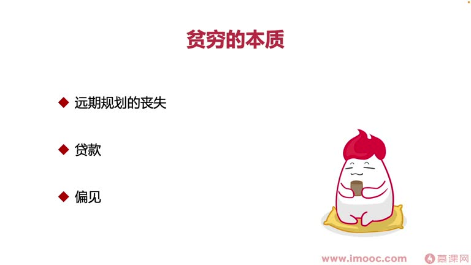

# 3-1 金钱给你带来的生活困境有哪些?

> 来源视频:第3章 / 3-1金钱给你带来的生活困境有哪些？.mp4
> 转写方式:本地 Whisper(small 模型)语音转写,已人工校对("计校"→绩效、"温宝"→温饱、"皮质纯"→皮质醇、"健肥"→减肥 等)

## 本节要解决的问题

这一节课围绕“金钱给你带来的生活困境有哪些?”展开。先别急着记结论，大家可以带着一个问题来听：**这件事为什么会影响我们的绩效，以及我能不能把它用到自己的工作里？**
## 本课目标

上一节课讲了历史背景,带大家小试牛刀了解了理论知识和行动法则(两个职场案例)。这一节课开始讲**"用绩效点石成金的秘密"**。

本节的目的是让大家了解:**为什么要获得一个好绩效?好绩效能带给我们什么?**
- 答案大家基本都清楚:**好绩效能带来金钱,金钱能提升生活品质,解决生活中很多困扰的问题**
- 但"生活中缺钱"的主要原因是表象,本课想从**更内在的角度**帮大家了解**贫穷的本质**

## 一、贫穷的本质

有同名书籍(有兴趣可查阅购买,看内容与生活中遭遇是否相似)。大体上把遇到贫穷/缺钱的情况归为**三类原因**:

### 原因一:远期规划的丧失
包含多方面原因:
- 主要为了解决现在此时此刻生活面对的问题,导致**手忙脚乱,没时间思考远期规划**
- 存在**思维的惰性**,也会让我们丧失远期规划的过程

**远期规划丧失中的多个维度:**
1. **教育问题**:很多同学受过高等教育,生儿育女时也让孩子接受教育;但教育开支很高。很多穷人是因为自己的教育不足、受高等教育少,导致一直往复循环产生**恶性循环**,一直贫穷下去
   - 改善贫穷,首先根本问题必须是**让自己得到充足的教育,也让后代得到充足教育**
   - 学习面向绩效编程本身也是"接受教育",掌握更好的理论与实践方法,改善绩效、拿到更好的薪资
2. **温饱问题**:追求温饱是人一出生就有的本能。穷得连饭都吃不上,怎么可能有心情学习、努力工作、追求更好的绩效
   - 例子:工作压力大时,很难再聚焦于减肥/健身,否则间接面临温饱问题,导致工作效率低下
   - 温饱是**生理上最基本的需求**
3. **压力问题**:长期存在金钱问题,压力会一直处于较高水平,导致**皮质醇分泌升高**;长期受压力影响,在做很多决策时都会做出**不太理性的决策**

> 这三点都是从长远方向看,会给我们带来贫穷、给生活带来困扰的原因。

### 原因二:贷款
很多时候贷款都是为了解决**当下**遇到的问题(房贷、车贷、养孩子等)。三个子类:
1. **生子**:在一些贫穷国家,穷人会生更多孩子——不是观念落后,而是觉得自己贫穷、需要靠子女赡养自己;而中等/发达国家生孩子是为了传承知识。在中国生子是为传承知识,但为解决子女教育、养活子女问题,需要通过贷款拿到资金
2. **婚姻**:从历史角度看,婚姻一直被当作一种**规避风险的方式**(通过婚姻结识更多人、获得帮助);但婚姻又面临彩礼等钱财问题,为筹办婚宴需要贷款
3. **高利贷**:特别急需大量资金时,只能借高利贷。高利贷能解决短期问题,却会让长期越来越贫穷——**一损俱损**

> 这三方面都是为了解决某件特别紧急的短期情况,却会造成我们长期的困扰。

### 原因三:偏见
偏见很难仔细定义。例子:
- 面临健康问题时,有些人选择**民间偏方**而不遵从医嘱
- 使用偏方可能是迷信,对很多群众来说就是一种偏见
- 偏方可以省资金、"短平快"、让心理满足,但可能对身体造成**更长期的危害**,最后付出更多健康代价,让人越来越贫穷

## 二、本课总结

- 当我们觉得自己是穷人的时候,面临的生活困扰是多方面的,**每一方面都需要金钱来解决**
- 这就是我们**为什么要努力赚钱、为什么要面向绩效编程**的意义所在

## 整理者补充：可以马上做什么

这部分不是老师原话，是为了方便复习而加的行动提示：

1. 回到正文，圈出一个与你当前工作最相关的观点。
2. 用这个观点检查最近一次项目、汇报或绩效记录，找出一个可以改进的地方。
3. 把改进动作写成一句具体的话，并安排在今天或本绩效周期内完成。
