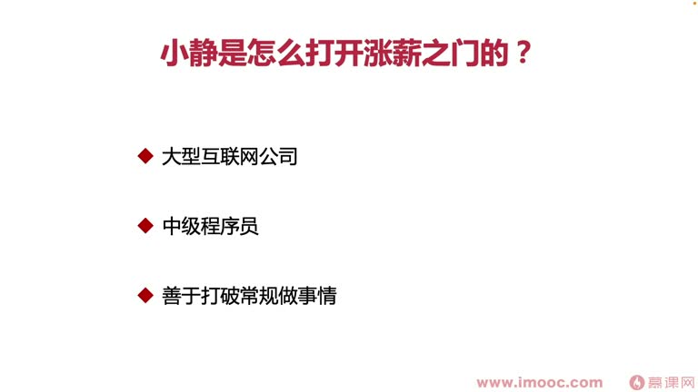
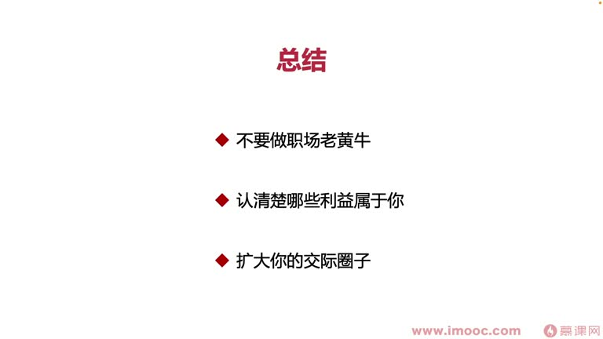

# 3-3 好绩效打开了涨薪之门的案例有哪些?

> 来源视频:第3章 / 3-3好绩效打开了涨薪之门的案例有哪些？.mp4
> 转写方式:本地 Whisper(small 模型)语音转写,已人工校对("技效/迹效"→绩效、"掌心"→涨薪、"加息"→加薪、"进诸者赤静默者黑"→近朱者赤近墨者黑 等)

## 本节要解决的问题

这一节课围绕“好绩效打开了涨薪之门的案例有哪些?”展开。先别急着记结论，大家可以带着一个问题来听：**这件事为什么会影响我们的绩效，以及我能不能把它用到自己的工作里？**
## 本课目标

前两节讲了贫穷的本质(金钱带来的生活困境)、绩效与薪资的关联关系。本节从几个**真实职场案例**分析:**好绩效如何打开涨薪之门**。

**使用案例的方法**:先认真判断自己是一个什么样的人、属于哪一种情况,再对号入座找到有针对性的案例进行反思,总结出自己的"打开涨薪之门"方案。

### 三个案例针对的人群

PPT 先将三个案例按“问题类型”并列归类:

| 案例 | 关键词 | 针对人群(反面教材) |
|------|--------|-------------------|
| **主动出击的小静同学** | 主动争取 | 职场中老实本分、不为自己争取利益的同学 |
| **永不满足的小王同学** | 追求机会 | 喜欢"佛系"、淡泊名利的同学 |
| **左右逢源的小张同学** | 扩大圈子 | 表现内向、影响力低迷的同学(长时间周围同事都注意不到你,不在场也没人发现) |

## 一、案例一:主动出击的小静同学

### 背景
- 任职于一家大型互联网公司,**女性中级程序员**
- 喜欢打破常规做事情,**董明珠**是她的职场榜样
- 坚信董明珠的话:**"和谐是斗争出来的,你只有把那些绊脚的东西不断清理干净,才能让你变得更加有战斗力"**

### 做法
- 觉得自己做得到位的,就会**主动向领导提出**,希望领导给予足够的嘉奖
- 看到公司中不符合常规的点,都会想出自己的一套方案——**这些对她来说都是机会**
- 每个周期经常有产出,产出主要围绕**如何解决公司中的问题**,是实干主义者

### 启示:不要做职场中的老黄牛
- 很多同学积累了很多业绩,却得不到相应的薪资/绩效
- **小静每次拿到业绩都会积极跟领导沟通、总结近期业绩**,所以每次领导通过总结都会给予对应嘉奖,进而提升薪资——水到渠成
- 关键教训:
  - **一定不要忘记总结自己在阶段产出的工作成果**
  - 不要当老黄牛默默耕耘,评绩效时忘了说自己这些产出,导致领导遗忘你这一阶段做过的事
  - 如果发生这种情况,**那不是领导的问题,而是我们自身的问题**
- 如果工作努力、拿到很多结果却拿不到满意薪资,就要**调整个人在职场中的总结策略和向上汇报策略**——你可能就是职场中的老黄牛

## 二、案例二:永不满足的小王同学

### 背景
- 任职于一家大型互联网公司,**初级程序员**
- 喜欢追逐名利,家境不好,上学时基本靠奖学金补贴生活
- 毕业后的第一件事就是马上赚钱回报家庭

### 做法
- 步入职场后每天都在想方设法看做什么工作能赚更多钱(也会做兼职)
- 不是实干主义者,但**只要看到工作中的机会,就会表现得特别积极、特别向上**,给领导阳光主动的感觉
- 工作中的杂活累活大家不愿做时,小王**抢先第一个去做**,做完积极向领导汇报、总结工作成果
- 这不仅让领导觉得小王热情靠谱,还觉得他应该得到很多嘉奖

### 启示:认清哪些利益属于你
- 职场中看到机会时,别觉得"无所谓,总有人会做,我做了也没帮助"
- 小王觉得**做任何事情都有可能带来名利上的丰收**
- 关键:
  - 看到机会时,一定要**清晰判断这些机会会不会带来利益,认清哪些机会属于你的利益**
  - 不能成为职场"老白兔"那样淡泊名利、放弃机会,让涨薪机会白白付诸东流
  - 到了涨薪季,一定要**清晰地把自己的所有产出做优先级排序**,搞清楚哪些利益对薪资上涨有最大化帮助
  - 通过这些利益向领导发起申请,打开自己的涨薪之门

## 三、案例三:左右逢源的小张同学

### 背景
- 任职于一家大型互联网公司,**资深程序员**
- 对自己的技术能力比较认可,社交时有自信
- 在公司成长较长时间,周围都得到大家信任,**社交圈子很广**
- 觉得只在公司有点局限,周末通过同城 APP 找线下活动参与,打开知识面和社交圈子

### 关键道理:收入 = 身边六个好朋友收入的平均值
- 想打开涨薪之门,就要**提升自己社交圈子的质量**,让身边的人都是高薪者
- **近朱者赤,近墨者黑**:会被潜移默化,逐渐被高收入人群影响、被标杆朋友带动,慢慢成为高薪者

### 做法
1. **扩大交集圈子**(最正确的一件事)
2. 公司考核时,需要邀请其他同事为业绩做评价:
   - 小张邀请的同事基本都是**外部部门合作过的同事**(让领导觉得很"新")
   - 而组里其他同事邀请的评价人基本都是合作紧凑/平行的同事,领导都认识
   - 外部同事对小张的评价:**非常善于跨部门协作**——让领导觉得小张很有潜力
3. 经常参加社交活动,认识了很多**举办活动的主办方同学**,有时被邀请去活动讲述自己的经历
   - 这提升了小张**对外的影响力**

### 结果
- 领导看到小张对外影响力逐渐上升、内部非常善于跨部门协作,觉得他很有潜力
- **提升薪资来留住小张、让小张有动力,基本上也是必行之路**

## 四、本课总结:如何通过好绩效打开涨薪之门

三位同学都通过职场表现拿到好绩效,并且让领导**主动给他们加薪**。他们做到的关键点:

1. **不要做职场老黄牛**(对应小静):千万不要默默耕耘,一定要及时把这一阶段的产出表现给领导,让领导知道你做了什么、做出哪些成果,并给予相应嘉奖
2. **认清哪些利益真正属于你**(对应小王):不能放过任何身边属于我们的机会,放过机会就等于和涨薪之路擦肩而过
3. **扩大自己的交集圈子**(对应小张):薪资由周围接触密切的六个朋友的平均薪资决定,所以要提升社交圈子质量、接触到高薪的人
   - 在职场中带来的利益:提升影响力、多了很多可学习的"标杆性"高薪朋友、让领导觉得你有培养的潜力,从而主动给你涨薪、打开涨薪之门,并涉及后续晋升

> 本节主要是概括性的案例讲解,后续课程会逐渐发散做具体讲解,希望大家能够**举一反三**。

## 整理者补充：可以马上做什么

这部分不是老师原话，是为了方便复习而加的行动提示：

1. 回到正文，圈出一个与你当前工作最相关的观点。
2. 用这个观点检查最近一次项目、汇报或绩效记录，找出一个可以改进的地方。
3. 把改进动作写成一句具体的话，并安排在今天或本绩效周期内完成。
