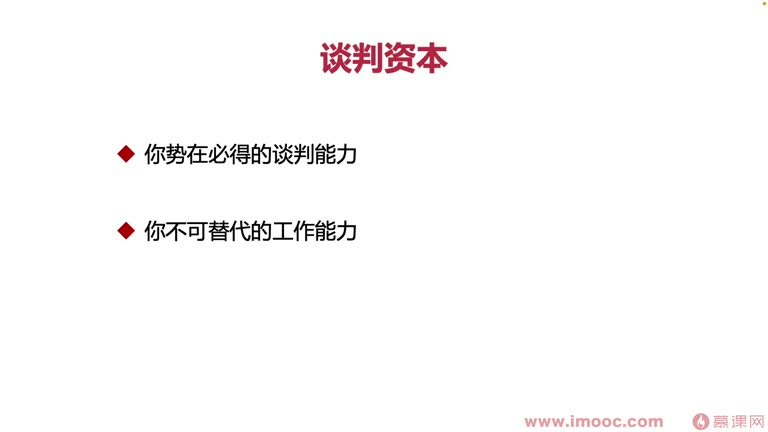
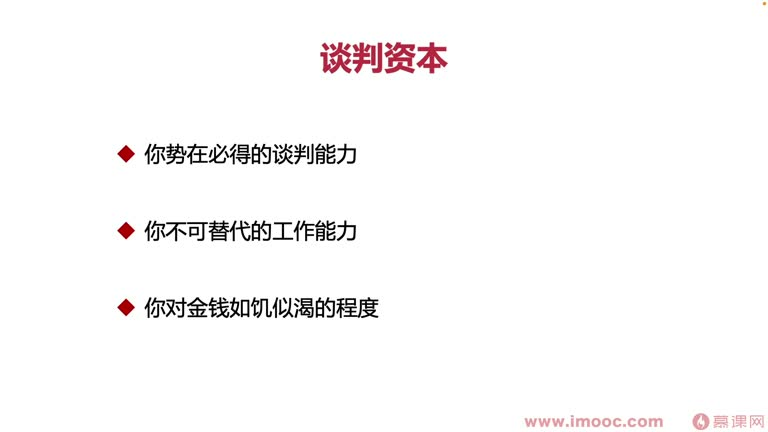

# 3-4 你和老板谈薪的资本是什么?

> 来源视频:第3章 / 3-4你和老板谈薪的资本是什么？.mp4
> 转写方式:本地 Whisper(small 模型)语音转写,已人工校对("掌心/涨薪"→涨薪、"谈心字"→谈薪、谈资、"如期似可/如鸡刺客"→如饥似渴 等)

## 本节要解决的问题

这一节课围绕“你和老板谈薪的资本是什么?”展开。先别急着记结论，大家可以带着一个问题来听：**这件事为什么会影响我们的绩效，以及我能不能把它用到自己的工作里？**
## 本课目标

前几节讲了贫穷带来的生活困境、绩效与薪资的关联、三个"打开涨薪之门"的案例。本节探讨:**和老板谈薪的资本是什么?**

拿到好绩效、做好准备要和领导提加薪时,提之前**一定要注意思考:你和领导谈薪的资本是什么?**

## 谈薪的资本:三方面

### 资本一:志在必得的谈判能力
- 职场中经常需要谈判:
  - 开发同学接到需求发现不合理
  - 产品同学设计了需求想让开发同学开发
  - 双方都会发生相互之间的小谈判
- **谈判能力的强弱,决定你能否在谈判中取得优势条件**
- 很多时候不是只看事情对错,而是看谈判能力:
  - 事情没有错,但去谈判时哑口无言、一个字说不出道理,最后就会**被人牵着鼻子走**
- 例子:薪资确实低于市场行情水位,明知道这一点,跟领导谈判"是否应该根据能力涨薪"——答案是肯定的,但为什么有些同学失败?
  - 因为他们在谈判中表现出的**谈判能力与领导差距太大**,最后被领导牵着鼻子走

### 资本二:不可替代的工作能力
- 例子:小组约5位同事,4位做安卓开发,只有1位做苹果开发
  - 接到公司业务组需求时,安卓和苹果两端都要开发,苹果开发人力明显不足
  - 由于大环境原因,无法短期快速招到能力合适的苹果开发
  - 对领导来说,这位苹果开发同学就拥有**不可替代的工作能力**
  - 一旦流失,团队接需求会出现大偏颇、大的人力成本问题,项目组会不断受到业务方投诉
- **谈薪资之前,先看看你在职场中的地位是不是不可替代的**——如果是,胜算和筹码就更高

### 资本三:对金钱"如饥似渴"的程度
- 什么时候领导会给你加薪?就是领导发现你生活中**确实非常渴望金钱**
- 例子:身负房贷、压力非常重,如果没有对应薪资,短期肯定无法承受生活压力
  - 领导会主动考虑到这一点,心里清楚"不给你涨薪,你没办法解决生活压力"
- 即使真正佛系、对金钱没有渴望,在职场中也**一定要表现得你很缺钱、很急需钱,并让领导看到这一点**
- 如果本来就急需钱,更应该直接表现给领导,让领导意识到:**不给你涨薪,是留不住你的**

## 如何提升这三方面的谈薪资本?

### 1. 提升谈判能力
- 推荐阅读:**《麦肯锡谈判技巧》**,掌握基本谈判思路
- 核心:**换位思考**,站在谈判对方的立场出发,看怎样让双方互利共赢
  - 你去谈判希望领导加薪,那你能为领导提供什么?
  - 拿着**下一阶段的工作计划**告诉领导:如果他给你涨薪,你会更有工作动力,让下一阶段工作成果更光芒
  - 这部分工作成果还能**直接影响领导的工作成果**
  - 这样领导就会觉得:给你涨薪,他自己也确实能得到很多

### 2. 打造不可替代的工作能力
- 需要**挖掘**并在职场中**深深打磨自己**:
- 挖掘:看你在职场中**与别人不一样的点是什么**
  - 不能只自己觉得不一样,还要通过身边同事、朋友来确认你是否拥有这个区别于别人的能力
  - 例子:理工科开发但非常喜欢写作——工作文档表现会给别人"彩化"(出色)的感觉,同事会鼓励你、表扬你写得好
  - **把这一点记录下来,这就是你不可替代的工作能力之一**
- 也可以根据自己在团队中的**地位**去挖掘(如上面安卓/iOS 的案例):职场中不可替代的地位,对应不可替代的工作能力

### 3. 展现对金钱的渴望
- 如饥似渴地渴望金钱,并让领导看到(见上"资本三")

## 本课总结

当我们掌握了这些谈薪的资本、并且做好了详细的规划,就可以**拿到更大的筹码,去跟老板提加薪**。

## 整理者补充：可以马上做什么

这部分不是老师原话，是为了方便复习而加的行动提示：

1. 回到正文，圈出一个与你当前工作最相关的观点。
2. 用这个观点检查最近一次项目、汇报或绩效记录，找出一个可以改进的地方。
3. 把改进动作写成一句具体的话，并安排在今天或本绩效周期内完成。
