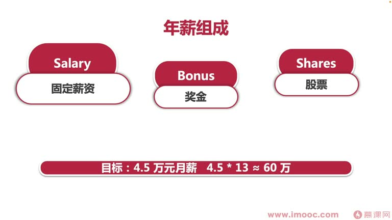
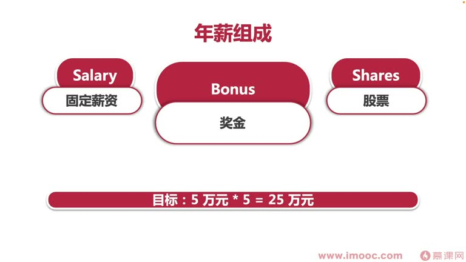
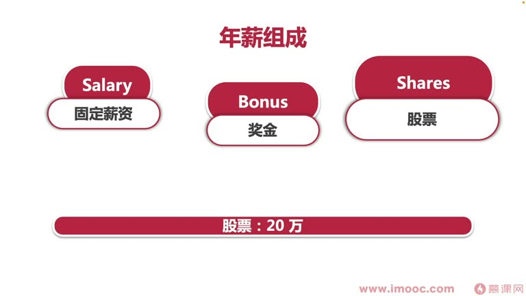
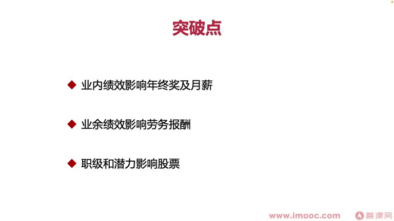

# 3-5 谈谈如何用主动来突破百万年薪

> 来源视频:第3章 / 3-5谈谈如何用主动来突破百万年薪.mp4
> 转写方式:本地 Whisper(small 模型)语音转写,已人工校对("平静"→瓶颈、"板税"→版税、"欺权"→期权、"职集"→职级 等)

## 本节要解决的问题

这一节课围绕“谈谈如何用主动来突破百万年薪”展开。先别急着记结论，大家可以带着一个问题来听：**这件事为什么会影响我们的绩效，以及我能不能把它用到自己的工作里？**
## 本课目标

前几节用案例分析了绩效与薪资的关系。本节**如何用"主动"来突破百万年薪**。

- 百万年薪是很多人步入职场后的梦想
- 但很多同学发展一段时间后发现:到 **50 万年薪**这个口径时,基本就到了职场生涯的**瓶颈**
- 想再往上走:要么**升职**,要么从事一些**兼职**相关的事情
- 也可以选择入职大厂(今日头条、拼多多、阿里等)能给出较高薪资的互联网公司,或从事金融行业拿高薪

## 一、目标拆解:100 万年薪意味着什么

以 12 个月薪资为维度分析(互联网公司多有 13 个月薪资、加年终奖到 15/16 个月,但普通公司可能只有 12 个月):
- 目标:税前年薪 100 万 → 每月到手月薪需 **8.3 万**
- 现实:
  - 很多同学月薪的瓶颈在 **4.5 万**左右
  - 大部分同学月薪在 2 万左右(一线城市)
  - 普通二三线城市可能月薪普遍在 5000-8000

## 二、年薪的基本组成结构

PPT 用三个并列模块展示年薪结构:

1. **Salary（固定薪资）**
2. **Bonus（奖金）**
3. **Shares（股票）**

课程中的目标拆解为约 **60 万固定薪资 + 25 万奖金 + 20 万股票 = 100 多万总包**；实际结构会因行业和公司而不同。

年薪一般分为三方面:
1. **固定薪资**
2. **奖金**
3. **股票**

- 刚毕业的同学可能只有固定薪资和奖金,这两块在各行业都实用
- 股票大部分时候要到比较高的级别才能触及;进入上市公司或创业公司能得到一些**期权**,需分多年兑现

### 1. 固定薪资(目标约 60 万)
- 很多互联网公司是 13 个月月薪(年底双薪)
- **4.5 万月薪 × 13 个月 ≈ 60 万**——追求百万年薪需要达到的级别
- 怎么拿到:
  - 需要在职场深深耕耘 **5-6 年**
  - 也有同学一毕业就拿到 2-3 万月薪(拿到 special offer,或算法/金融等行业),拿到高薪不无可能
  - 但对大多数同学,刚毕业薪资 1-2 万属于正常范围
- 想拿起步薪资(4.5 万),至少工作 5 年甚至 7 年以后才可能;**一毕业就拿百万年薪非常困难**
- 建议:把目标定到**5 年以后**,做详细的 **5 年规划**(每年目标是什么、目标薪资是多少、怎样一步步推动)
- 已经毕业 10 年、20 年还没拿到这样的薪资?**任何时候起步都不晚**,从现在开始给自己一个 **3 年内的规划**

> 为什么固定薪资重要:**奖金与固定薪资挂钩**——以薪资为基数乘以奖金倍数(绩效倍数),由面向绩效编程的努力程度和水平决定。想拿高奖金,前提是固定薪资触及百万年薪标准值(4.5 万左右)。

### 2. 奖金(目标约 25 万)
- 本课程(面向绩效编程)核心想要拿到的薪资,就是**奖金**这一部分
- 拿到手的奖金不只是年度奖金/季度绩效奖金,工作之外还有**劳务报酬**:
  - **出版书籍**:拿阶梯性**版税**,出多本书可拿较高版税报酬——"睡觉时也能赚钱"的兼职工作
  - **参加演讲**:拿演讲出席费用,业余比较丰厚的报酬
  - **专利奖金**:行业内很多公司设立专利奖金,发起申请能拿 5000 元申请奖金,审批下来后拿到更高额的授权奖金,**合计约 1 万元/专利**
    - 申请 10 个专利 → 10 万元奖金
  - 其他:开餐厅等等,都属于我们的"副业/负义"(副业)

### 3. 股票(标准值约 20 万)
- 固定薪资目标约 60 万 + 奖金约 25 万(4.5 万月薪拿 5 倍月薪)+ 股票约 20 万 ≈ **总包 100 多万**
- 这是大部分互联网行业拿到百万年薪同学的标准值
- 做金融或销售的同学薪资结构可能不同:更多维度奖金,且不只看月薪基数

## 三、如何通过"主动"突破(发力点)

### 发力点1:业内——绩效影响年终奖及月薪
- 通过**面向绩效编程**,获得领导对你的信任,在工作中拿出有结果的成绩,提升绩效水平
- 进而影响绩效奖金、以及后面提薪加薪等问题
- 主要看同学自身的努力程度和面向绩效编程的掌握技巧

### 发力点2:业外——"躺着睡觉时也能赚钱"
- 业余从事副业、获得劳务报酬,通过**业余绩效**从另一层面提升奖金
- 适合:喜欢所在公司,但公司能给到的薪资已达瓶颈的同学
- 把更多发力点放在外部,找更多兼职相关工作,提升总体年薪

### 发力点3:职级和潜力影响股票
- 有的同学觉得"安安分分做一个搬砖工具人就可以了,没必要提升职级"——这会影响薪资,更会影响期权/股票的发放
- 很多公司以**职级**确定期权和股票的发放
- 想拿股票/期权,需要**在工作中更主动,获得领导信任,获得升职机会**,从而提升总包

## 本课总结

通过主动发力于"绩效(奖金)、副业(劳务报酬)、职级(股票期权)"三个方向,逐步把总包推向百万年薪。

## 整理者补充：可以马上做什么

这部分不是老师原话，是为了方便复习而加的行动提示：

1. 回到正文，圈出一个与你当前工作最相关的观点。
2. 用这个观点检查最近一次项目、汇报或绩效记录，找出一个可以改进的地方。
3. 把改进动作写成一句具体的话，并安排在今天或本绩效周期内完成。
