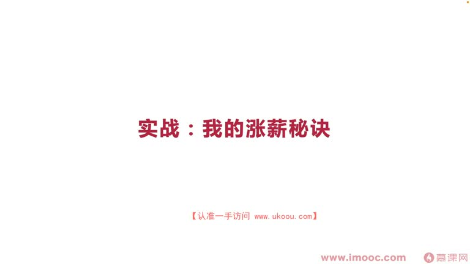
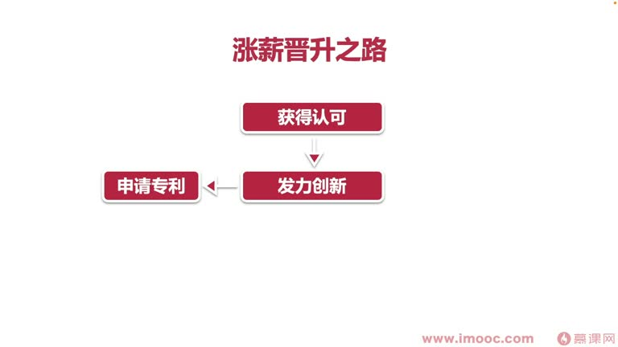
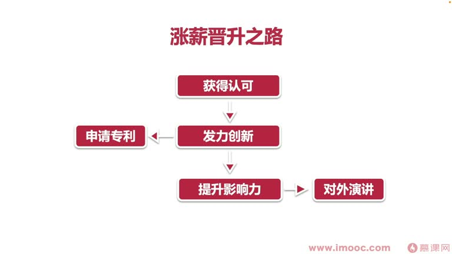
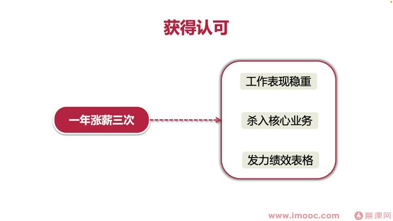
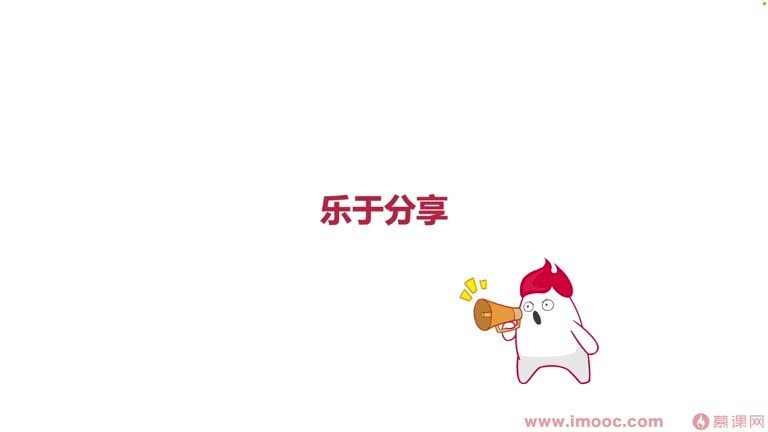

# 3-6 实战:我的涨薪秘诀

> 来源视频:第3章 / 3-6实战：我的涨薪秘诀.mp4
> 转写方式:本地 Whisper(small 模型)语音转写,已人工校对("掌心"→涨薪、"迹效"→绩效、"板税"→版税、"炊子创新大赛"→TRIZ(萃智)创新大赛、"Q-Cal"→QCon、"扩养想力"→扩大影响力 等)

## 本节要解决的问题

这一节课围绕“实战:我的涨薪秘诀”展开。先别急着记结论，大家可以带着一个问题来听：**这件事为什么会影响我们的绩效，以及我能不能把它用到自己的工作里？**
## 本课定位

前几节讲了绩效与薪资的联系、提加薪需要注意的资质、以及案例。本节是**实战类课程**:李老师讲解自己在职场多年生涯中的**涨薪秘诀**。

## 涨薪之路三大块

1. **获得认可**(对应向上管理)
2. **发力创新**
3. **扩大影响力**

> 这几个环节是**层层递进**的关系。

## 第一块:获得认可

- 获得认可代表你的**向上管理水平**和程度
- 现代职场不再是领导单向管理员工,而是**员工和领导之间的双向管理**:不仅要让领导管理我们,我们也必须**管理好领导**(如做项目时管理领导的预期)
- 李老师步入职场做的第一件事,就是**获得领导认可**
- 推荐课程:**曾仕强老师的《人性管理》**——这门经典课程大多讲领导怎么管理员工,但员工去听也能**理解领导做某些事情背后的原因**

### 怎么做(连续一年涨薪三次的实践)

1. **表现稳重**:工作中努力表现得稳重,让工作产出没有太多 bug
   - 李老师做安卓开发,程序 bug 多会被领导重点关注,测试同学评价也差
   - 做好本职工作之外,**反反复复自测**,回家后也对自己的代码自测
   - 什么时候最需要通过自测提升认可度?**刚步入职场或换到新公司时**,一定要尽全力保障工作产出质量,让领导觉得你是稳重踏实、值得信任的人
2. **拿到核心业务**:因工作表现稳重,领导把最重要的**商业化业务**交给他
   - 做的工作很多都会影响领导的绩效,拿到核心业务 = 拿到好绩效
3. **利用近因效应**(前面讲过的理论):每次绩效考核前拼命发力
   - 把绩效表格弄**足够精致、精心**,把阶段产出的重点产出全部用**关键字标红加粗**,让领导/评审一目了然
   - 快速与其他同学拉开差距
- **结果**:连续三年获得整个部门**前 1% 的绩效成绩**

### 四个字总结:踏实稳重
- 想快速获得认可,**一定不要做"老滑头"那样的人**(尤其到新公司接触新领导,领导非常讨厌老滑头)
- 要尽力给领导表现**踏实稳重的形象**;获得认可后可以继续做回自己,但没获得认可、想获得认可时,还不能完全做自己

## 第二块:发力创新

- 获得认可后杀入核心业务,看到业务更多维度,有更多机会对外部部门沟通协作
- 在实现外部门同学需求时,想到更多容易实现的创新技术方案

### 关于"传话筒"的洞察
- 原先通过产品经理对接,把外部同学想法传达给我们——产品经理成了"传话筒",中间总隔着一个人,有时不能完全理解客户真实想法
- **杀入核心业务后,有必要主动跟真实客户沟通**,把他的想法映射成程序方面的创意

### 具体做法
1. **架构重构创意**:提出架构重构创意,形成**30 多页的材料计划书**,发到组内架构组并给领导,领导组织大家一起沟通推进
2. **广告定制化**:实现广告的"盟层"(某种层次)/特殊定制化业务,市场上没有太好方案,根据客户实际需求定制化,提出自己的创新想法
3. **转写发明专利**:
   - 创新想法积累多了,统一花**一个月时间**全部转写为发明专利,一件件申请
   - 每年基本都有一个月做这件事,最终输出**20 多件发明专利**,没有被驳回打回,大部分拿到专利奖金
   - 前四年职业生涯共申请 **20 件发明专利**,一件专利奖金约 1 万元,共约 **20 万元**
     - 刚步入职场时 20 万可能就是一年年薪,通过专利方向打开薪资和影响力很有必要
     - 工作时间长了,专利奖金诱惑力就没那么大,反而可能丧失创新能力

### 创新方法:组合创新(TRIZ/萃智)
- 李老师大学参加过全国性创新大赛——**TRIZ(萃智)创新大赛**(语音识别"炊子")
- 经典例子:铅笔写错字要橡皮擦,但找不到橡皮;有人提出**把橡皮安装在铅笔后面,组合成一个整体**,创新出新型铅笔,推动大规模贩卖,成为今天最流行的铅笔形态
- 这在 TRIZ 创新想法中叫**组合创新**:把现有两种物体组合成一件,产生创新物件
- 后续课程会发散讲解 TRIZ 相关创新想法,提升职场创新能力

### 为什么职场申请专利更容易?
- 大学时期:授权书、声明书等都要自己查阅法律和样本撰写,涉及很多专利术语不知道怎么描述,申请一次被驳回一次(没找专利代理人、没成本、没奖金),发明专利变得遥不可及
- 职场中:只需写一个**技术交底书**,交给公司专利部门,专利部门会有老师联系你交流想法、找代理人撰写申请文件,**申请下来概率非常高,需要做的事少、成本低**

### 四个字总结:敢想敢干
- 步入职场前觉得发明专利很难申请,但职场中一定要敢想敢干,才能做出更多创意

## 第三块:扩大影响力

- 主要扩大你的**交集圈子、辐射范围**:让更多人认识你、帮助你、推广你
- 李老师的路径(层层递进):

1. **出版专业书籍**:工作约 3 年后出版一本安卓开发专业书籍
   - 先调研市场情况,看安卓/移动开发领域欠缺什么书,再着手撰写
   - 出版后长期占据京东热门榜靠前位置,获得比较理想的版税
2. **参加 QCon 大会**(语音识别"Q-Cal"):出版书籍后马上申请报名当年 QCon
   - 参加 QCon 可提升技术领域的专业度、知名度,有更大舞台交流分享
   - **参加 QCon 的前提:在行业有一定知名度或权威性**——对李老师来说需要通过书籍达成
3. **申请谷歌开发者专家(GDE)**:听说行业内安卓开发有名的认证
   - 申请 GDE 必须有**一定的大型演讲经历**,才能获得谷歌总部认可,成为"布道师"角色推广技术
   - 参加 QCon 后,又延续参加两个小型演讲,通过三个演讲打开了进入谷歌开发者专家的门
4. **成为 GDE 后**:获得越来越多演讲机会,更多机构邀请演讲,提供演讲费用——**这也是提升年薪的一个方式**

### 结果
- 经过这一系列,有了业内的一些资金,也有源源不断的兼职资金、劳务报酬
- 一年基本会被邀请参与**十多次对外演讲**,结识志同道合的工作伙伴,对外宣传自己、分享知识、宣传出版书籍(带动销量→更高版税)

### 四个字总结:乐于分享

## 本课总结

李老师的涨薪秘诀链条:**获得认可(踏实稳重)→ 发力创新(敢想敢干)→ 扩大影响力(乐于分享)**,三个环节层层递进,共同推高绩效与总包薪资。

## 整理者补充：可以马上做什么

这部分不是老师原话，是为了方便复习而加的行动提示：

1. 回到正文，圈出一个与你当前工作最相关的观点。
2. 用这个观点检查最近一次项目、汇报或绩效记录，找出一个可以改进的地方。
3. 把改进动作写成一句具体的话，并安排在今天或本绩效周期内完成。
