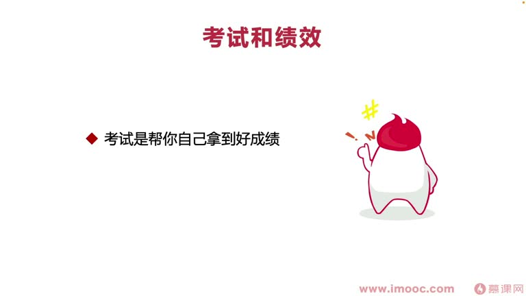
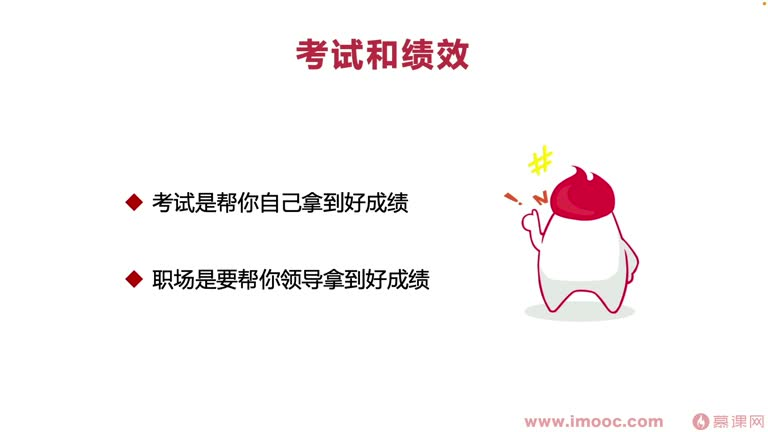
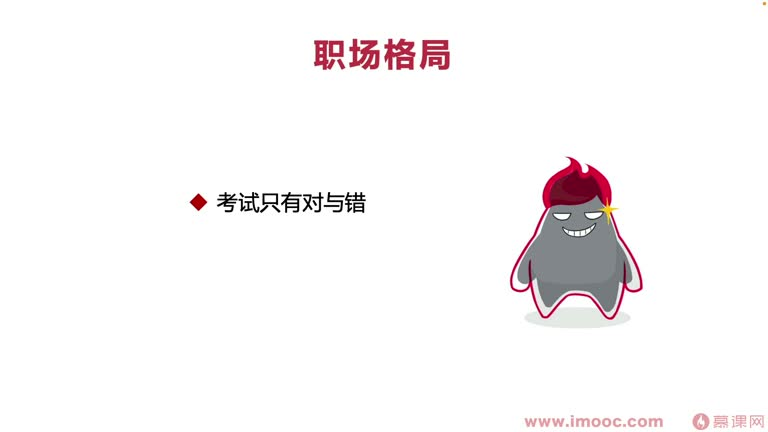

# 4-1 帮你跳出"把绩效当考试"的泥潭

> 来源视频:第4章 / 4-1帮你跳出&ldquo_把绩效当考试&rdquo_的泥潭.mp4
> 转写方式:本地 Whisper(small 模型)语音转写,已人工校对("技效/极效"→绩效、"掌心"→涨薪、"度人就是度级"→度人就是度己 等)

## 本节要解决的问题

这一节课围绕“帮你跳出"把绩效当考试"的泥潭”展开。先别急着记结论，大家可以带着一个问题来听：**这件事为什么会影响我们的绩效，以及我能不能把它用到自己的工作里？**
## 本课定位

从本章开始探讨:**你为什么拿到的绩效不够好**。本小节讲**"把绩效当考试"**这个泥潭。

**核心问题**:你有没有真正把绩效当考试?其实职场中有很大一部分同学都把绩效活动当成了"应试教育之中的考试",只是没有感受到而已。

### 把绩效当考试的表现
- 绩效成绩下来时,总是希望知道身边同事的绩效成绩并相互对比,比出高低,才觉得得到了评估结果
- 只知道自己的绩效,还是不满意;虽然职场中禁止交流绩效成绩,但总想方设法得知他人成绩
- 绩效成绩不够好时,就觉得是自己这一阶段表现不够好

## 一、考试 vs 绩效:目的的区别

PPT 用对照表强调两者差异:

| | 考试 | 绩效评估 |
|---|------|---------|
| **目的** | 帮**你自己**拿好成绩 | 帮**你的领导**拿好成绩 |
| **关系** | 你自己是主角,其他人(老师/家长)都是配角 | 一个领导带十多个员工,你需要帮助小组长和主管领导拿到好成绩 |
| **场景** | 自己把知识学好,拿好成绩就足够 | 职场每一块都在"帮领导",每个小组目标明确 |

- 很多人把绩效当考试的本质原因:绩效评估时仍很大程度在**努力帮自己拿好成绩**,忽略了领导
- 职场中一个领导带十多个员工(手下有小组长),这符合**"分治思想"**(分解目标):领导的目标是分解给各小组,再下发给具体同事

## 二、如何跳出泥潭:思维转换

### 转换一:目标与领导对齐
- 想拿好绩效,首先要做到**目标必须和领导的目标对齐、吻合**
- 领导阶段有10个目标,会平均分配给他手下的小组(两个组各5个,三个组各3个),小组再下发给具体同事
- **常见问题**:下发给你之后,为了拿好绩效你把更多关注点放到其他地方,把组长下发的目标优先级放得非常低,甚至拖到季度最后才完成
  - 优先级不明确的本质:**不知道组长和领导具体想要什么、目标是什么**
- **转变**:思维认知变成"你要去帮助你的领导拿到一个好的绩效"
  - 领导设定的绩效目标,对你就**优先级最高**,不管其他事情怎么影响、怎么拖延,首先要落实到位
- 坚持一个观念:**度人就是度己**
  - 想自己拿到好绩效,前提是先帮助领导拿到好绩效,领导才会给你相应嘉奖

### 转换二:打开格局看结果
- 跳出泥潭,必须让自身的格局、眼界放得足够宽
- 绩效评估没拿到好成绩时,**并不一定**说明这一阶段表现不好、没有产出——你可能加了很多班、做了很多正确的事,但绩效成绩依然不好
- 考试中只有对与错;如果把绩效当考试,就会觉得绩效也只有对与错(好绩效/不好绩效)
- **但职场中还有一个词:格局**
  - 我们看到的只是自己或身边同事,但**领导看到的上下文、得到的信息比我们宽很多**
  - 例子:组里3个同学负责技术栈A,1个同学负责技术栈B
    - 负责A的三位同学中有人表现非常突出,但最后绩效可能很平常,领导不会给太多鼓励
    - 负责B的唯一同学,业务平平、成绩不出彩,但领导**为了稳住军心、留住他**,可能把好的绩效发给他
  - 并不代表他这阶段表现好,而是**领导从长远视角出发**考虑问题
- **做法**:打开自己的格局来看结果,**不要单纯把绩效结果当成对你这一阶段表现的完全决定性因素**

## 本课总结

跳出"把绩效当考试"的泥潭,需要做到:
1. 思维转换——**帮助领导拿好绩效**(度人就是度己),把领导的目标当最高优先级
2. 打开格局——**不要单看结果**,理解绩效背后的全局考量

## 整理者补充：可以马上做什么

这部分不是老师原话，是为了方便复习而加的行动提示：

1. 回到正文，圈出一个与你当前工作最相关的观点。
2. 用这个观点检查最近一次项目、汇报或绩效记录，找出一个可以改进的地方。
3. 把改进动作写成一句具体的话，并安排在今天或本绩效周期内完成。
