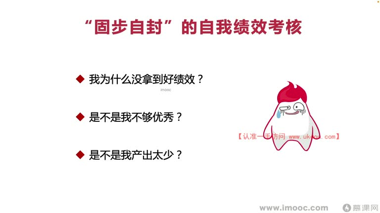
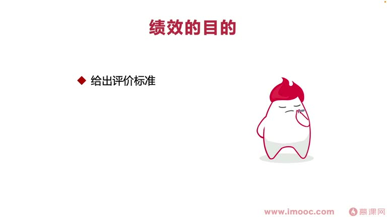

# 4-2 教你如何从"单一考虑自己绩效"问题之中走出来

> 来源视频:第4章 / 4-2教你如何从单一考虑自己绩效问题之中走出来.mp4
> 转写方式:本地 Whisper(small 模型)语音转写,已人工校对("技校/极效"→绩效、"顾不自封"→固步自封、"杜仁就是杜吉"→度人就是度己、"PoA"→PUA、"半角石"→绊脚石 等)

## 本节要解决的问题

这一节课围绕“教你如何从"单一考虑自己绩效"问题之中走出来”展开。先别急着记结论，大家可以带着一个问题来听：**这件事为什么会影响我们的绩效，以及我能不能把它用到自己的工作里？**
## 本课定位

上一节讲"不把绩效当考试、不相互攀比、不单一让自己拿好绩效,而是帮助领导拿好绩效"。本节继续:**如何从"单一考虑自己绩效问题"之中走出来**。

有些同学还是觉得:既然是面向绩效编程,肯定是面向"我"的绩效编程,怎么是面向领导的绩效编程呢?

**关键认知**:面向绩效编程不只是针对自己去编程。就像上节说的"**度人就是度己**",想拿到好绩效,必须**走出固步自封的自我绩效考核模式**。

## 一、固步自封模式的危害

停留在固步自封的自我绩效成绩中,会不断自我怀疑:
- 为什么我没拿到好绩效?为什么其他人就能拿到?
- 是不是我不够优秀?这阶段表现不好?产出太少?
- 是不是领导觉得我没有培养潜力,把我放弃了?
- 为什么产出足够多了还是拿不到好绩效?

这种模式带来的问题:
1. **抛开身边的世界,沉溺于自己的情绪泥潭**
2. **影响后续工作**:一次没拿好绩效,下阶段工作信心被大打折扣,觉得做再多努力也拿不到好绩效,**完全没必要努力了**
3. 与领导交流绩效成绩时,如果完全沉浸在自己的世界里,**领导未必会告诉我们真话**

## 二、走出自己的世界

- 例:这阶段绩效成绩不够好,跟领导交流"我觉得应该拿好绩效,工作也做到位了,为什么绩效很平常?"
  - 领导可能说:大环境的原因;或者**想 PUA 你**,说你没达到/没超过他的预期
  - 你心里会反问:谁超出你预期了?我打听到的拿到好绩效的同事也没超出预期呀(但公司禁止交流绩效成绩,不会这么问)
- **领导那边有自己的绩效预期、有自己要走的格局**:他给你的绩效成绩,并不完全代表对你这一阶段工作的评估

### 核心洞察:领导可能早已"框定"你的绩效
- 当我们走到领导的职级/较高层次会发现:**在阶段工作还没开始、季度考核还没开始的时候,领导就已经在心里给我们的绩效打了分数**
  - 比如:这季度给甲同学最好的绩效、给乙丙同学普通绩效、给丁同学最差绩效
- 为什么会这样?因为**领导有长期规划目标**:
  - 想长期留住某位同事(如没给涨薪机会,不给好绩效可能就面临跳槽/离职)
  - 影响组织框架
- 怎么判断自己在领导心中能否成为这样的位置?参见前面章节**"谈薪资的资本"**那一课

### 面向绩效编程要改变什么
- 绩效活动很多时候要根据**周围环境、身边同事、所处的技术栈、所拥有的工作能力**来看
- **即使很多领导在工作之初就把绩效成绩给我们"框定死了",我们也要通过面向绩效编程、通过自己的努力,去扭转领导框死的这个成绩**——这就是面对"很早很早做出规划"的领导要做的事

## 三、绩效活动的目的(为什么绩效仍有意义)

1. **给出一套评价标准**:可能是长期使用的
   - 即使领导提前打好分,也可以**参照上一阶段的绩效评价标准**来预打分,我们这阶段的工作在他心中已被"预期好、隐形化"
2. **更客观地评估员工**:通过标准多维度评估员工
   - 但这种评估只能从**硬性层面**评估,不能从近期遭遇、家庭情况、环境情况等多维度出发,所以**评估还是比较冷、比较片面的**
3. **促进我们进步、改善**:
   - 了解绩效目的的意义:通过拿到的绩效成绩,逐步改善自己做得不到位的地方
   - **让绩效促进自我进步,而不是让不理想的成绩成为击败我们、影响下一阶段努力工作的"绊脚石"**
   - 根据绩效给出的标准体系,不断有针对性地改善不足,让自己在领导心中**更符合预期,逐渐超出预期**,让面向绩效编程有更明确的目标

## 本课总结

从"单一考虑自己绩效"走出来:
1. 认识固步自封模式的危害,走出自己的世界
2. 理解领导可能提前"框定"绩效,但依然可通过面向绩效编程扭转
3. 把绩效当作**自我进步的工具**,而不是自我怀疑的来源

## 整理者补充：可以马上做什么

这部分不是老师原话，是为了方便复习而加的行动提示：

1. 回到正文，圈出一个与你当前工作最相关的观点。
2. 用这个观点检查最近一次项目、汇报或绩效记录，找出一个可以改进的地方。
3. 把改进动作写成一句具体的话，并安排在今天或本绩效周期内完成。
