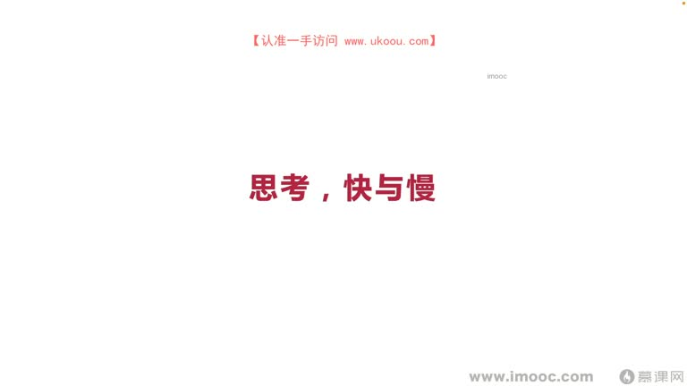
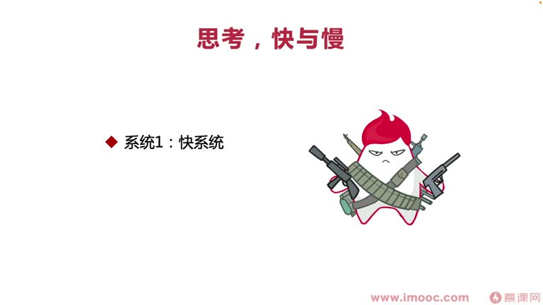
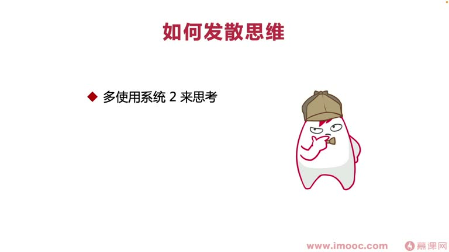
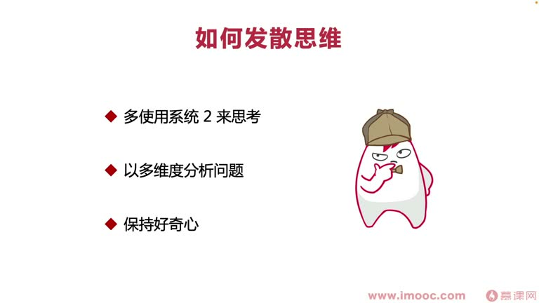
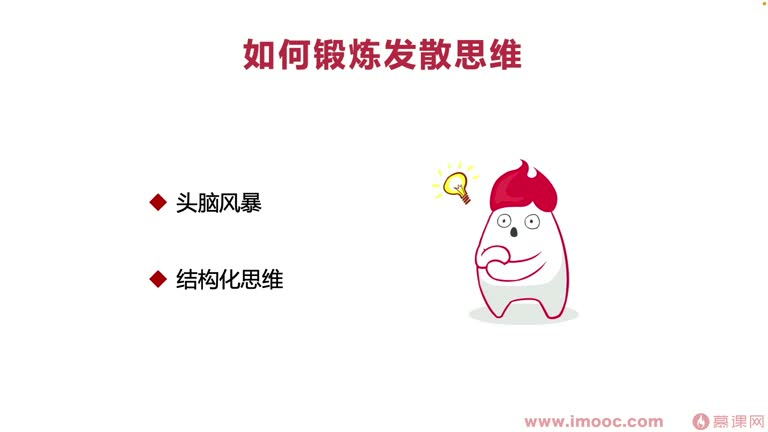

# 4-3 教你如何发散自己的思维

> 来源视频:第4章 / 4-3教你如何发散自己的思维.mp4
> 转写方式:本地 Whisper(small 模型)语音转写,已人工校对("断裂"→锻炼、"多一多/多一度"→多一度(多维度)、"模方"→魔方、"拙目鸟"→啄木鸟 等)

## 本节要解决的问题

这一节课围绕“教你如何发散自己的思维”展开。先别急着记结论，大家可以带着一个问题来听：**这件事为什么会影响我们的绩效，以及我能不能把它用到自己的工作里？**
## 本课定位

前两节课讲"不把绩效当考试、走出泥潭",避免拿到不好绩效时对现有阶段工作产生羁绊。本节探讨:**如何发散自己的思维**。

- 如果参与绩效活动时,经常把思维沉浸在自己的世界中,从单一角度思考,觉得绩效不好就是对自己的否定,会对自身工作和生活产生很多负面影响
- 需要**从多个维度、多个角度思考看待问题**,发散思维、分析问题,才能从更多角度理解所遭遇的情况

## 一、推荐书籍:《思考,快与慢》

### 作者:丹尼尔·卡尼曼
- **人类历史上第一个获得诺贝尔经济学奖的心理学家**
- 因为很多金融/经济学相关的情况,需要用心理学理论来分析和解决
- 该书上市后连续 20 多周蝉联亚马逊图书畅销榜前 20,上市超 7 个月稳居总榜前 50
- 被华尔街日报、华盛顿邮报等权威媒体争相报道,读者好评如潮

### 核心:双系统思考理论
- **系统一(快系统)**:运行无意识、非常快,不需要动脑,处于自主控制状态——"自动驾驶"
  - 例:正常走路时想事情、看到周围的人和事边走边想
- **系统二(慢系统)**:需要把注意力转移到费脑力的大脑活动上
  - 例:突然有人让你计算复杂数学题,你会停下脚步费力思考计算

### 为什么要多用系统二?
- 从原始进化角度看,为了生存、保存能量,大家会很大程度**避免使用系统二**(深度思考耗费大量能量)
- 但在现今社会,已脱离原始丛林追逐厮杀的生存状态,更多时候坐在办公室思考、分析、解决问题
- **现状不同了,要锻炼自己更多使用系统二**,这样才能把问题想得更深入,让视野、看待事情的层面打开得更广阔

## 二、什么是发散思维?

- 不少心理学家认为发散思维是**创造事物的主要功能**
- 发散思维是**创造性思维的最主要特点**,也是衡量创造才能的重要方式/标准
- 工作中涉及需要创新的事情,都需要动用发散思维
- 发散思维让我们可以产生"**一题多解、一物多用**"等形态,让解决方案更加**多维化**,面临问题时**有更多解决方案**
- 能让我们在阶段工作表现中想到很多创新方案,解决领导设定的目标,**让领导觉得我们更有培养潜力**
- 发散思维又称**辐射思维、放射思维**,是一种**扩散状态**的思维模式
  - 对比:定向思维(聚点状态)vs 发散思维(扩散状态)
  - 例:**思维导图**就是模拟发散思维的思维结构衍生出来的效率化工具

## 三、如何发散思维?

### 1. 多用系统二思考
- 觉得思考很费力时,要想到这是**原始本能**;现在已经无需处处受原始本能限制(不用再为生存厮杀)
- 保留体力只会让我们不断"发胖",现在不需要更多体力为生存考虑
- 要把更多体力放到**如何思考现有的工作**上
- **每当你不想思考时,想一想是不是系统一代替了系统二做事**——那样带来的结果是产出很多时候变成**单方面的**,没有多元化的、迸射的产出

### 2. 多维度("多一度")分析问题
- 看到的事情可能只是魔方的一面;魔方每一面都五颜六色,**总有一面的颜色相对更"荟萃"(好看),让人赏心悦目**
- 生活中很多事情都要从多个方面看待:
  - 例:看到某位女生长相不出彩,觉得印象分低;了解后发现她父母是亿万富翁,长相就不重要了,背后的资产吸引了你
- 对待**绩效成绩**也一样:不仅要看到现有的绩效标准体系,还要看到**所身处的背景、大环境**,思考大环境会不会影响现阶段拿到的绩效成绩
- 工作中也要发散思维:如遇到技术难题需用算法解决,不能只会"分治算法"就只思考分治,还要掌握**动态规划**等其他方法去思考能否解决

### 3. 保持好奇心
- 人类很多时候的进步都是靠好奇心推动的
  - **牛顿被苹果砸到脑袋**:保持孩童一般的好奇心,推动他探索世间"废解"(未解)的事情,才有更多发现
  - **啄木鸟**(语音识别"拙目鸟"):经常用嘴啄木头,平常;但有些同学会思考"啄木鸟的舌头是什么样的"——好奇心相关的书里提过
- 想获得发散思维,要看到生活中一些事情**多去思考:它现有的结构为什么会是这样?是什么导致它变成这样?**
- 看待职场、生活中的问题,也要思考为什么会这样

## 四、如何锻炼发散思维的能力(两个方法)

### 方法一:头脑风暴
- 公司做未来规划、现阶段决策或没点子需要集思广益时,会组织头脑风暴
- 在头脑风暴中**比较消极,对个人来说就是一次锻炼机会的丧失**——要抓住机会多多参与
- **注意**:组织者可能给予一些"嘲讽性"反馈(觉得你的 idea 太无厘头而 diss 你)
  - 这种 diss 会扼杀我们参与头脑风暴的积极性,这属于**组织者的错误,不是你的错误**
  - 因为被 diss 而不再喜欢参加头脑风暴的同学,要及时调整观念,**不要认为是自己的失误**

### 方法二:结构化思维(思维导图)
- 结构化思维有代表性的工具:**思维导图**
- 看书时做思维导图,整理思路、理清思绪,回溯时快速记起知识
- 思维导图**模拟大脑思考的结构**形成的一套工具化解决方案,能有效锻炼发散思维

## 本课总结

发散思维的关键:**多用系统二深度思考 + 多维度看待问题 + 保持好奇心**,并通过**头脑风暴**和**思维导图**两大工具持续锻炼,让绩效活动中的思维不再固步自封、单维度。

## 整理者补充：可以马上做什么

这部分不是老师原话，是为了方便复习而加的行动提示：

1. 回到正文，圈出一个与你当前工作最相关的观点。
2. 用这个观点检查最近一次项目、汇报或绩效记录，找出一个可以改进的地方。
3. 把改进动作写成一句具体的话，并安排在今天或本绩效周期内完成。
