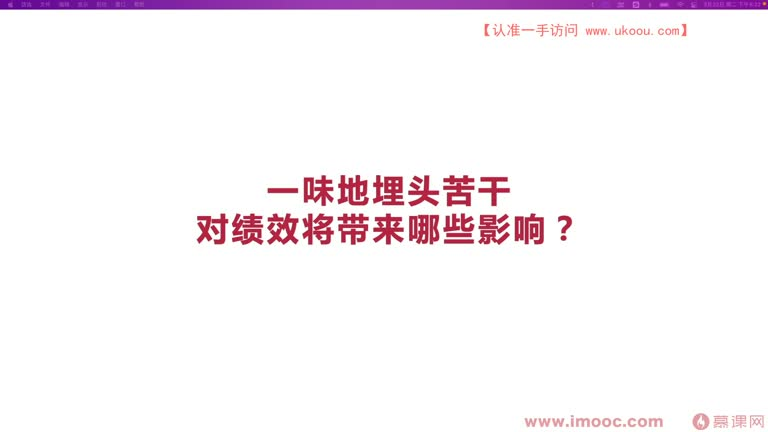
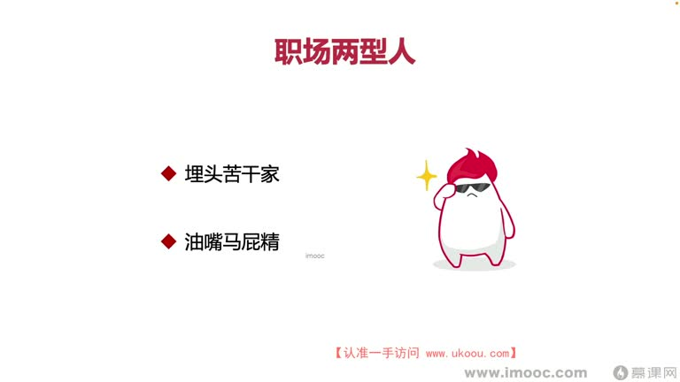

# 4-4 一味地埋头苦干对绩效将带来哪些影响?

> 来源视频:第4章 / 4-4一味地埋头苦干对绩效将带来哪些影响？.mp4
> 转写方式:本地 Whisper(small 模型)语音转写,已人工校对("技校/极效"→绩效、"埋头骨盘/骨盖"→埋头苦干、"蛇战群辱"→舌战群儒、"子布"→子布(张昭) 等)

## 本节要解决的问题

这一节课围绕“一味地埋头苦干对绩效将带来哪些影响?”展开。先别急着记结论，大家可以带着一个问题来听：**这件事为什么会影响我们的绩效，以及我能不能把它用到自己的工作里？**
## 本课定位

本章探讨对绩效的错误认知的典型 case。前几课讲了:跳出把绩效当考试的泥潭、从单一考虑自己绩效走出来、避免思维单一/学会结构化发散思维。本课继续探讨**绩效考核周期内一味埋头苦干会带来哪些影响**。

## 一、职场中的两类人(夸张化视角)

为了讲清楚,先把职场中常见的绩效表现划分为两类人(像动画调试时把参数放大一样,把问题放大以便定位):

| 类型 | 特点 | 领导眼中的形象 |
|------|------|---------------|
| **埋头苦干家** | 只认埋头苦干 | 忠诚、执行力高、实干派,常帮领导出成绩 |
| **油嘴马屁精** | 不怎么干活,天天在领导面前拍马屁 | 靠拍马屁上位(古代"太监"形象夸张化);美化一点说就是**擅长沟通交际** |

> 这两类人在职场中**获得领导的认可都不容易**。把两类人放大夸张后,可能不好对号入座,再细分来看。

## 二、职场三类人(更中性化的划分)

| 类型 | 特征 | 历史案例 |
|------|------|---------|
| **能说能做的人** | 说话能说到点子上,懂领导心思 | 三国·吴国丞相 **顾雍**(语音识别"故庸") |
| **善于言谈的人** | 说得多但办事偏弱 | 张昭(子布) |
| **善于做事的人** | 会做事但不说 | 历史上比较多,但很多人被贬 |

### 什么是"能说能做"?
- 不是说话量多,而是**一说就说到点子上**
- 三国案例:
  - 孙权成帝后,"内事不决问张昭,外事不决问周瑜",但周瑜已不在人世,在世的是张昭(子布);**孙权却没立张昭为丞相**(尽管张昭能说、是实干家,如舌战群儒时很能说),立的是**顾雍**
  - 顾雍平时话不多,但很善于执政、会做事情;孙权常问他意见,他**不明确回答,只使脸色或委婉回答**,孙权看脸色就知道对错
  - 吴国贤人 **虞翻**(语音识别"于帆"):有计谋、与顾雍谋略不相上下,但说话尖锐、常批评指责孙权,地位非常低,最后被贬
- **启示**:职场中不光要"能做",还要"会说"——不是说的多就算会说,而是**说到点子上、能理解领导意思、说到领导心坎里**(情商高),才算能说能做的人
- 能说能做的人在职场中**非常稀有,被视为珍宝**

## 三、一味埋头苦干对三类人的影响

### 1. 对"能说能做的人":影响非常轻微
- 埋头苦干时,领导发现你是能说能做的人也会认可你
- 领导会觉得你"这段时间状态低迷,只想埋头不想说话",但有一天你想说话时还是能说到点子上,所以**领导可以包容你**
- 领导对这类人的绩效经常有**宽泛性**,不会因一段表现差就给特别不好的绩效——他在心中觉得你有潜力
- 所以如果你是能说能做的人,大概不用担心

### 2. 对"善于言谈的人":领导会"心虚"
- 如果有一天你埋头苦干了,领导可能觉得心虚:是不是最近想跳槽?或者有其他动向、打算突然变化特别大?
- **要做的事**:必须把你自己的变化与领导的行为关联起来
  - 让领导知道你的变化是因为**领导做了某些事情引起的**,而不是你突然变了
  - 帮助领导了解你变化的具体原因,领导对你才会有安全感
- 否则领导对你没有安全感,不会给你好绩效

### 3. 对"只善于做事的人":最容易埋头苦干,最需要向上管理
- 这类人**没有做好"向上管理"**
- 如果做好向上管理,就不该一直闷头做任务,应该**适时找领导沟通,看看做的事是否符合他的预期**
- 不要等到过了半年才发现做的事不是领导想要的、领导不认可你,那时再抱怨自己做了很多事**已经为时已晚**
- **做法**:
  - 适时多跟领导沟通、多约领导谈一谈、多给领导讲自己的规划
  - 放下手上的工作,多思考未来的长远规划(比如**5 年规划**)
  - 按照规划一步一步走,同时**不断跟上级沟通、反复思考现在的规划是否合理、是否需要调整**

## 本课总结

一味埋头苦干,对不同人影响不同;核心是**向上管理**——多沟通、对齐预期、讲规划,才能"做正确的事情,说正确的话",拿到好绩效。

## 整理者补充：可以马上做什么

这部分不是老师原话，是为了方便复习而加的行动提示：

1. 回到正文，圈出一个与你当前工作最相关的观点。
2. 用这个观点检查最近一次项目、汇报或绩效记录，找出一个可以改进的地方。
3. 把改进动作写成一句具体的话，并安排在今天或本绩效周期内完成。
