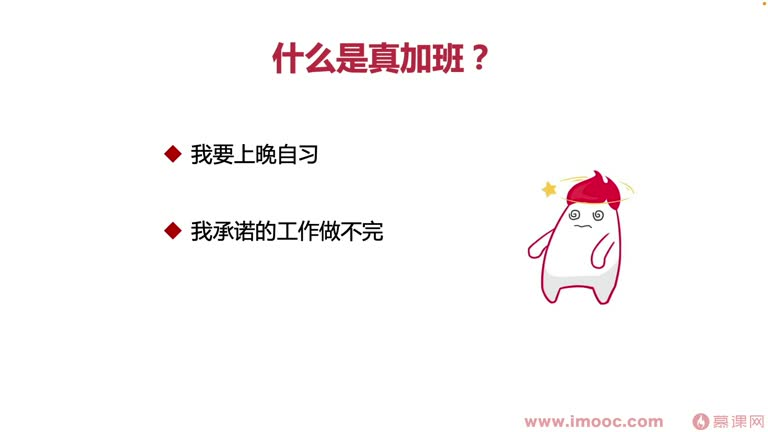

# 4-5 帮你解决"为了加班而加班"带来的绩效差的问题

> 来源视频:第4章 / 4-5帮你解决为了加班而加班带来的绩效差的问题.mp4
> 转写方式:本地 Whisper(small 模型)语音转写,已人工校对("技校/极效"→绩效、"埋头骨干"→埋头苦干、"介绍"→绩效、"道日"→道(时)、"谨慎天花"→锦上添花、"9有6"→996 等)

## 本节要解决的问题

这一节课围绕“帮你解决"为了加班而加班"带来的绩效差的问题”展开。先别急着记结论，大家可以带着一个问题来听：**这件事为什么会影响我们的绩效，以及我能不能把它用到自己的工作里？**
## 本课定位

上一节讲了"一味埋头苦干"对三类人群的影响。本节探讨:**很多时候为了加班而加班,最后绩效结果非常差,怎么解决?**

课程列出几个经典分类,大家根据自己的情况对号入座,才能产生有针对性的解决方案。

## 一、什么是"真正的加班"?三类人群

### 第一类:我要"上晚自习"(自我提升)
- 晚上利用时间进行**自我提升、自我技术学习**:学新框架、看流行博客、看技术大神的研究、看技术风向标
- 给自己找到更多灵感,产生更多创意点子,促进产生更多**项目改进计划书**给领导提
- 特点:**一到公司约定的下班时间,就不做公司的工作了**,只做自己给自己设定的目标(不是给公司付出)

### 第二类:我承诺的工作做不完(效率低)
- 公司按迭代排期给工作;应届生容易出现的情况:想提前超额完成工作,做完又找领导申请新工作
  - 因为申请多少基本都能申请来,永远有做不完的工作;做一段时间后疲惫、没兴趣,体力也有限
- **真正"承诺的工作做不完"**指:平时职场效率比较低下,做事情经常思考很长时间想不出好方案
  - 需要求助同学、通过互联网查询("谷歌工程师"式找答案),消耗大量时间在资料搜集、思考、问题分析上
  - 导致迭代周期内承诺的工作做不完,需要**牺牲加班时间来解决问题**
- 这类同学**基本就是大多数人因加班而加班、最终绩效表现差的群体之一(核心分析群体)**

### 第三类:我不想回家(逃避家庭)
- 不想面对老婆孩子、家人,想逃避这个家,对现有家庭有抵触情绪
- 李老师遇到非常多这样的同学;他们也属于"真加班"
- **怎么办**:希望这类同学转变、及时调整心态:
  1. 第一时间**找心理医生疏导**
  2. 转变成"我要上晚自习"那类同学的心态——短期之内既不回家、也能学到知识
  3. 长期慢慢调整心态,通过心理医生疏导,慢慢变得接受自己的家庭

## 二、什么是"假加班"?两类人群

> "有李逵就有李鬼"(语音识别"有李葵就有李鬼"),有真加班就有假加班。

1. **别人加班,你也加**:看别人没下班,不好意思下班——"大家都不下班,我怎么好意思走"
2. **领导不下班,你就不下班**:工作都做完了,领导没走,自己也不能先走——"这样领导肯定要给绩效打不及格"

> 这两类人群基本代表了现在职场中每天加班(996)大部分同学面临和思考的真实情况。

## 三、如何解决?

### 先判断:自己是真加班还是假加班
- 如果是真加班,看属于**积极的情况还是消极的情况**
- 无论哪种,**加班对我们来说都是思想和身体、身心上面的双重伤害**

### 情况一:真加班 + 效率低(绩效差毋庸置疑)
- 产出不够多:别人用工作时间"锦上添花"(产出更好),而我们占用公司资源、用工作时间完成本该工作时间内完成的任务
- 很多公司其实并不希望加班——加班本身浪费公司的水、电等资源,对公司是资金消耗,而你能做的事情跟不加班的同学做得一样多
- **怎么办**:
  - **降低平时遇到问题"钻牛角尖"的时间**,把更多时间花在"道"上(刀刃/正确方向)上
  - 把更多时间放在**优先级更高的事情**上
  - **学会拒绝低优先级的事情**,及时推出去
  - 只做自己这边**优先级最高、任务最明确**的事情
  - 这样就能解决工作中"拖沓、效率低",进而解决绩效差的问题

### 情况二:假加班
- 看到别人没走就不走,觉得是对自己工作态度的承诺、忠心的表现
- 假加班确实能表现工作态度,但问题在于:**你加班多,产出有没有很多?**
- 职场中有加班的同学,必然也有几个不加班的同学
- **需要把产出跟不加班的同学对比衡量**:你加班时的产出,有没有人家不加班的同学多?
- 如果花了大量时间假加班,就需要拿出更多时间做公司的事情、进行更多产出,才能让领导觉得**你加班是有意义的**,认可你的加班
- **如果产出平平、有时还比不过不加班的同学,那你的假加班就大可不必了**——因为领导本身并不认可你的假加班

## 本课总结

- **真加班**:分清积极/消极;效率低者要降内耗、抓优先级、会拒绝
- **假加班**:用产出说话,比不过不加班的同学时,假加班毫无意义
- 核心:加班不是目的,产出与绩效才是关键

## 整理者补充：可以马上做什么

这部分不是老师原话，是为了方便复习而加的行动提示：

1. 回到正文，圈出一个与你当前工作最相关的观点。
2. 用这个观点检查最近一次项目、汇报或绩效记录，找出一个可以改进的地方。
3. 把改进动作写成一句具体的话，并安排在今天或本绩效周期内完成。
