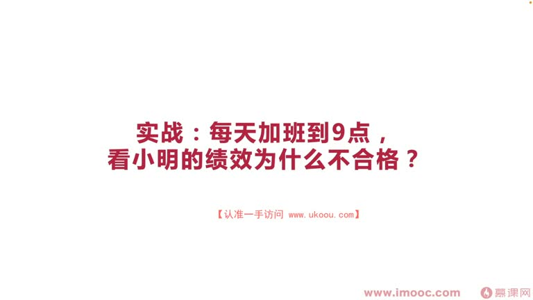
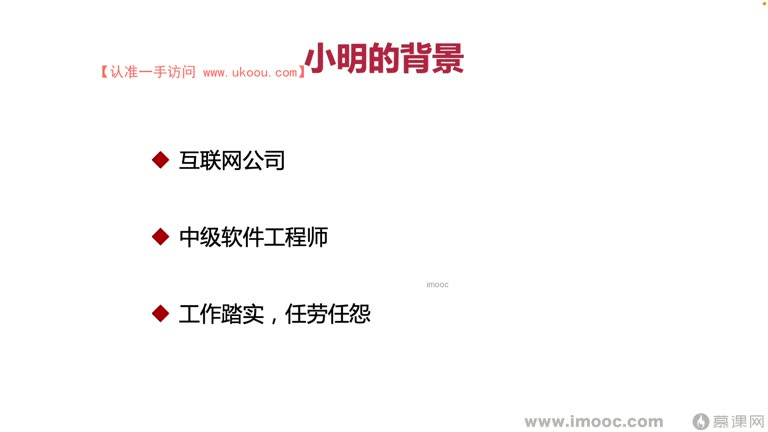
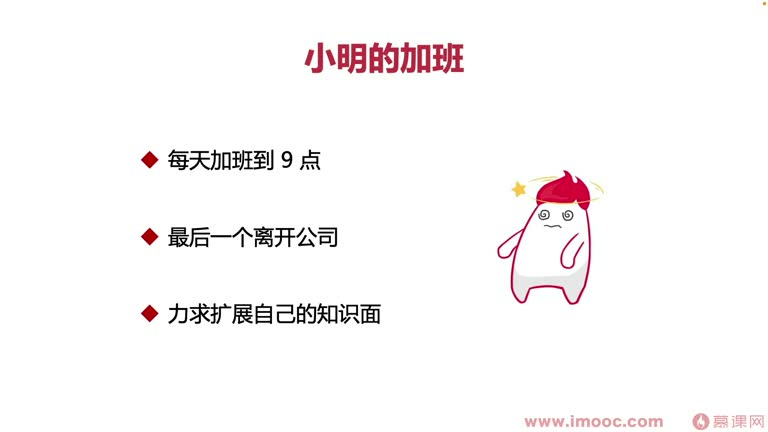
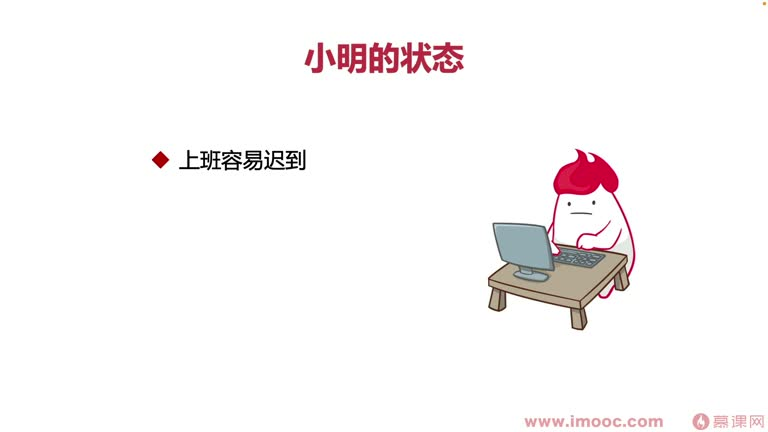
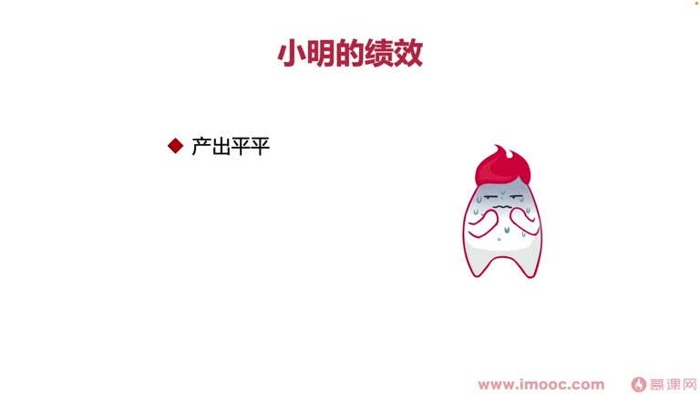
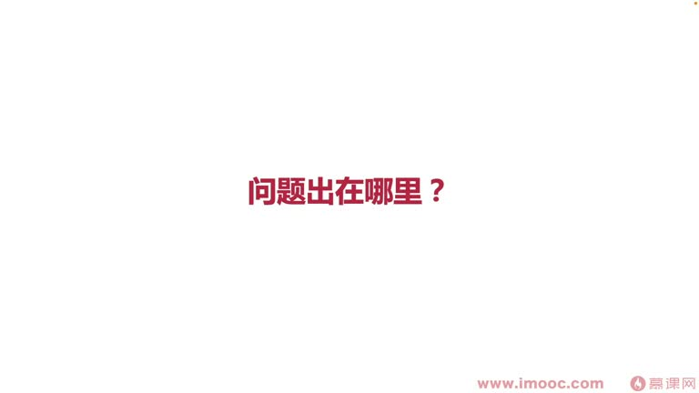

# 4-6 实战:每天加班到9点,看小明的绩效为什么不合格?

> 来源视频:第4章 / 4-6实战：每天加班到9点，看小明的绩效为什么不合格？.mp4
> 转写方式:本地 Whisper(small 模型)语音转写,已人工校对("技校/迹效/极效"→绩效、"埋头虎干"→埋头苦干、"有地放石"→有的放矢、"XX里德"→心力交瘁、"伤增"→熵增 等)

## 本节要解决的问题

这一节课围绕“实战:每天加班到9点,看小明的绩效为什么不合格?”展开。先别急着记结论，大家可以带着一个问题来听：**这件事为什么会影响我们的绩效，以及我能不能把它用到自己的工作里？**
## 本课定位

本章前面分享了很多反面教材,提出针对性的改善意见。本节是**实战类课程**,通过一个案例讲解:**每天加班到 9 点的小明同学,为什么绩效不合格?**

> 有同学可能心里一惊:"每天加班到 9 点还算加班?某些公司(某条/字节)每天加班到 11、12 点都是常态。"

## 一、小明同学的背景

- 任职于一家互联网公司(非"某条"),**中级软件工程师**
- 平时工作**踏踏实实、任劳任怨**,同事们眼中比较稳重,评价比较好
- 公司是中型规模、中等偏上的互联网公司,工作约 3 年

## 二、小明的加班情况

- 每天加班到 9 点,晚上经常忙没做完的工作
- 做事仔细,遇到问题反复"抠来抠去",还发散去了解更多不了解的业务(觉得是学习)
- 长时间处于**饱和工作状态**,每天都是最后一个离开公司的同学,负责公司关灯
- 每天觉得自己非常辛苦,"把自己全部奉献给了公司",甚至女朋友都快跟他分手(觉得跟单身没区别)
- 家住得远,到家要十点、十一点,洗漱后十二点才能睡

### 为什么加班这么晚?
核心原因:小明是**求知欲非常强**的人,力求扩展知识面。但这里有**误区**:
- 扩展知识面对于工作党是"无稿后飞"(无可厚非)的事,但小明产生了误区:
  - 扩展知识面应该**发散性、多维度扩展**,还是**有的放矢、明确方向目标后朝着这一点发力**?
- 看到不明白的知识就把它弄清楚弄明白,能让自己忙碌起来、减少思考时间——这跟《思考,快与慢》(卡尼曼)的观点**不谋而合**(部门而合):
  - 我们经常喜欢用**快系统**(系统一)思考,而不是**慢系统**(系统二)
  - 因为慢系统耗费更多能量;思考问题时希望聚焦于问题本身,而更少思考"解决这个问题背后的价值是什么"
  - 思考价值需要把维度放得更宽阔,消耗更多能量,人类本着"趋利避害"精神会避开
- 但只这样的话,恰恰让小明**丧失了深度思考的时间**

## 三、996 与"思考时间"的丧失

- 之前新闻:有些公司 996 严重,**马老师(马云)说"996 是福报"**,引起网友一片哗然
- 专家经典解释:**996 对年轻人来说是丧失掉了思考的时间**
- 小明现在的状态就是 996:一味埋头苦干、解决当下遇到的问题,**对长远规划产生丧失状态**

### 小明 996 产生的三个问题
1. **上班容易迟到,给领导留下非常不好的印象**
   - 公司每天要开"晨会",小明总要迟到 5-10 分钟
   - 小明心里想:我每天都是最晚走、加班最长,其他同学晨会能来是因为走得早,我迟到一点领导应该能容忍
   - 但事实并非如此:加班时间长,产出却不够多;每天迟到反而给领导留下更差的印象
   - **领导觉得小明在打破团队规则、把团队往混乱状态引领**——对领导来说小明就是"刺头"、不良因素
2. **没有长远规划**
   - 每天埋头苦干、丧失思考时间,996 让他更多聚焦当下,缺少对外来长期发展的规划
   - 直接结果:容易**迷失长期完整的规划**,慢慢走向偏向的状态
3. **被很多同事视为反面教材**
   - 大家笑完小明最晚走之后,还会加一两句嘲讽的话
   - 大家心里都不想成为小明这样的人
   - 有一本书叫《活好》:你自己生活得很快乐,别人都羡慕你、希望成为你——按这本书来讲,**小明并没有活好**

## 四、小明的绩效表现

- **产出总体比较平淡**,绩效考核时**绩效表格填写非常潦草**
- 同事和领导都问过他原因,小明的真实想法:
  - "我每天做了这么多工作,每天最后一个下班,做了什么还需要我说吗?"
  - "还需要完整填写绩效表格吗?完全不用填了,领导应该能看到我每天的努力"
  - "绩效表格填不填都没有意义,领导心里已经有数了"

### 关键误区:混淆了"努力/辛苦"和"结果"
- 刚步入职场的同学最容易混淆这两件事
- 职场中打磨多年的人会知道:**职场很多时候不看你的辛苦,只看你的产出结果**
- 想让产出结果发光发亮、得到最大化利益,想让面向绩效编程足够精彩,**一定要在绩效表格上充分发力**
  - 这也是前面讲过的**记忆效应(近因效应)**里提起的一点
- 结果:小明拿到了**全团队最差的绩效成绩**

## 五、问题总结

小明的问题主要出自**对他自己所做的努力太过于自信**——觉得只要努力了领导都能看在眼里、自然会给他好绩效,所以只管埋头干、只管努力。

三个核心问题:
1. **加班多,但产出少**:大量占用公司水电等资源,让领导觉得"很心痛"
2. **状态比较差,总迟到**:总觉得"我有千千万万个理由可以迟到",但领导大多数时候会忽略这些理由
   - 领导会想:小刚、小王同学家离公司也很远、有时下班也很晚,为什么他们就可以不迟到?
   - 小明太自信自己努力的价值,完全从自身角度出发;在领导眼中就是**刺头,会给团队带来混乱、不好的影响**,还会变成**熵增**状态——领导驯服不了小明,就要想办法"除掉"他
3. **缺乏思考、没有规划**:把大量时间聚焦在解决眼前问题上
   - 不懂拒绝,要扩大知识面就大量"吸损"(吸收)公司看到的知识
   - 学习过程中缺少深度思考、缺少对未来的明确规划 → 没有明确目标、无法有的放矢 → 学习内容过于分散,没有"拧成一股绳"

## 六、加班的意义究竟是什么?

- 加班代表**工作态度**:
  - 想让领导认可工作态度,并不代表每天都需要加班
  - 可以**一周选两三天加班**(如这周周一、周三,下周周二、周四)
  - 把加班当作自己的"晚自习":既有自己的提升时间,也向领导表明认真、敬业的工作态度
- 加班代表**工作效率**:
  - 每天加班假如做的是公司的工作还可以,能给公司带来更多产出
  - 如果产出跟不加班同学不相上下,领导会觉得你工作效率非常低下
  - 如果加班时间不想做太多公司的事,最好减少加班时间,否则就要提高产出
- 加班代表**公司资源消耗**:
  - 加班时不做公司的事、还占用公司水电资源,领导会觉得"你在公司里像心力交瘁一样给领导看态度,结果消耗了资源还没为公司做事情",一定不满意

## 七、行业趋势:大公司取消加班

- 现在很多公司越来越不提倡加班:
  - **字节跳动**(2021 年底公布):取消周末加班,从 996 变为 **1075**(10 点上班、7 点下班、上 5 天班),给大家更多生活空间
  - 鼓励大家用业余时间体验生活,整体提升公司效率——不鼓励加班,大家会更快地在白天几小时内做完工作,避免晚上内卷内耗
  - **腾讯**:公布 **965**(9 点上班、6 点下班、上 5 天班)
  - 大公司先行,后面会产生**蝴蝶效应**,逐渐影响更多公司

## 本课总结

实战中如果面临加班,一定要想好:你是否产生了跟小明一样的问题?如果产生了,用解决方案尽快调整;如果没有,认真思考一下**现在加班的意义到底是什么**。

## 整理者补充：可以马上做什么

这部分不是老师原话，是为了方便复习而加的行动提示：

1. 回到正文，圈出一个与你当前工作最相关的观点。
2. 用这个观点检查最近一次项目、汇报或绩效记录，找出一个可以改进的地方。
3. 把改进动作写成一句具体的话，并安排在今天或本绩效周期内完成。
