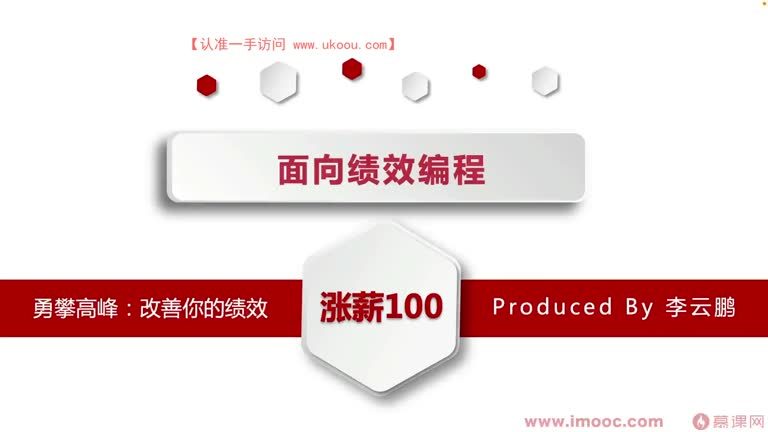
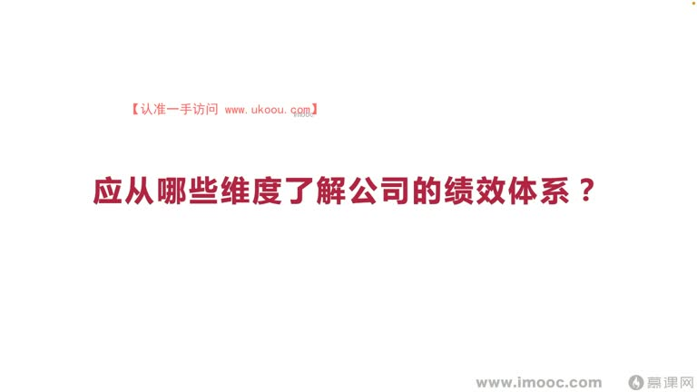
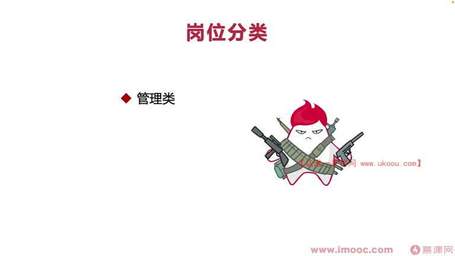
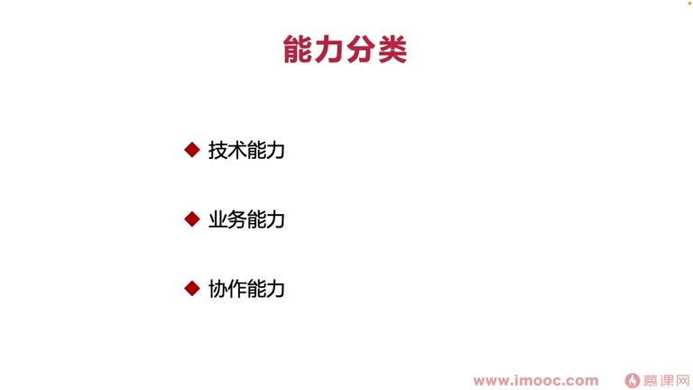
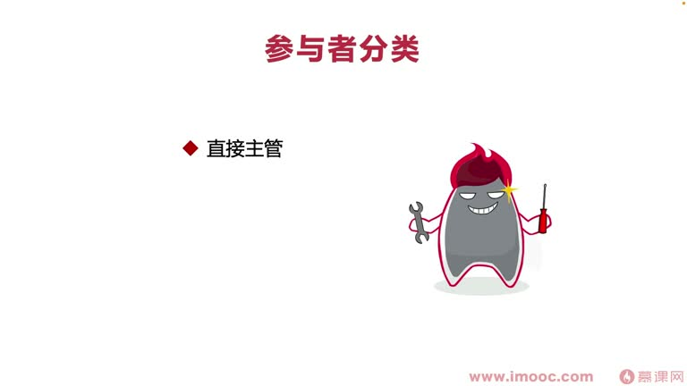
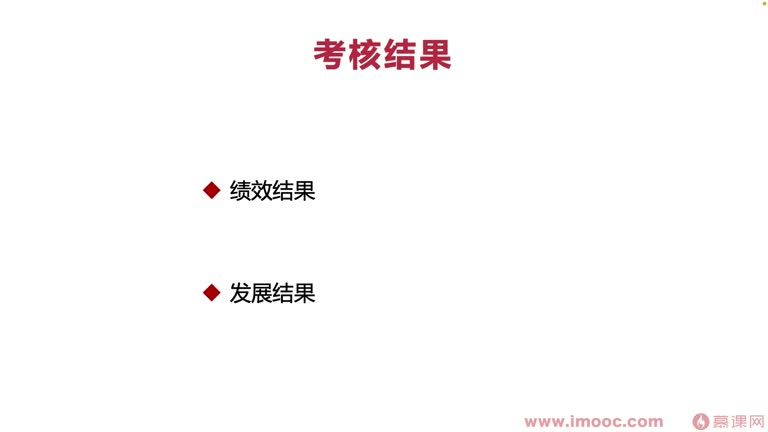
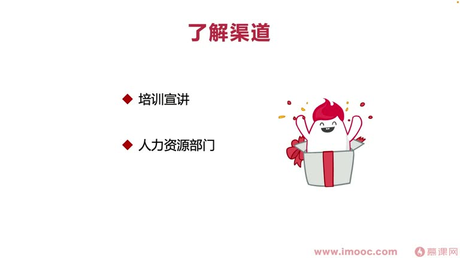

# 5-1 应从哪些维度了解公司的绩效体系?

> 来源视频:第5章 / 5-1应从哪些维度了解公司的绩效体系？@优库it资源网www.ukoou.com.mp4
> 转写方式:本地 Whisper(small 模型)语音转写,已人工校对("计校/技校"→绩效、"掌心"→涨薪、"分耳之肢"→分而治之、"拖延而出"→脱颖而出 等)

## 本节要解决的问题

这一节课围绕“应从哪些维度了解公司的绩效体系?”展开。先别急着记结论，大家可以带着一个问题来听：**这件事为什么会影响我们的绩效，以及我能不能把它用到自己的工作里？**
## 本课定位

前几课讨论了什么因素导致绩效不良(通过实例与经典 case 列举影响因素)。从本课开始讨论:**如何改善你的绩效**——课程命题"勇攀高峰:改善你的绩效"。

- 改善绩效的目的:绩效直接挂钩**薪资**、影响未来在该岗位的动向及**晋升**
- 俗话说"有的放矢":面向绩效编程之前首先要**明确目的**——直接的结果导向是提升薪资
- 过程目标:需要了解**公司具体的绩效体系都是从哪几个维度出发的**

## 一、从不同岗位看绩效考核体系

### 管理岗(主管、总监、行政管理等)
企业最注重两点能力:
1. **规划能力**
   - 管理主要做什么?可用"**分而治之**"描述(类似算法"分治算法")
   - 像古代部落族群:首领负责管每位成员、分配猎物,大家听从指挥获得利益
   - 现代企业管理:管理者手中拥有很多利益,员工按管理者下发的命令指示及**长远规划**做事
   - 为什么考核管理者的规划能力?**管理者掌握的上下文比普通员工多很多**
     - 普通员工只知道部门/团队的企业目标,管理者需要看企业财报、了解企业整个发展脉络
     - 所以对管理者的规划能力要求比普通员工强很多
2. **沟通能力**
   - 管理是分而治之,任务分下去不能没有下文
   - 管理者需要不断跟员工**双向沟通**,了解任务进度
   - 员工内向、不愿主动向上沟通时,管理者必须主动向下沟通——不能因为别人内向自己也不沟通,让任务随意做
   - 否则是**失职行为**,也是绩效考核中不达标的沟通管理能力

### 研发岗
- 核心关注:**技术能力**(如今很多业务发展快的公司可能不太关注研发的技术能力,大家常抱怨"做了代码重构得不到认可";企业更关注推动业务发展,需要研发做更多产品经理相关的技术职能,拥有**多面手**能力)
- 研发同学更多需要把目光集中在自己技术能力方面;管理者则不太高要求这些
- 研发同学最需要关注的一个词:**创新**——只有创新才能让研发者**脱颖而出**

### 其他岗位(销售、运营等)
- 比较强依赖某一些指标,用指标进行标准化考核,本课不展开细讲

## 二、从能力维度划分

三类能力:**技术能力、业务能力、协作能力**(主要针对管理者以外的同学;有些企业也考核管理者的技术能力,视公司具体情况):
- **技术能力**:周期内产出技术成果(不是产品经理主导的,如实现需求时自己加入一部分创新实现)
- **业务能力**:技术同学跟产品经理协作,发生的业务指标变化
- **协作能力**:每个岗位都或多或少需要
  - 管理者、产品经理岗位要求较高
  - 开发同学岗位要求较低
- 不同岗位都会有这些能力要求,**只是侧重点不同**——要了解你所在的公司对你某项能力要求的侧重点是多少

## 三、从绩效评定参与者维度划分(三类)

1. **直接主管**:为你的绩效打分的人,对你绩效影响比较大
   - 最主要的:**与直接主管建立比较强的、直接的合作关系,产生相互信任**
2. **HR**:绩效考核中或多或少担任"裁判"角色
   - 负责**平衡各个团队之间分到的绩效考核指标**
   - 主管给了你很高分数但给太多人高分时,HR 可能考虑资源平衡分配,把资源从主管这边拿到其他部门
   - 主管给了你较低分数时,HR 可能直接找你聊绩效,看是否满意,为你们做平衡和裁定
3. **合作方**:有的公司注重合作方对你的评价
   - 通过公司绩效考核系统了解,或主管与合作方直接沟通
   - 从第三者视角看你在别人眼中的样子,排除主管在考核中受干扰的因素

## 四、考核结果的分类(层层递进)

- **绩效结果**:直接影响这一次绩效考核拿到的分数(如拿到了好绩效)
- **发展结果**:绩效结果直接影响到的后续结果
  - 例:这次绩效拿了好分数,可能影响后面的晋升、涨薪
  - 如果公司体系中没有这些发展结果,绩效结果直接影响的发展结果可能就是**主管对你的信任**(如后续会不会继续把工作交给你处理)——比较隐形的发展结果

## 五、了解公司绩效体系的渠道

1. **入职培训宣讲(HR 开展)**
   - 大公司:HR 会把大部分关注点整理成 PPT 逐一讲解,不太需要自己操心
   - 小公司/创业公司:人不多、HR 经验不定,要**自己做好准备**、想好有哪些问题向 HR 提出咨询,并自己做记录、更上心一些
2. **主动找人力资源部门(HR)了解**
   - 公司没有培训宣讲时,主动找 HR 了解绩效考核维度、要绩效考核表
   - 注意:新到公司一般考核时才发考核表,可能已过很长时间,导致工作方向不明确——**只有拿到考核表才知道考核维度有哪些**
3. **能力相关网站(大企)**
   - 大公司绩效考核维度可能公开在能力相关的网站上
   - 咨询身边同事,看公司有没有这样的网站,能快速了解绩效考核维度

## 本课总结

了解公司绩效体系需要从**岗位、能力、评定参与者、考核结果、了解渠道**等多个维度出发,做到"有的放矢",才能有针对性地开展面向绩效编程。

## 整理者补充：可以马上做什么

这部分不是老师原话，是为了方便复习而加的行动提示：

1. 回到正文，圈出一个与你当前工作最相关的观点。
2. 用这个观点检查最近一次项目、汇报或绩效记录，找出一个可以改进的地方。
3. 把改进动作写成一句具体的话，并安排在今天或本绩效周期内完成。
