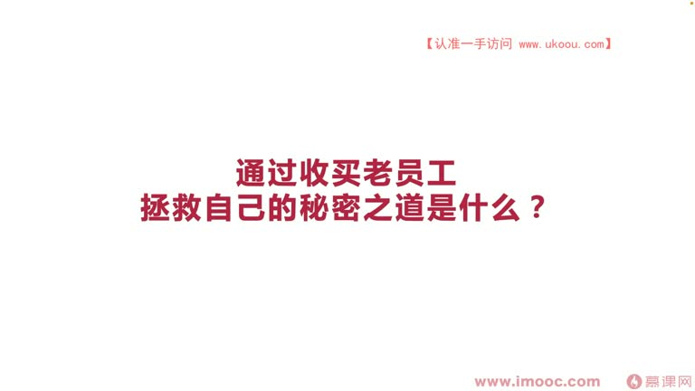
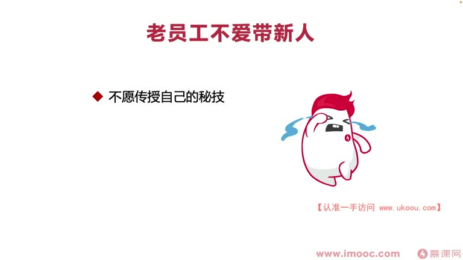
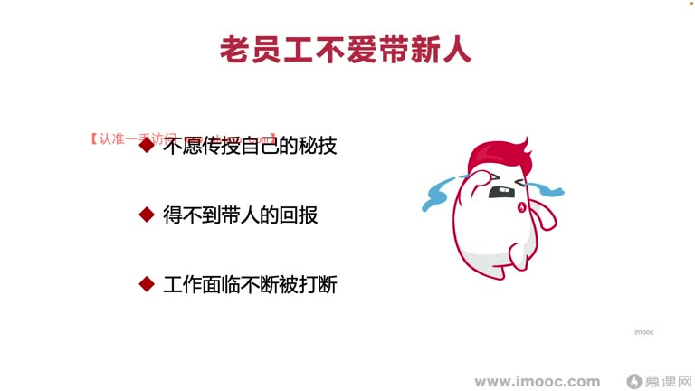
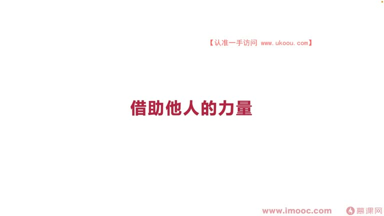
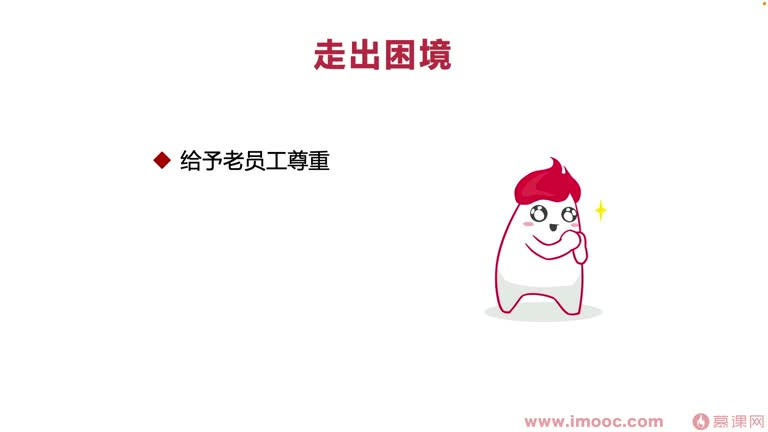
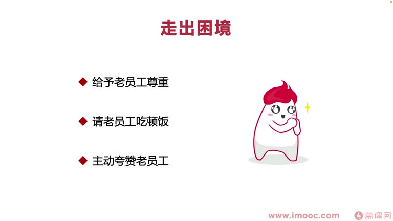

# 5-2 通过收买老员工拯救自己的秘密之道是什么?

> 来源视频:第5章 / 5-2通过收买老员工拯救自己的秘密之道是什么？@优库it资源网www.ukoou.com.mp4
> 转写方式:本地 Whisper(small 模型)语音转写,已人工校对("迹效"→绩效、"商家文"→上下文、"landing"→着陆(入职适应)、"把光丝"→曝光 等

## 本节要解决的问题

这一节课围绕“通过收买老员工拯救自己的秘密之道是什么?”展开。先别急着记结论，大家可以带着一个问题来听：**这件事为什么会影响我们的绩效，以及我能不能把它用到自己的工作里？**
## 本课定位

很多时候绩效并不是通过一个人就能拿到好成绩的,需要**借助他人的帮助**:
- 帮助我们了解公司的很多**上下文**
- 帮助我们更快的 **landing**(入职落地/适应)
- 即使是公司老员工,有时也想去向更老的员工咨询求助、要一些"指点"

**核心问题**:在向老员工求助的过程中,需要了解/分析哪些问题?尤其是:**为什么很多时候老员工并不愿意帮助我们?**

## 一、老员工为什么不愿意带新人?

### 原因一:教会徒弟,饿死师父
- 老员工不愿意把自己总结多年的"秘技"、工作经验传授给新员工

### 原因二:带人得不到回报
- 即使把秘技传授给新员工,也得不到"带人"的回报
- 带人的回报主要来自**领导对老员工的隐形信任**,无法用物质直接奖励
- 好一点的领导可能会给老员工一些物质小奖励(如把曝光/奖项送给老员工)
- 但大部分领导觉得"老员工带新人是理所应当的事"——老员工却不这么认为

### 原因三:工作被不断打断
- 带新员工时,工作会面临被不断打断、咨询问题的情况
- 对老员工来说**百害而无一利**

## 二、为什么需要"收买"老员工?

- 老员工愿意帮助,可以让我们拿到更好的绩效:
  - 主管评定绩效时,**也会参考老员工的意见**
  - 老员工跟我们不是一个级别,不面临绩效争夺问题
  - 老员工可能是我们的**合作方**,会帮我们"美言几句"
- 所以需要通过老员工的言语,去**拯救自己的绩效**

## 三、如何让老员工愿意帮助我们?(三招)

### 第一招:给予老员工足够的尊重(精神层面收买)
- 让老员工心理上更加喜欢你
- 参考书籍:**《如何让你喜欢的人也喜欢你》**
  - 需要给予这样的人更多尊重,让他觉得他在你这边是有光彩的、放光的、可以得到认可的
  - 这样他就更喜欢跟你在一起

### 第二招:请客吃饭 / 送饮料(物质层面小恩小惠)
- 可以请老员工吃顿饭,或买一瓶饮料
- 李老师经验:刚到新公司 landing 时请教老员工问题,会主动买一瓶**椰汁**或更健康的**低糖饮料**送给老员工
  - 买高糖的,人家可能减肥会拒绝——考虑要周到一些

### 第三招:多多夸赞老员工
- 咨询问题时,要找老员工的一些**亮点**去夸赞
- **注意不能特别假**,要绕开比较通用的词汇(如"你好厉害啊")
- 应该围绕老员工给我们讲的一些要点,展开**追问**,根据追问及回答情况,**从侧面**夸赞(不那么假)
- 这样老员工更愿意指导、帮助我们解决问题

## 本课总结

通过**精神尊重 + 物质小恩惠 + 真诚夸赞**三招"收买"老员工,借助他们的力量了解上下文、更快落地,并在绩效评定中借助老员工的正面评价来**拯救/提升自己的绩效**。

## 整理者补充：可以马上做什么

这部分不是老师原话，是为了方便复习而加的行动提示：

1. 回到正文，圈出一个与你当前工作最相关的观点。
2. 用这个观点检查最近一次项目、汇报或绩效记录，找出一个可以改进的地方。
3. 把改进动作写成一句具体的话，并安排在今天或本绩效周期内完成。
