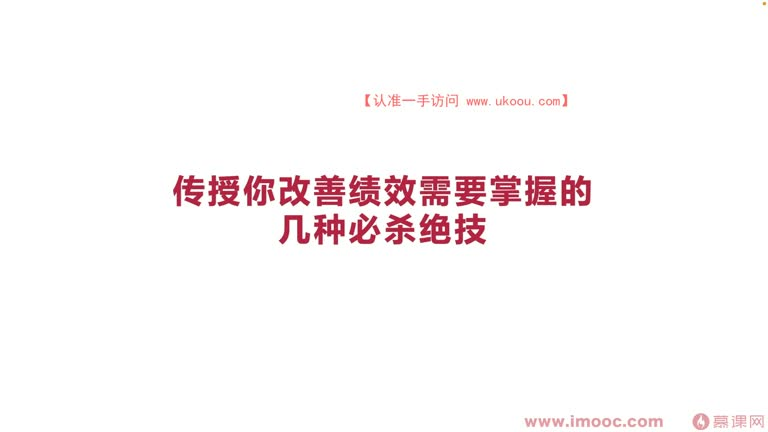
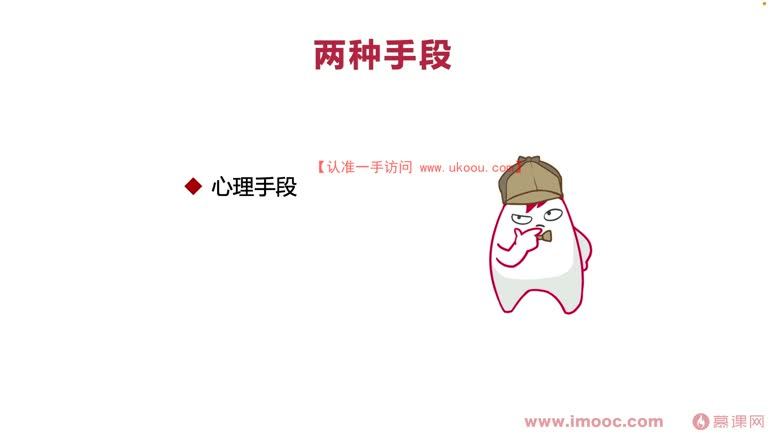
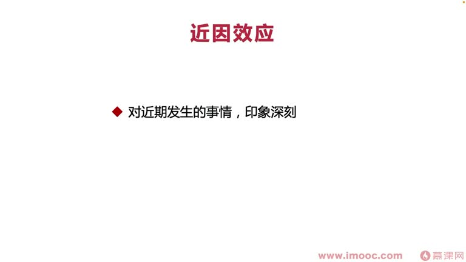
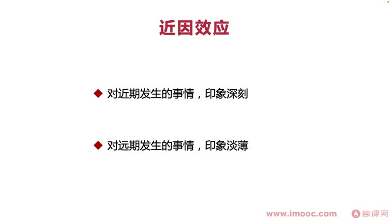
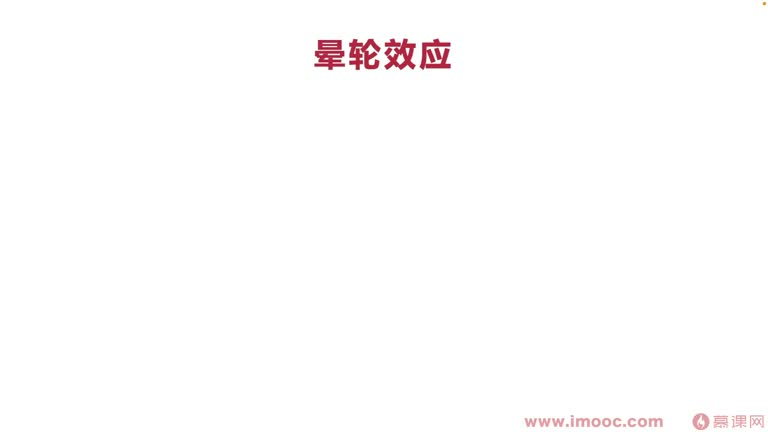
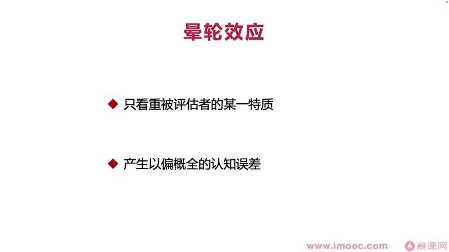
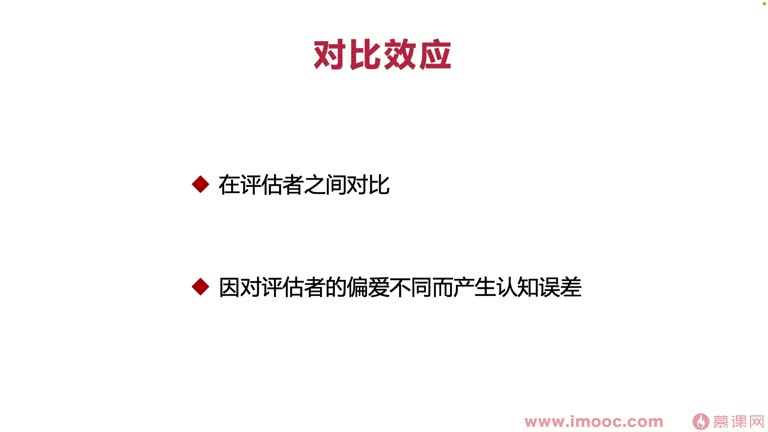
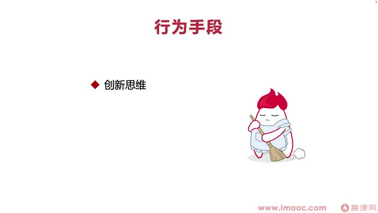

# 5-3 传授你改善绩效需要掌握的几种必杀绝技

> 来源视频:第5章 / 5-3传授你改善绩效需要掌握的几种必杀绝技@优库it资源网www.ukoou.com.mp4
> 转写方式:本地 Whisper(small 模型)语音转写,已人工校对("技校"→绩效、"静音效应"→近因效应、"音轮效应"→晕轮效应、"吹死"→TRIZ、"送工"→送功 等

## 本节要解决的问题

这一节课围绕“传授你改善绩效需要掌握的几种必杀绝技”展开。先别急着记结论，大家可以带着一个问题来听：**这件事为什么会影响我们的绩效，以及我能不能把它用到自己的工作里？**
## 本课定位

前面课程:第一课分析从哪些维度/渠道了解公司绩效考核体系(有的放矢);第二课了解如何获得老员工帮助。本课讨论:**改善绩效的典型手段和方式**。

改善绩效的手段分为两种:
1. **心理手段**:发生在绩效考核**前一阶段周期内**,帮助快速扭转绩效考核可能产生的不良影响、扭转整个局面
2. **行为手段**:发生在绩效考核周期的**整个持续过程内**,通过长期行为表现影响

> 想拿非常好的绩效成绩,要**心理手段 + 行为手段两种一起用**,效果会出人意料。

## 一、心理手段的典型方式(三类)

### 手段一:近因效应(语音识别"静音效应")
- 回忆:绩效考核前期,主管对**近期发生的事情印象深刻**(不光是主管,很多人都这样)
  - "鱼的记忆只有七秒",人类记忆也有一段周期:近期印象深刻、远期印象淡薄
- 都知道近因效应,但**并不会利用它帮我们实现想要的效果**
- **如何利用**:
  1. 绩效考核前,针对绩效考核表做**表达优化**:让考核表非常清晰、突出,与团队其他同学拉开差距
  2. 绩效考核前半个月或一个月,多努力(如加班更频繁)、针对领导做向上管理、多找领导谈话,**快速改善领导近期的印象**
- **注意规避**:近因效应**不宜频繁使用**
  - 可能两年用一次,一年用一次频率都算高了
  - 频繁使用,主管会快速发现你利用心理手段实行心理控制,产生**不信任和抵触情绪**,不利于长期发展

### 手段二:晕轮效应
- 回忆:考核周期前一阶段,领导只看中我们被评估者的**某一种气质**,产生**以偏概全**的认知误差
- **两种用法**:
  1. **短期表现**:长期在领导这边不受信任,但在绩效考核前突然从"调皮捣蛋"的员工变得非常听话、服从,让领导**快速发现你的某一点产生了改变**、发现你的某个亮点
  2. **长期表现**:长期对领导表现得非常忠诚,领导会因忠诚产生更多偏爱——即使这阶段业绩不是很出彩,领导也可能给出较高认可
- 晕轮效应对绩效考核的长期表现也有帮助,需要在实际场景中灵活运用

### 手段三:对比效应
- 定义:领导在绩效考核前期,会在**被评估者之间进行对比**,因对评估者偏爱不同而产生认知误差
- 与近因效应、晕轮效应有交集、相互交叉
- **如何定义"好"**:绩效表比同组同时参加考核的其他同学表现得好
  - 大家都做得非常亮眼时,需要做得**更加亮眼、更加好**——对面向绩效编程更有挑战性
  - 因为普通技巧其他同学都了解了,需要针对性地了解**主管喜好的风格**:
    - 例:把考核表做得五颜六色、多姿多彩,但如果主管相对传统保守,可能反而反感(觉得你"画蛇添足"),产生不利影响
    - 所以要**充分了解主管的喜好,才能有的放矢**
- **如何在竞争者之间产生差异化表现**:
  - 整理全组参与绩效考核同事的**优点、缺点、近期哪方面表现不好**
  - 在他们表现不好的点上努力
  - 例:近期业务繁重,大家大部分时间投入业务产出、压力大、情绪不良、**减少与上级沟通频率**
    - 我们可以利用这一点:多与上级沟通,让上级把我们与其他人区分、对比
    - 觉得其他人因忙碌丧失沟通/向上管理能力,而我们忙碌时也能保持好的沟通协作能力
    - 上级会觉得我们有潜力、抗压能力更强,给绩效带来好影响

## 二、行为手段的典型方式(三类)

### 方式一:创新思维
- 为了跟其他同学拉开对比
- 例子:面试时考算法题——很多公司针对不同面试者考 3-5 个算法题;有的同学没怎么考算法、一直在问项目
  - 很多时候考算法是因为**面试者很难与其他人拉开差距**
  - 如果简历上有亮眼点(出过书、参加很多演讲、做过很多创新项目),面试官可能象征性考一道算法题,更多讨论你与别人不一样的点
- **工作中如何做**:利用 **TRIZ(吹死)创新方案**,快速产生创新思路,让自己与众不同

### 方式二:汇报艺术
- 工作产出即使做好了,但如果**不懂得汇报**,就没法让别人看到工作带来的影响
- 具体如何实现汇报艺术,后面课程会详细讲解

### 方式三:主动送功
- 我们做努力都是为了领导/虚线领导
- 如果领导抢了我们的功劳,**不应该嫉妒、抱怨,而是觉得理所应当**——本来我们就是服务于领导的
- 如果领导没有抢功劳,**可以主动送功**:
  - 例:申请专利时,把领导的名字也"带上"
  - 领导对你的印象会更好,肯定会在其他方面对你产生补偿

## 本课总结

改善绩效的**必杀绝技**:
- **心理手段**:近因效应、晕轮效应、对比效应(考核前快速扭转印象)
- **行为手段**:创新思维、汇报艺术、主动送功(考核周期内长期影响)
- 两种手段要在职场生涯中**灵活运用**,才能发挥更好效果

## 整理者补充：可以马上做什么

这部分不是老师原话，是为了方便复习而加的行动提示：

1. 回到正文，圈出一个与你当前工作最相关的观点。
2. 用这个观点检查最近一次项目、汇报或绩效记录，找出一个可以改进的地方。
3. 把改进动作写成一句具体的话，并安排在今天或本绩效周期内完成。
