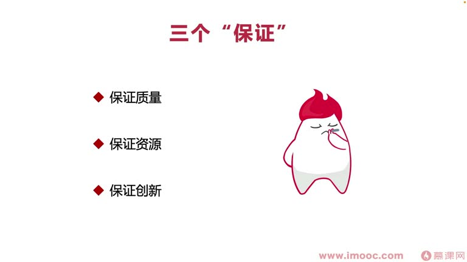

# 5-4 代码重构让绩效快速增长的秘诀是什么?

> 来源视频:第5章 / 5-4代码重构让绩效快速增长的秘诀是什么？@优库it资源网www.ukoou.com.mp4
> 转写方式:本地 Whisper(small 模型)语音转写,已人工校对("计校/技校"→绩效、"代码成构/成功"→代码重构、"意欲阅读/维护"→易于阅读/维护、"奔施率"→流失率、"flatter"→Flutter 等

## 本节要解决的问题

这一节课围绕“代码重构让绩效快速增长的秘诀是什么?”展开。先别急着记结论，大家可以带着一个问题来听：**这件事为什么会影响我们的绩效，以及我能不能把它用到自己的工作里？**
## 开场:师傅的启示

李老师刚步入职场时和师傅讨论:做这块业务,过两天换另一块业务,或跳槽后业务变更,找不到之前的业务方向,不是一种损失吗?怎么样才能拥有"去哪家公司都不变、都能用得上"的技能?

**师傅的回答**:想要做技术又一直不变的,那只有**架构**了——就是编程的**架构思想**。
- 能陪伴很长职业生涯的是架构思想(相比具体业务:跳槽后业务铺垫只转化成隐形技术能力,无法带来硬性业务能力沉淀,"鸟枪换炮、左打一枪右打一枪",对职业发展不利)
- 架构思想直接影响工作中的能力:**代码重构能力**
- 如何组织代码结构,让代码**易于阅读、易于维护、提升生产力**

## 核心痛点:为什么代码重构难获认可?

- 一提代码重构就犯愁:**代码重构没办法带来直接的、可见的收获**
- 跟领导说"我把这段业务/这个模块的代码重构了,更易于维护"——如果不是做相关垂直业务领域的领导,会一头雾水,觉得收益看不到,**并不认可代码重构的成绩**
- 很多初入职场的同学想通过代码重构改善绩效,都撞得"头破血流"

## 一、重构前:看清三个"看清"

### 看清1:现有公司对你所在岗位的绩效考核结构
- 如果公司绩效考核只有"业务表现"这一点,**要谨慎进行代码重构**
  - 因为代码重构很难带来直接的业务影响/结果
  - 即使做完,领导认可,还涉及领导的上级、HR 同学是否认可(HR 参与绩效考核)

### 看清2:领导这一阶段的态度
- 明白你的直接领导**最近最需要解决的问题是什么**
- 看他是否认可、愿意把资源投入到代码重构中
- 如果领导不同意投入资源、觉得没意义:
  - **主动愿意牺牲自己的一些时间**(利用业余时间/周末)把代码重构做完
  - 这要求**自驱力比较高**,要明确:代码重构一定会给你的技术能力带来增长

### 看清3:公司的大环境
- 如果公司业务积极向上、蓬勃发展,业务迭代需求非常紧张(如短视频爆发元年,很多公司转向短视频业务),此时做代码重构会比较难
- 初创公司势头:更多想完成产品经理决策的需求,**能给技术做的基建工作比较少**

## 二、重构中:三个"保证"(能进能退)

代码重构要明确具体过程、保证质量、让重构没有太大风险:

1. **保证代码重构的质量**
   - 例:解决代码维护成本高、故障率高的问题,但重构反而导致上线产生更多 bug、严重事故,就与理念背道而驰
   - 即使重构影响是长期的,但**任何人都脱离不掉看你短期影响的思维**
   - 所以重构时一定要**反复充分自测、严控质量**:QA/测试同学很难发现重构中的具体问题,大多数问题需要自己在抠点过程中保证;只有自己才明白重构可能触发的边界条件
2. **保证投入的资源**
   - 公司蓬勃发展、没资源投入更多重构时,要**做好心理准备**:一旦决定重构,估算的人力时间可能不准,领导无法给充足人力
   - 一定要做**自我牺牲**:自我牺牲保证重构质量、保证重构进度
   - 无论如何重构投入的时间都可能超出预期、压力大,所以重构过程中要**保证资源没有太多问题**
3. **保证创新性**
   - 做了业务一定要有所沉淀、总结出东西
   - 在代码重构中加入**别人没有实现过的功能**
   - 例:重构过程中发现重构效率很低,开发了一个**研发效能插件**——即使没时间去开发,提出这个思维/要点也是**创新 idea、加分项**

> 记住三个保证,才能让代码重构"能进能退、有质有量"地完成。

## 三、重构后:善于发光(三个"挂钩")

俗话"是金子总会发光",但职场中**不主动站出来说,很多金子会被埋没**(不善于表达、不善于汇报)。重构之后要**及时总结重构带来的影响,让更多人看到代码重构的意义**,避免演变成"被领导不认可"。要让重构"发光",记住三个挂钩:

1. **与数据挂钩**(最难的一点)
   - 一般说代码重构与性能优化要分开做,避免带来更多问题;重构要保证业务重构前后不会产生太多变化
   - **但仍需在重构中加入一些性能优化/业务优化来提升数据指标**,让重构更有说服力
   - 例:重构后降低页面加载时间 → 间接降低页面用户流失率 → 提升用户转化、下单率
   - 很多人不关心指标具体增长多少,只要看到有指标变化,就会觉得代码重构有意义
2. **与质量挂钩**(最容易建立关联)
   - 例:重构前业务模块开发产生 50 个 bug,重构后维护/迭代只产生 10-20 个,模块故障率降低一半多
   - 需要**周期性统计**,拿到具体数据(不是重构后马上就能拿到)
   - 可以用**展望未来**的方式给领导/其他同学讲这一块内容
3. **与资源挂钩**(多出现在跨端场景)
   - 例:重构前需求需要 20 人天开发,重构后只需 10 人天
   - 例:原先用 React Native 开发,苹果、安卓双端都要开发;使用 **Flutter** 技术开发后,开发成本直接缩减一半

## 本课总结

| 阶段 | 要点 |
|------|------|
| **重构前** | 三个看清:看清绩效考核结构、看清领导态度、看清公司环境 |
| **重构中** | 三个保证:保证质量、保证资源、保证创新 |
| **重构后** | 三个挂钩:与数据挂钩、与质量挂钩、与资源挂钩 |

掌握重构前/中/后每个地方的要点,才能让代码重构变得更加有意义,进而**面向绩效编程、提升绩效**。

## 整理者补充：可以马上做什么

这部分不是老师原话，是为了方便复习而加的行动提示：

1. 回到正文，圈出一个与你当前工作最相关的观点。
2. 用这个观点检查最近一次项目、汇报或绩效记录，找出一个可以改进的地方。
3. 把改进动作写成一句具体的话，并安排在今天或本绩效周期内完成。
