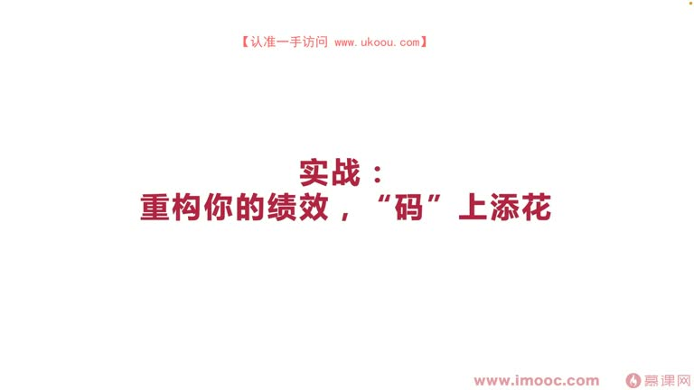
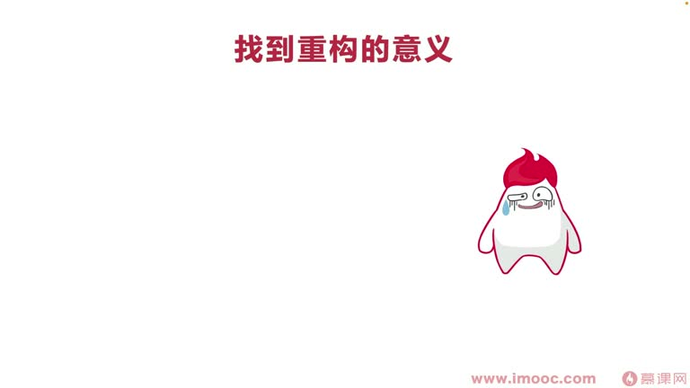
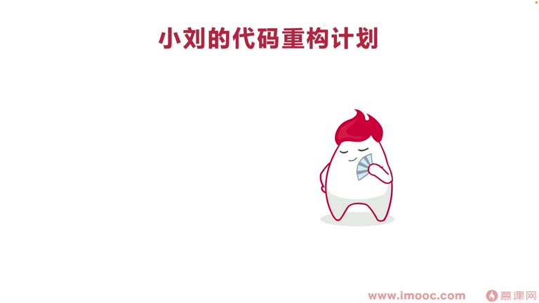
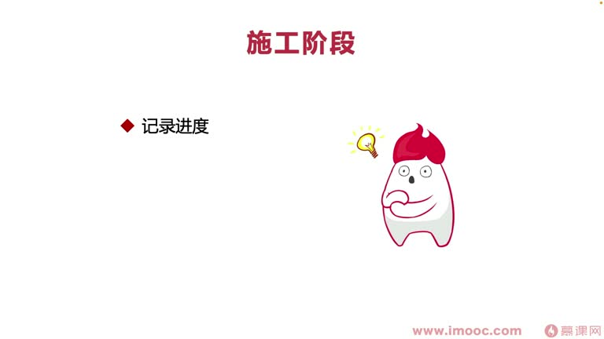
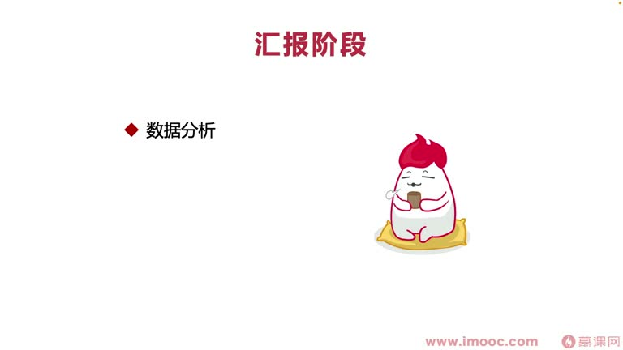
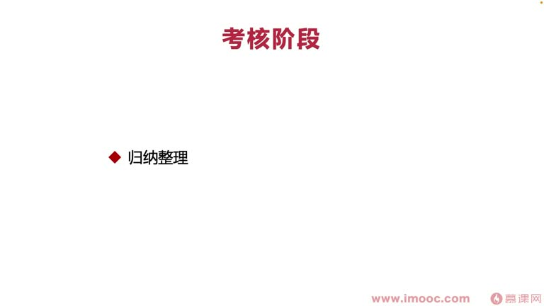
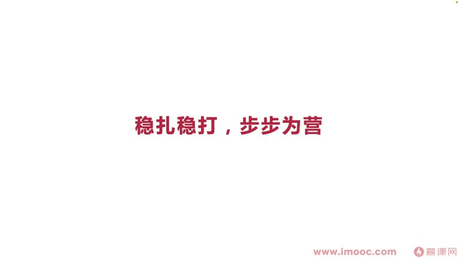

# 5-6 实战:重构你的绩效,"码"上添花

> 来源视频:第5章 / 5-6实战：重构你的绩效，&ldquo_码&rdquo_上添花@优库it资源网www.ukoou.com.mp4
> 转写方式:本地 Whiper(small 模型)语音转写,已人工校对("技效/迹效"→绩效、"成构"→重构、"习文"→檄文、"陈林骂操"→陈琳骂曹操、"元少"→袁绍、"PBT"→PPT 等

## 本节要解决的问题

这一节课围绕“实战:重构你的绩效,"码"上添花”展开。先别急着记结论，大家可以带着一个问题来听：**这件事为什么会影响我们的绩效，以及我能不能把它用到自己的工作里？**
## 本课定位

技术同学想找一个"恒定不变"的能力,不是业务过程中实施的能力(业务沉淀很难带到新公司),而要关注**架构思想**——更多时候通过**代码重构**才能沉淀出可以带走的技能。本节是**实战课**:通过一个案例看如何"重构你的绩效,马上添花"。

## 回顾:代码重构三个阶段的要点

- **重构前(三个看清)**:看清绩效考核结构、看清领导态度、看清公司环境——要锻炼一双"火眼金睛"
- **重构中(三个保证)**:保证质量(保质保量)、保证资源(不影响人力投入)、保证创新(与众不同,否则无法产生区分度,领导觉得表现平平)
- **重构后(三个挂钩)**:
  1. 与**数据**挂钩:加入性能优化、业务逻辑优化,让数据表现产生变化,领导才觉得重构对业务有增长、能向上级交代
  2. 与**质量**挂钩(最容易):周期内总结重构后对项目质量的改变
  3. 与**资源**挂钩:重构后开发同样需求节省的资源

## 实战案例:小刘的代码重构计划

> 这是李老师在职场中真实看到的同事进行的代码重构计划。小刘身在大厂,通过代码重构计划**一步一步面向绩效编程**,拿到出彩的绩效成绩。

小刘的代码重构计划分**三个阶段**:重构前(设计)、重构中(施工)、重构后(汇报),每个阶段都注重三个要点。

### 阶段一:设计阶段(重构前)

**1. 前期调研——找到重构的意义,让重构"师出有名"**
- 像古代行军打仗前撰写檄文(如陈琳骂曹操的讨贼檄文,必须先给曹操安几个罪名"挟天子以令诸侯"才师出有名)
- 小刘发现团队**人力资源非常吃紧**——领导不可能给时间让他投入代码重构
- 小刘**牺牲业余时间**制定重构计划,核心围绕"团队人员吃紧、改善资源消耗"出发
- 另外还改善**界面渲染帧率**,提升性能相关方案
- 从这些触发点制定了一份**20 页左右的代码重构计划书**
- **建议**:计划转换成 **PPT** 形式更容易向上管理、更容易讲 idea;直接扔文档给别人看,效果远不如 PPT 讲来得直接

**2. 获得认可**
- 小刘把文档发给上级,上级转发给组内专家同学,内部碰了一下,小刘跟专家核对了一下,方案就通过了
- **获得认可就是这么简单**:因为领导觉得计划做得很充分、没有太多需要质疑的地方,小刘在领导心中也比较有认可度

### 阶段二:施工阶段(重构中)

**1. 记录施工进度**
- 上级虽然给了时间,但远远不够;上级内心也担心给小刘的资源太小、他完不成任务,所以很关心进度
- **不能等上级主动来问**,否则上级会觉得行为非常被动、对你丧失信任,给你打"向上管理不够优秀"的标签
  - 一旦被打标签,以后跳槽时**背调**也可能受影响
- 做法:适时记录进度(如一周记录一次开发百分比),**定期主动向上级汇报进度**,让上级心里有完整预期

**2. 做到三个保证(质量/资源/创新)**

**3. 谨慎自测**
- 每当开发完一个模块里的某一项具体功能,都**运行一下代码**,看能不能运行起来、有没有问题
- 如果全部施工结束后再运行,可能一下就产生十几个问题,改一个问题又产生一个新问题——问题集中暴露会呈现"熵增"混乱,改 Bug 像"打地鼠"一样打不完,质量难看
- 实战要点:**多运行代码,让每个问题尽早暴露,不要集中暴露**

### 阶段三:汇报阶段(重构后)

**1. 完善数据分析**
- 代码重构结束后过了一个迭代再进行汇报
- 这个迭代鼓励产品同学提了一个新需求,评估出**节省了三人天**(重构带来人力资源节省)
- 通过数据可以看到**帧率的提升、页面加载时间的降低**——直接的数据变化

**2. 完善文档(两类)**
- 代码重构业务展现给其他同学的文档
- 代码重构给上级汇报展示的 **PPT**
- 让别人的认可度、评价更好;完善 PPT 后领导对重构内容有完整预期
- **在 PPT 中给领导"讲故事"**:产品经理做好产品要讲引人入胜的故事,做游戏要让人沉浸,做代码重构一样要编一个非常好的故事讲给别人听——"故事才能推动文明进步"

**3. 展望未来**
- 故事讲完,要**再留给大家更多憧憬**,不要让故事直接画上句号
- 否则领导会觉得代码重构只是你这个阶段的产物,不能持续给团队带来增益
- 做法:管理好领导的预期,让面向绩效编程的影响范围、辐射范围更长远
  - 例:小刘跟领导说,重构后可以承接更多需求,人力资源"结场"(节省)非常多,业务方投诉会少很多,吞吐量更高,评组织奖时还可以通过吞吐量申请"最佳团队奖"
  - 领导会觉得:原来这个代码重构能辐射这么长远,认可度更高

### 考核阶段:突出代码重构的价值
- **归纳整理**:把代码重构的工作整理出来几句话(汇报阶段文档已做了部分)
- **提炼要点**:整理后找出最高亮点,**加粗、标红**,尤其是数据相关的,表现在绩效考核表格中,让 HR 和领导一目了然、回想起来
- **表达预期**:
  - 大公司绩效考核常有"考核自评"项,在自评中对这项工作打出**比较高的分数**——领导就明白你有这个预期
  - 绩效考核沟通/谈话时,可以表达想晋升、想对薪资有提升有要求
  - 从更"伟岸"的角度表达预期,领导觉得你确实对这方面工作有自信,也会考虑帮助你完成预期

## 本课总结

小刘在代码重构阶段做到了什么、实战中要做什么,总结成一句话:**稳扎稳打,步步为赢**。希望大家在工作中代码重构时,辛苦劳作之后能拿到令自己满意的成绩。

## 整理者补充：可以马上做什么

这部分不是老师原话，是为了方便复习而加的行动提示：

1. 回到正文，圈出一个与你当前工作最相关的观点。
2. 用这个观点检查最近一次项目、汇报或绩效记录，找出一个可以改进的地方。
3. 把改进动作写成一句具体的话，并安排在今天或本绩效周期内完成。
