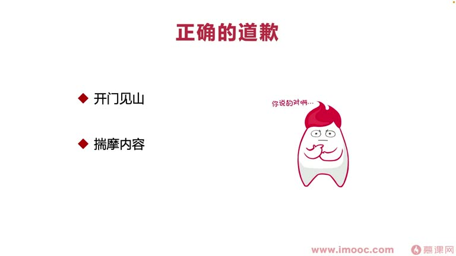

# 6-1 道歉可以降低突发事故的负面效应,这里的门道你知道多少?

> 来源视频:第6章 / 6-1道歉可以降低突发事故的负面效应，这里的门道你知道多少？.mp4
> 转写方式:本地 Whisper(small 模型)语音转写,已人工校对("继效/机销"→绩效、"切提"→切入、"华人道"→华容道、"斩首失重"→斩首示众、"副盘"→复盘、"铺朔迷礼"→扑朔迷离、"开门建山"→开门见山、"爽而好"→数一数二 等

## 本节要解决的问题

这一节课围绕“道歉可以降低突发事故的负面效应,这里的门道你知道多少?”展开。先别急着记结论，大家可以带着一个问题来听：**这件事为什么会影响我们的绩效，以及我能不能把它用到自己的工作里？**
## 本课定位

从本章起,讨论话题是**"可进可退,为你的绩效上保险"**,几节课都围绕**风险控制**:在绩效考核周期内进行风险控制,让绩效结果可进可退。

- 例:绩效考核周期内犯了线上故障,肯定影响绩效;按传统做法忽视故障,最后绩效结果不理想
- 本课通过几个经典案例,分析在绩效考核周期内遇到问题(线上事故、绩效表填写等),如何**不让这些因素影响最终绩效结果**或产生负面影响

## 本课关键词

1. **道歉**:有一本书《你为什么不道歉》,详细讲解什么样的道歉是错误的、什么样是正确的,以及遇到问题为什么要道歉、为什么不好意思道歉
   - 针对我们造成的一些失误**真诚道歉,反而会抵消失误的影响**,不仅如此,还会让别人**特别佩服你**
2. **突发事故**:工作中基本上大部分同学都会遇到自己造成突发事故的情况
3. **负面效应**:造成突发事故,按公司规定基本都会导致拿到不好的绩效

## 历史案例:关羽华容道放曹操

- 三国演义中,关羽在华容道放走曹操,他立了军令状,犯了罪过,回去要被斩首示众
- 为什么关羽最后没被斩首?因为**刘备和所有关羽的同事都帮他"倒了个歉"(求情)**
- 大家也知道这是演戏,诸葛亮为了"得到一些信服"才这么做
- **这些历史场景也可以应用在现实的职场之中**

## 实战案例:小周引发的线上事故

- 小周同学在与第三方合作对接中,第三方提供 SDK 由小周接入
- SDK 文档没研读清楚,**漏用了一个 API**
- 测试同学只覆盖十几个机型;安卓碎片化严重,小周(安卓开发)漏掉的 API 在一种机型上没覆盖到测试
- 结果上线产生大量崩溃,造成**很多用户无法进入 APP**的恶劣影响
- 对小周领导、部门带来非常大影响,基本"人尽皆知"

### 小周的正确挽救(三步)
1. **第一步:马上跟同事配合,解决了问题**
   - 解决后,马上向领导说明相关原因,并向领导道歉
   - 对比:制造这么大线上事故,如果不向领导道歉能躲过这一劫吗?
     - 假设躲过(领导假装没发生):周围同事会窃窃私语、指责他,大家心里难接受,小周也心虚,总觉得有不好的事要发生
     - 如果没躲过:领导当面批评,让小周在同事中下不来台
   - **主动向领导道歉,是掌握了"先发之机",做得非常好的一点**
2. **第二步:发内部复盘邮件**
   - 只向领导道歉不够,还发了内部复盘邮件,**向整个组的同学道歉**
   - 因为小周写出线上事故,整个组的绩效系数都会受影响:绩效考核时,组里分配到的"绩效好"的名额会减少,组里同学都会怨恨小周
   - **一个及时诚恳的内部复盘邮件,是小周的"润滑剂"**,让他在组内更顺畅
3. **结果:绩效考核时,小周竟然拿到了"优秀"的绩效(组里属一属二的)**
   - 这是李老师职场中的真实案例

## 错误的道歉模式(三种)

1. **逃避责任式**:道歉像在安慰领导("我知道你心情不好,对不起让你心烦了"),没有让领导看到自己认识到问题——好像是小周去安慰领导,而不是道歉,错误
2. **讨价还价式**:("我知道没做好,但你一定会原谅我吧,毕竟后面还要一起做很多事情")——好像威胁领导,让领导必须原谅你,连领导自己选择的权利都没有
3. **扑朔迷离式**:左说一句右说一句,道歉内容模糊不清,没承认错误、没说问题是自己导致的,让领导迷惑

## 正确的道歉模式

1. **开门见山**:直接向领导承认错误
   - "对不起领导,我写了一个线上事故,这是我的责任。是因为我接入第三方 SDK 时对文档研读不清晰,是我自己的疏忽,导致团队承受了这么大损失,也导致你们遭受组内非议。这些都是我做得非常不好的地方。"
   - 领导的反应:
     - 有政治头脑的领导:摇摇头说"没有没有,你想多了,没那么严重"
     - 比较钻牛角尖/小气的领导:"哎呀你自己还知道啊,你真是太让我失望了"
2. **揣摩内容**(不气馁,进一步揣摩):
   - 政治手腕高的领导说"没事没事",你一定要**把这种话接住**:不能真觉得没事了,要说出一些**保障**,让领导心里听起来开心一点(如"后续一定做好这块工作,弥补造成的损失")——领导说没事其实只是为了安慰你
   - 遇到小气的领导说"你还知道啊":**更要再道歉一次**,并承诺给领导一个进一步的 **action**(如"后续在组内做复盘,一定会正确对待"),让领导看到你的诚意——你表态了,领导也不会再为难你
3. **选择正确的方式**:
   - 道歉要给领导**自己的选择权**(不是强迫领导原谅,而是领导自己有选择权才可能真正原谅)
   - 不能方式不对:产生这么大的问题,还摆宴席像庆功宴一样拉领导吃席,或包红包、送贿赂——会让领导觉得你在**挽救自己的工资、前途、绩效成绩**
   - **道歉的出发点要换位思考**:让领导觉得你道歉是因为**觉得自己对不起领导、让领导承受了不必要的损失**
   - 虽然实际做法与出发点不完全一样(表里不一),但这样**才能真正起到效果**:抵消失误/事故产生的负面效应,做风险控制

## 本课总结

职场中真正产生失误、事故时,要学会**正确道歉来挽救自己受到的损失**:开门见山承认错误 + 揣摩领导话语 + 选择正确方式(给领导选择权、换位思考),用道歉做好绩效的"风险控制"。

## 整理者补充：可以马上做什么

这部分不是老师原话，是为了方便复习而加的行动提示：

1. 回到正文，圈出一个与你当前工作最相关的观点。
2. 用这个观点检查最近一次项目、汇报或绩效记录，找出一个可以改进的地方。
3. 把改进动作写成一句具体的话，并安排在今天或本绩效周期内完成。
