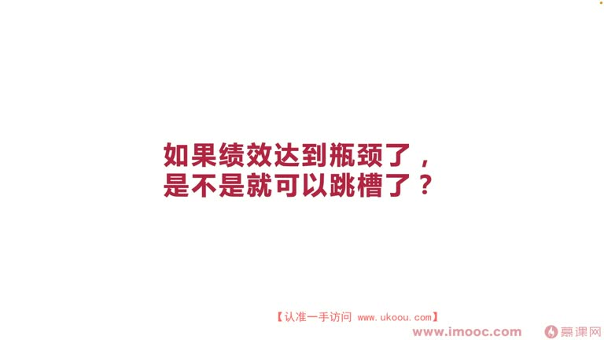
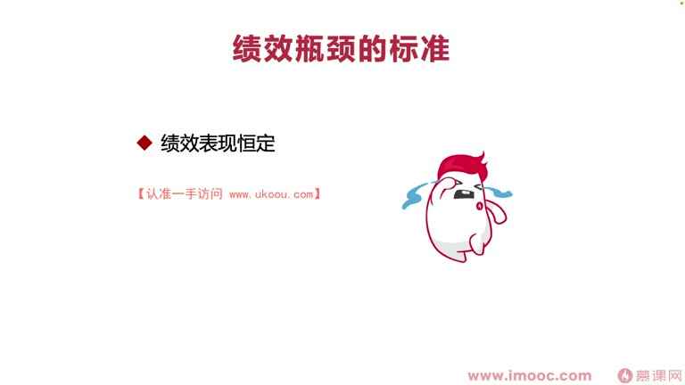
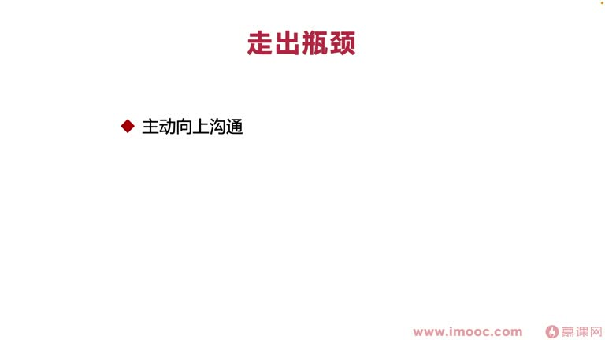
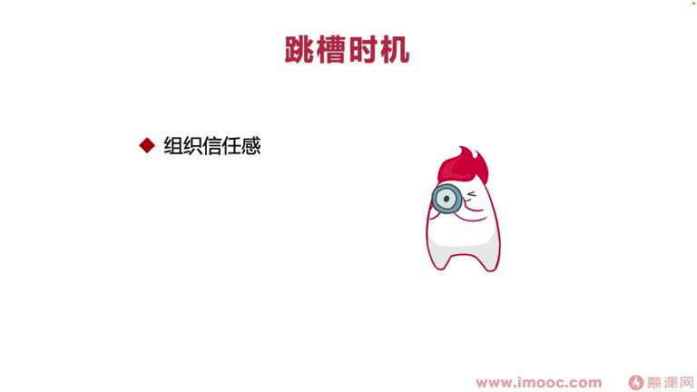
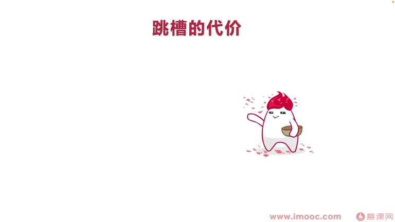
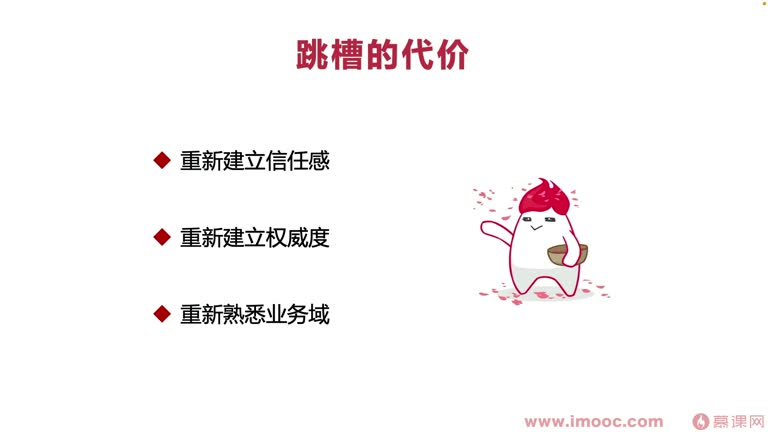

# 6-2 如果绩效达到瓶颈了,是不是就可以跳槽了?

> 来源视频:第6章 / 6-2如果绩效达到瓶颈了，是不是就可以跳槽了？.mp4
> 转写方式:本地 Whisper(small 模型)语音转写,已人工校对("技校/迹效"→绩效、"平静"→瓶颈、"同训"→腾讯、"寄生"→晋升、"掌心"→涨薪、"全衡力弊"→权衡利弊 等

## 本节要解决的问题

这一节课围绕“如果绩效达到瓶颈了,是不是就可以跳槽了?”展开。先别急着记结论，大家可以带着一个问题来听：**这件事为什么会影响我们的绩效，以及我能不能把它用到自己的工作里？**
## 本课定位

每个同学在职场中都会遇到"跳槽"这个关键词,有非常多的理由影响跳槽:
- 在一家公司伤心了、觉得不值得(大厂如阿里、腾讯、百度,以 80/90 后偏多)
- 薪资/绩效/晋升空间达到**瓶颈**,觉得没有发展空间、精神(晋升)不上去
- 对现在的工作内容没兴趣,提不起精神,想换更好的雇主或更感兴趣的赛道
- 搬家、各种生活变故

> 跳槽理由千千万万,但一定要**正确地评估现在是不是一个好的跳槽时机**。本课讨论:**如果因为绩效/薪资/晋升空间达到瓶颈,跳槽前应该注意什么、如何衡量。**

## 一、给"绩效瓶颈"一个明确的标准

### 情况一:绩效表现"恒定"(每次都是优秀)
- 有的同学说"每次绩效都是优秀,没什么提升空间了,挺没意思",喜欢"坐过山车"一样绩效有起起伏伏、有表现张力的感觉
- **这种不算绩效瓶颈**。这类同学其实是组织内**特别受领导信任**的同学
  - 每次拿优秀不一定说明工作做得非常好(前面课程讲过):可能因为你是领导心中**认可度高、规划内、期盼内、值得信任**的员工
- **应该怎么做**:更多应该在组织内部**晋升到更高的岗位、承担更高的职责**,而不是跳槽换公司

### 情况二:每次绩效都不理想
- 每次拿成绩都不是特别好,怎么努力都无法让领导给更好的绩效
- 绩效考核范围内有个关键词:**你和你的主管不适配**
- 这种可界定为绩效瓶颈:总是拿不到理想绩效,每次"及格、不及格"循环,总也拿不到优秀,觉得没有动力

### 情况三:对团队丧失兴趣
- 在团队内没有工作的欲望,拿到的绩效也不理想——可界定为"在这个团队已经达到绩效瓶颈"

## 二、跳槽的最大损失:信任成本

- 跳槽可能带来薪资增长、岗位提升,但**影响最大的是增加一个"信任成本"**
- **什么是信任成本**:
  - 现在团队中,你跟主管已合作两三年,主管对你更信任:一起承担项目时你说的话主管会选择信任,并在短期内给你好成绩鼓励你
  - 换到新公司,跟新主管合作时,**新主管更倾向于信老员工,而不是新员工**
  - 评估绩效考核时,新主管更愿意把天平倾向**老员工、更信任、更宠爱的员工**,新员工很难拿到好绩效
- **特殊情况:老东家领导离职、换新领导**——是不是也增加了信任成本、不如跳槽?
  - 这确实潜在增加信任成本,但**跟跳槽很不一样**:
    - 跳槽换新团队,竞争的是很多**已得到领导信任的老员工**,你在老员工面前会**丧失权威**
    - 在原公司换领导,对新领导来说**你们都是"新员工",没有老员工概念**,大家信任成本一样,你信任成本的丧失没有跳槽那么多
- **结论**:选择跳槽时,一定要非常重视**信任成本**这一点(对跳槽影响最大),**轻易最好选择不要跳槽**

## 三、如何走出绩效瓶颈(三点)

1. **主动向上沟通**:跟领导沟通,看看是不是**两个人的预期没有对齐**
   - 例:领导希望往 A 方向使劲,你却一直往 B 方向发力(因为对 B 更感兴趣),发力方向无法影响领导 A 方向的绩效成绩,领导就一直让你的绩效产生瓶颈
2. **明确工作规划**:跟领导沟通,看工作路线是否不够清晰、无法让领导觉得很清晰
   - 否则领导每次考核时记不清你到底干了哪些工作,很难给你满意的绩效成绩
3. **侧面出击**:如果真觉得绩效没办法努力了、真想跳槽,可以侧面出击
   - 很多公司的**绩效与晋升、涨薪并不挂钩**:领导为了平摊利益,会"给一些同学好绩效、给另一些同学晋升、再给另一部分同学涨薪",达到利益分配平衡
   - 如果公司是这样,可以努力往**涨薪、晋升**这两个方向尝试,**弥补绩效的损失**

## 四、合理跳槽的时机(三点)

1. **低组织信任感**:在这个组织内真的得不到信任感
   - 跟领导不适配、跟团队同事不适配、大家不善于与我合作、领导不放心交事、我也不喜欢领导——组织信任感出现危机,换到新公司或许是一个**更好的开始**
2. **工作"机器"(业务)不对口**:对所在业务不感兴趣
   - 例:公司做广告业务,自己天生对广告不感兴趣甚至有心理阴影;来公司是冲着名气、不是冲着业务,运气不好被分到不感兴趣的业务
   - 可以考虑跳槽换更好的雇主、选择更感兴趣的赛道——但**跳槽成本高,需要有明确方向去跳**
3. **更好的雇主**:找到更好的公司(涨薪 50%,或公司特别有前景,而当前公司"每日裁员、日落西山")
   - 把握机会选择更好的雇主,让自己更有生活干劲,打开更多工作机会

## 五、跳槽需要付出的代价(重新建立三样东西)

1. **重新建立信任感**:更多指你与主管之间的信任感
   - 原公司向上管理做得很充分、不需要花那么多时间;新公司需要**投入更多成本重新做向上管理**
2. **重新建立权威度**(内部+外部):
   - 新公司大家不认识你;原公司周围人都认识你,与产品经理/跨部门合作时,别人会打听你,口碑好就建立权威度,合作如打"润滑剂"顺畅
   - 新公司大家不了解你,很难有权威度:跨部门合作时大家做事不积极,说的话被当没看见、被忽略,合作中**存在感非常低**
3. **重新熟悉自己的业务域**:
   - 跳槽很大程度上放弃原先所属的业务赛道(如金融:基金→股票;软件开发:广告→视频业务)
   - 会增加比较大的**学习成本**,需要花很长时间熟悉新业务

## 本课总结

跳槽前要**权衡利弊、三思而后行**:
- 明确是不是真"绩效瓶颈"(每次都优秀≠瓶颈,反而该内部晋升)
- 重视跳槽最大的损失——**信任成本**
- 先尝试走出瓶颈(向上沟通、明确规划、侧面出击)
- 合理跳槽时机:低组织信任感、业务不对口、更好的雇主
- 清楚跳槽要重新建立**信任感、权威度、业务域**三大代价

## 整理者补充：可以马上做什么

这部分不是老师原话，是为了方便复习而加的行动提示：

1. 回到正文，圈出一个与你当前工作最相关的观点。
2. 用这个观点检查最近一次项目、汇报或绩效记录，找出一个可以改进的地方。
3. 把改进动作写成一句具体的话，并安排在今天或本绩效周期内完成。
