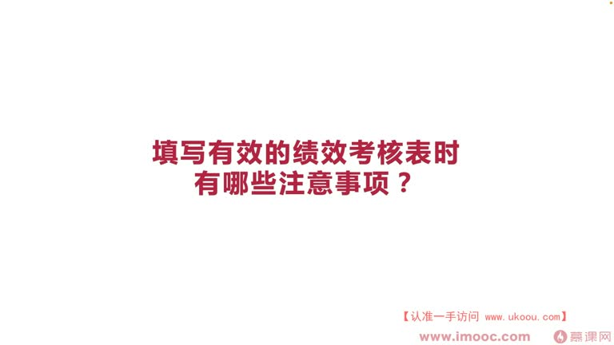
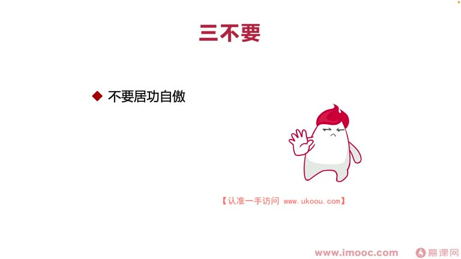
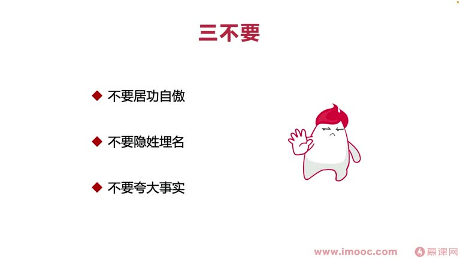
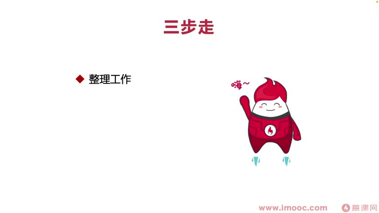
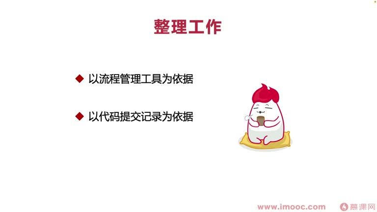
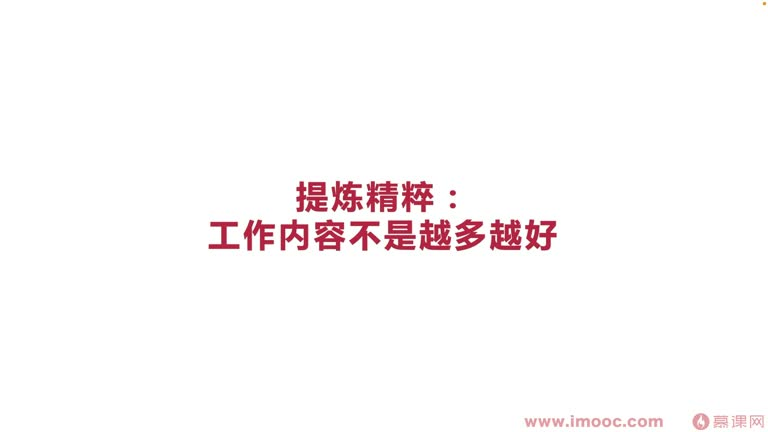

# 6-3 填写有效的绩效考核表时有哪些注意事项

> 来源视频:第6章 / 6-3填写有效的绩效考核表时有哪些注意事项.mp4
> 转写方式:本地 Whisper(small 模型)语音转写,已人工校对("机销/计效/极效"→绩效、"鞠躬自傲"→居功自傲、"隐性埋名"→隐姓埋名、"体链精粹"→提炼精华、"缠道/基隆"→禅道/Jira 等

## 本节要解决的问题

这一节课围绕“填写有效的绩效考核表时有哪些注意事项”展开。先别急着记结论，大家可以带着一个问题来听：**这件事为什么会影响我们的绩效，以及我能不能把它用到自己的工作里？**
## 本课定位

探讨在**绩效考核尾声填写绩效考核表**时,有哪些需要注意的事情和技巧。通过技巧可以"师出有名"(事半功倍),更科学、有针对性地填写绩效表,**让领导觉得你的出发点是从他的视角着想的**,最后给一个满意的成绩。

## 一、错误 case:三不要

### 不要一:居功自傲
- 写绩效表时,一定不要说"某一件事情都是通过我们的努力而达到的"
- 确实有一部分自己的努力,但很多时候还是**借助团队合作**——职场中更多时候依赖团队合作
- 不要把大部分事情归功于自己,**多提一提团队相关的事情**

### 不要二:隐姓埋名
- 有的同事到了绩效考核周期就喜欢"隐姓埋名":一个周期做了非常多事情,绩效表就写几行、特别简单
- 问他们为什么不多写,回答:"我不用写到绩效表,因为我做的事情领导心里都有数"
- **误区**:领导考核评估时一个人面对那么多同事,你自己填表时都想不起来做过的事,领导怎么可能全想起来?
- **一定要帮自己的领导做好整理工作**,让他看到能"拉起回忆"
- 否则领导看到你写寥寥几个字,会觉得你做事情**浮躁草率、浮浅**,很难想起你的成绩
- 你自己都不提"丰功伟绩",领导反而会想"是不是我太重视了,他自己都觉得不算什么好成绩"——领导怎么会给你好绩效?

### 不要三:夸大事实
- 例:版本做了性能优化,页面加载时长缩短 300 毫秒,为了拿好绩效写 600 毫秒
- **领导基本上都不是傻子**:如果存疑,会找其他同事核对
- 一旦发现你夸大事实,就会产生**信任危机**
- 很像面试场景:领导抛出一个问题,你胡乱回复,而领导恰好知道答案——领导会觉得你这个人不可用,以后交任务都可能随便编理由上报,公司容易出事故、耽误大家绩效

## 二、正确做法:三步走

### 第一步:整理工作
- 绩效考核周期比较长(一个季度、半年、甚至一年,也有年度考核、季度考核)
- 通过**工具**整理这一阶段做了什么样的工作,全部回忆起来
- 不存在"整理清楚后随便写几行字让领导回忆"的可能——这么做的人,**绩效成绩没有一个是好的**(虽然做的活很多,却不如不加班、没怎么做活的同学绩效好)
- **整理工作技巧**(三种依据):
  1. **流程管理工具**:禅道、Jira 等有导出功能,以周期为维度把所做工作筛选出来,全选导出成表格,再做数据分析,归类到绩效表中
  2. **代码提交记录**:以 git 记录为依据,做半年绩效时翻出半年的代码提交记录,把 git log 作为整理内容,从中提炼精髓
  3. **工作过程笔记**:以工作过程笔记为依据,留下文档,从文档里提炼工作精华

### 第二步:提炼精华
- 整理了 50 项工作,不可能全写进绩效表
- **最好总结出三条工作**放进绩效表,让领导一看就知道这三条工作影响很大
- 其他工作怎么呈现?用**数字表示**:
  - 例:大学拿到 76 项比赛证书,不全部展示到简历,但不想浪费成绩——在简历里列一列内容:国家级证书 12 项、省级证书 30 项、校级证书多少项,让面试官心里有数
  - 这些数字都**需要真实**,让领导想 check 时可以随时 check
  - 也可以把百度网盘链接贴上去,把超链接加到数字上,链接可直接打开看工作内容
  - 注意涉及脱敏,以及公司是否允许传百度网盘等

### 第三步:突出重点
- 三项工作里,每一项对应很多小节(6-7 个小项目列表),涵盖做这项工作的内容
- 这些内容需要**加粗标红**,让领导看起来一目了然(目了),知道工作内容做了什么
- **目的:帮领导省力**——领导评估时要看很多同事的考核表,内心一定是崩溃的;你突出重点帮他省力,他内心一定会感谢你

## 本课总结

填写绩效表要做到:
- **三不要**:不要居功自傲、不要隐姓埋名、不要夸大事实
- **三步走**:整理工作(用工具/代码记录/笔记)→ 提炼精华(三条核心+数字量化)→ 突出重点(加粗标红帮领导省力)

核心出发点:**从领导的视角着想**,让领导轻松看到你的价值,从而获得满意的绩效成绩。

## 整理者补充：可以马上做什么

这部分不是老师原话，是为了方便复习而加的行动提示：

1. 回到正文，圈出一个与你当前工作最相关的观点。
2. 用这个观点检查最近一次项目、汇报或绩效记录，找出一个可以改进的地方。
3. 把改进动作写成一句具体的话，并安排在今天或本绩效周期内完成。
