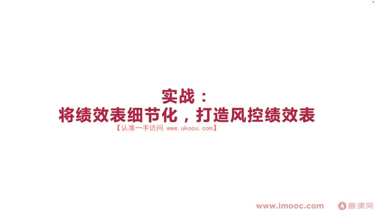
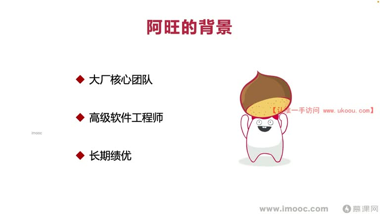
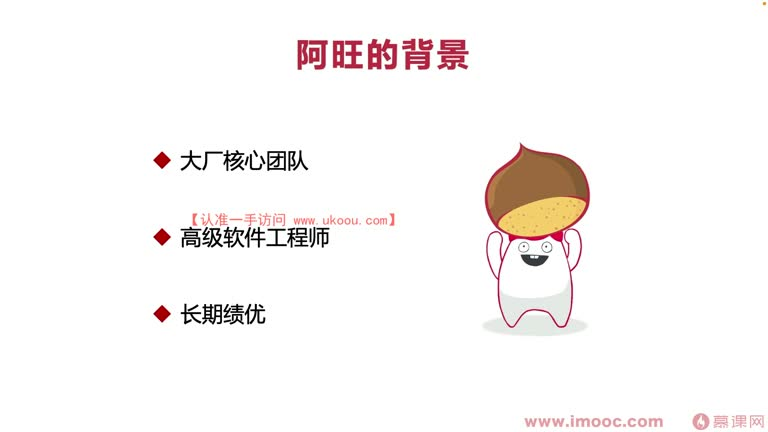
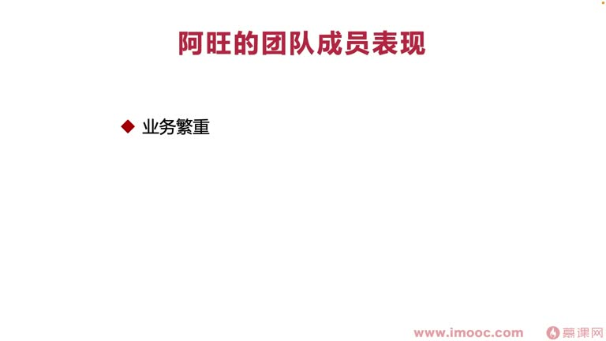
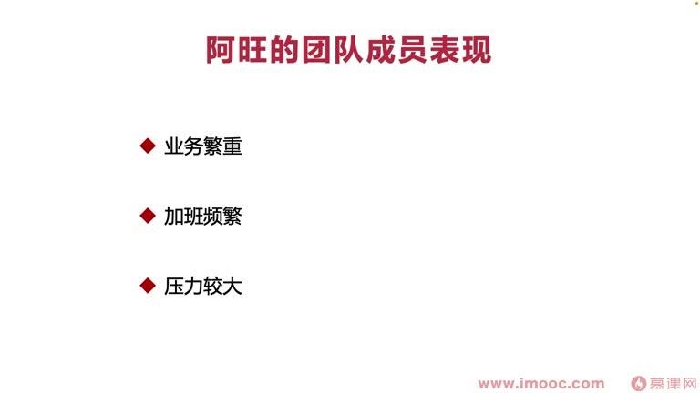
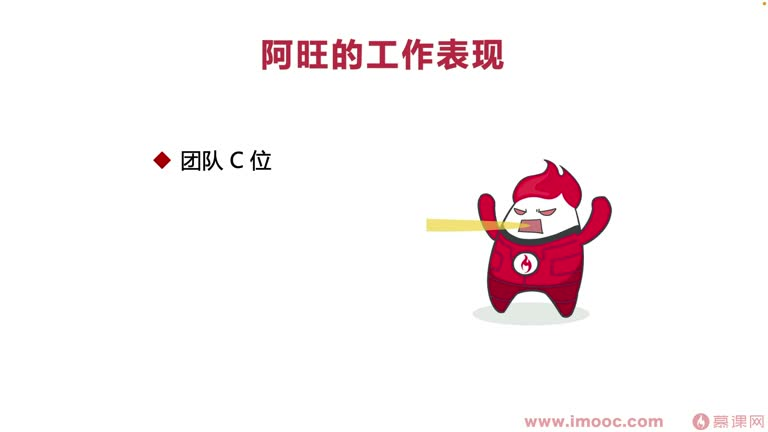
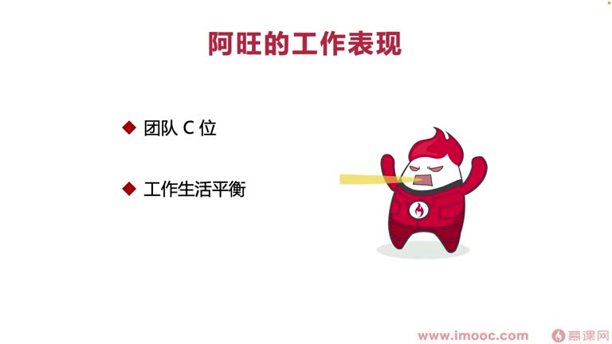
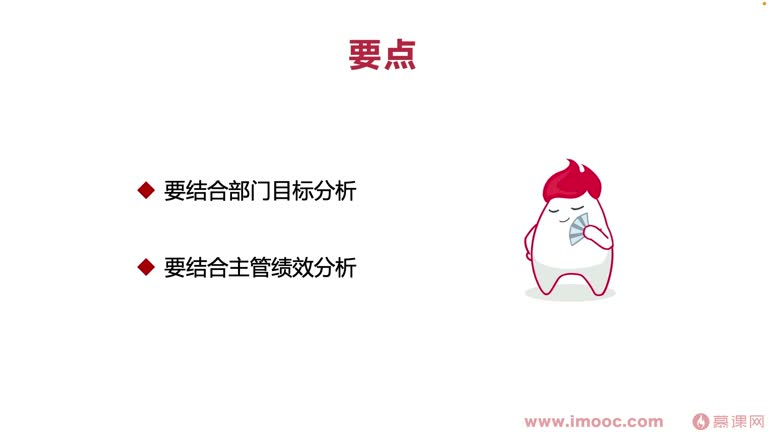

# 6-4 实战:将绩效表细节化,打造风控绩效表

> 来源视频:第6章 / 6-4实战：将绩效表细节化，打造风控绩效表.mp4
> 转写方式:本地 Whisper(small 模型)语音转写,已人工校对("计校和表/技巧表"→绩效考核表、"阿旺"→阿旺、"同类CV"→团队核心(CV=关键人物)、"G-ROD"→Jira、"exile/style"→Excel、"sha"→HR、SH、华文新魏 等

## 本节要解决的问题

这一节课围绕“实战:将绩效表细节化,打造风控绩效表”展开。先别急着记结论，大家可以带着一个问题来听：**这件事为什么会影响我们的绩效，以及我能不能把它用到自己的工作里？**
## 本课定位

上一课讲了填绩效考核表可能产生的问题和李老师总结的"三步走"。本课通过一个**真实的 case**(李老师身边的同事),看他如何通过绩效考核表拿到优秀的绩效成绩。

**什么是"风控绩效考核表"?** 换句话说,通过绩效考核表可以让我们**可进可退**——比如这一阶段自己造成了一个线上事故,通过绩效表**巧妙弥补这个事故造成的影响**。

## 一、案例主人公:阿旺

### 背景身份
- 任职于**大厂的核心技术团队**,是**高级软件工程师**
- 长期获得优秀的绩效成绩(计优的迹象)
- 每次绩效考核表都做得非常与众不同,总能跟大家拉开很大差距
- 持续让领导对阿旺**刮目相看**
- 但相比来说,阿旺在团队中**努力程度并没有那么高**,但总能**把实践(时间)抓精准**

### 绩效表为什么重要(背景原因)
- 大厂中,领导给绩效表打完分,表格还需要**拿到 HR 那边去过审**
- HR 要看领导分配的名额合不合理:如果人业绩平平却拿好绩效,**HR 可能把成绩驳回**,浪费名额
- 领导本来想给优秀,但发现绩效表写得很平常,给 HR 看一定拿不到理想成绩
- **领导会"测二球气"(权衡)选择更稳妥的方案,让阿旺拿优秀的绩效成绩**

### 阿旺所在团队的特点
- 业务繁重、对接业务方多、负责核心业务线、每个人做了非常多事情,绩效考核方面**很难拉开差距**
- 团队整体**加班非常频繁**(核心位置、对接团队多、项目质量要求高),压力大 → 幸福感降低
- 高压下如果绩效又不理想,在团队很难待下去
- **启示**:在这种团队一定要做好绩效考核工作、做好面向绩效编程,**在绩效考核表上充分发力,别让自己的付出东流**

## 二、阿旺的工作表现(三类亮点)

### 1. 成为团队"核心"(同类 CV)
- 刚开始阿旺不是核心,但每次绩效考核表做得非常出彩、拉开差距
- 领导非常信任阿旺,慢慢把阿旺转移到团队核心位置
- 逻辑:阿旺每次拿好绩效,领导觉得阿旺一定喜欢团队、喜欢领导(利益都给他了),阿旺就要付出更多、表现更多——于是阿旺成为团队核心,这是**领导促成的**

### 2. 工作生活平衡
- 团队成员业务繁重、加班频繁,阿旺却能工作生活平衡
- 因为阿旺发现大家写的绩效表都很潦草、没表现真实工作水平、没突出重点
- 阿旺的做法:工作中堆积五六件事,但绩效表上**只呈现三件事**——把这三件事抓住做好
- 其他事情只要完成、成功完成即可,**不用投入太多精力**;把更多精力投入**能体现在绩效考核表上的工作**
- 渐渐把边边角角、不必操心的细节**推掉**
- 有人觉得这功利,但**这才是绩效考核竞争时的一个自我的技巧**

### 3. 有额外产出(摆脱"工具人")
- 把边角事推掉,更多精力集中在三件重点事上
- 对比多数同学:每来一件事马上进入"防御状态"完成,不思考"这个活能不能给自己产生绩效、带来什么价值"——像**工具人**
- 阿旺**剥离了工具人状态**,工作中已经**在为自己服务**,为自己争取工作和生活状态的平衡,并拿到好绩效

## 三、阿旺的"三步走"实践

### 第一步:整理工作(确定周期 + 导出信息)
- **确定周期**:绩效周期从哪天到哪天(半年维度:3.1-9.1 或 1.1-7.1)
- **项目管理系统**:阿旺团队用 Jira(语音识别"G-ROD"),周期内框出自己作为参与者/完成者/施工者的任务,列出自己改的 bug 并分析原因(半小时到一小时搞定)
- **check git 提交内容**:避免 Jira 录入不完整,漏掉关键工作细节
- **两个要点**:
  1. **考核前做好准备**:工作中尽量把做的事录入到 Jira/项目管理系统,方便日后导出
  2. **信息导出要足够全面**:写 git log 信息时尽量便于阅读、写得全面,包含这次提交里的每一项工作

> 为什么强调全面?因为绩效表只需呈现三件"大象"(大项)工作,如半年做了 15 条"流量换端体验优化"相关的事,绩效表上列成一个大项"流量换端体验优化"(而不是"谷歌渠道的换端体验优化"小项)。大项下挂 4-5 个相关小项。整理工作既为了**体现重点**,也为了把**零碎的关键点**放进大块的三个重点中呈现。

### 第二步:提炼精华(体验工作)
1. **导出信息 + Excel 数据分析(以数字为维度)**
   - 例:半年做 50 项功能优化,其中 15 项 UI 优化,3 项自己创新提出的优化方案;产生的 bug 只有 20 个、bug 率低、修复快、基本无 P0/阻碍性 bug → 测试人员评价好
   - 说明工作**有质有量**
2. **统计整体数据(全面维度)**
   - 为每个要点整理所涉及的细节项的整体情况
   - 数字放在绩效表里**具有"爆炸力"**:如参与搜索项目,项目每周开周会,总共开了 40 场周会——既有时间占用,也增加与跨部门团队的信任感
   - 用数字形式呈现,给领导**爆炸力、冲击力**,让领导为数字而震撼
3. **认定三个重点**
   - **结合部门的目标去分析 + 结合主管的绩效去分析**(这两点是针对"怎么确定三个重点")
     - 做了 50 项工作,并不一定都为我们的绩效服务:很多是别的团队提出、落在我们团队职责内的"工具人"角色工作
     - **工具人角色工作不能作为重点体现**,而应作为"保质保量、突出工作能力"的部分体现
     - 绩效表要突出的重点,需要看**领导公开的绩效标准是什么**(他这阶段在为哪些东西努力)
     - 公司没公开领导绩效信息时,**向上管理**:主动找领导谈话,问领导的绩效是什么、更重视哪块任务
     - **时机**:一定要在写绩效表**前期**就做;已经填表时再问,领导会觉得你"投机取巧、很功利"
     - 呈现要点**以领导的绩效/部门目标为中心**

### 第三步:突出重点(装修工作)
1. **风格统一**:有的同事绩效表字体有大有小、宋体变华文新魏、装饰不一样、有斜体,看着粗糙、不如顺心;阿旺让风格非常统一
2. **重点加粗**:领导评绩效表要面临那么多人的表,全是普通字体、没有重点,他会"发疯";重点加粗帮领导一目了然
3. **数据标红**:领导看到数字/数据有"爆炸力、权威感";阿旺把重点标红,让领导一眼看到数字,觉得"这个人绩效表想跟别人不一样,能力也不一样,是不是我遗漏了一个人才"——领导刮目相看

## 四、风控工作(可进可退)

### 打造绩效表的两大要点
1. **从"观看者视角"出发**:排版目的不只是自己看着赏心悦目,更要**让别人方便看**——从看表人的视角出发,想方设法让他看得舒适
   - 把握不好度,可以找不相关同学帮你分析,看这个表是否舒适
2. **做到可进可退**:做了不好的事情,绩效表里一定要把这一部分内容也**"装修"一下**

### 阿旺的风控做法
1. **聪明地避开自己的失误**:
   - 做了一项工作引发线上事故,不直接写"线上事故",而写"通过某某做法,马上弥补了遇到的什么问题"
   - 为什么?① 已跟领导道过歉,领导心知肚明;② 绩效表可能要给 HR 看——如果 HR 不知道/忘记这个事故,自己又提起来,就会给自己场景(处境)带来**隐形的扣分**
2. **诚恳及时地复盘**:
   - 避开失误,领导心里会看"你没复盘"而不开心
   - 加上几句:"通过邮件公众周知了关于这件事的影响"——这是阿旺**"可退"的测试**,避免因为失误给绩效带来不好的影响

> **核心原则:聪明地正视自己的错误**——不要在绩效表中回避错误,但也不要直接说自己造成了什么事故(绩效表可能不止你一个人看)。**打造一张高情商的绩效表。**

## 五、本课总结:如何打造高情商的绩效表

1. **结合主管的绩效去分析**(绩效周期内最需要做的事):做的 50-60 项工作很多是工具人角色,要看哪些是主管最关注的
2. **从观看者视角出发**(影响装修工作):装修得更美观、更合理——不能像"沉默的羔羊"(汉尼拔的屋子)那种风格,自己看着开心,别人看觉得阴森恐怖
3. **聪明地避开自己的失误**:不能回避错误,但提错误要更聪明、更柔和,因为绩效表可能不止你或领导两个人看

> 掌握这些要点,在工作场景中**灵活运用**,为自己打造一张高情商的绩效表,一定可以**事半功倍**。

## 整理者补充：可以马上做什么

这部分不是老师原话，是为了方便复习而加的行动提示：

1. 回到正文，圈出一个与你当前工作最相关的观点。
2. 用这个观点检查最近一次项目、汇报或绩效记录，找出一个可以改进的地方。
3. 把改进动作写成一句具体的话，并安排在今天或本绩效周期内完成。
