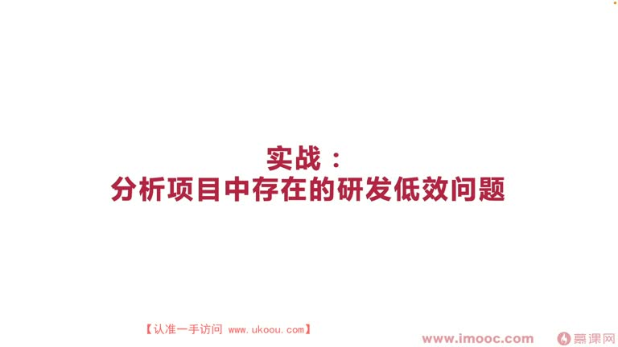
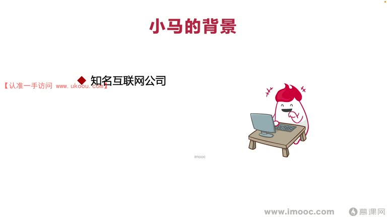
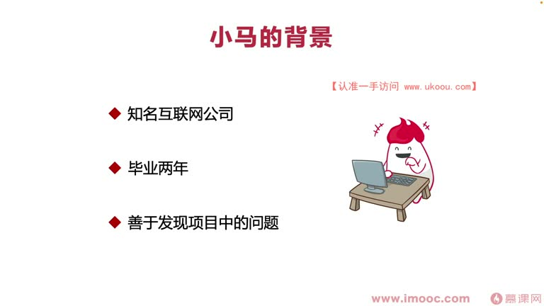
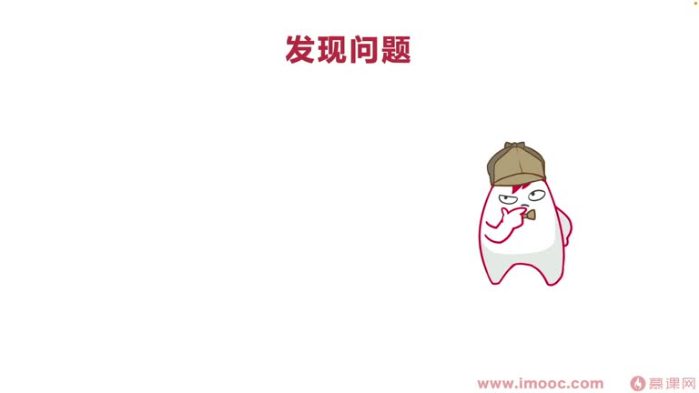
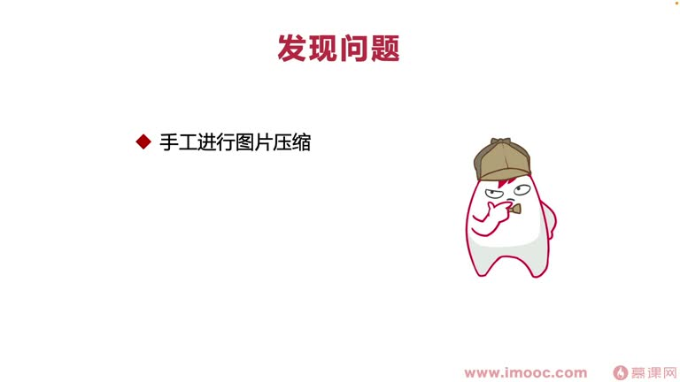
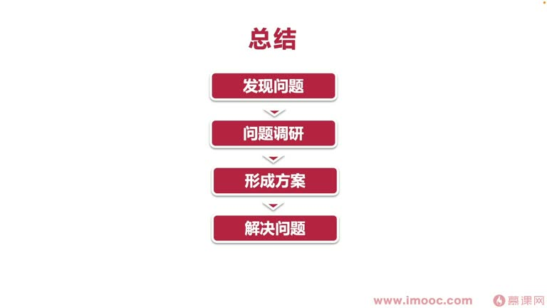

# 7-10 实战:分析项目中存在的研发低效问题

> 来源视频:第7章 / 7-10实战：分析项目中存在的研发低效问题(0-38秒杂音较多).mp4
> 转写方式:本地 Whisper(small 模型)语音转写,已人工校对("迹效/技效/极效"→绩效、"面相机就变成/面向计校编程"→面向绩效编程、"吹子/Trace/TREAS"→TRIZ、"Guitar"→GitHub、"圈奖"→宣讲、"校万元"→上万元 等
> 注:视频开头 0-38 秒杂音较多,转写可能略有影响

## 本节要解决的问题

这一节课围绕“实战:分析项目中存在的研发低效问题”展开。先别急着记结论，大家可以带着一个问题来听：**这件事为什么会影响我们的绩效，以及我能不能把它用到自己的工作里？**
## 本课定位

实战课程:结合前面讲过的问题,通过**真实的职场案例**分析**如何在团队中落实研发项目的改变**,实现面向绩效编程。课题:**分析项目中存在的研发低效问题**。

## 前置知识回顾:研发效能体系

- 分析项目研发低效问题,需要先看项目属于**绿地项目、红地项目还是黄地项目**——每种项目类型有不同的指标体系
- 先确定项目类型 → 找到所属指标体系 → 从指标体系中找到最适合自己团队的指标
- 也可以"大而全"像"企业黄页"一样全部囊括在内,定制一个计划,实现团队的研发效能体系

## 一、案例主人公:小马同学

### 背景
- 任职于一家知名的互联网公司(公司有非常多团队)
- 当时"研发效能"这个名词刚火热起来,公司里**并没有专门负责研发效能的团队**——给小马创造了机会
- **毕业两年**,对晋升、绩效非常有追求,迫切希望团队领导/同事注意和认可自己
- 提出研发效能的改变,是一个**非常大的亮点**,让别人看到他拥有新想法
- 非常**善于发现项目中的问题**,平时看到项目中可能违背常识的缺点,经常吐槽抱怨

### 关于"吐槽抱怨"的观点
- 喜欢吐槽抱怨,代表这位同学是**善于思考、有独立人格、有独立思考精神**的同学——这样才能发现团队里的问题
- 如果不抱怨、不争吵,很多时候可能代表**忽视了团队中的很多问题**,丧失了很多修改/推动团队变得更好的机会

> 基于这三点,小马非常适合在现有团队落实研发效能。

## 二、发现项目中的低效问题

小马所在团队是一个中型 App,日活大概在几百万,量级较高,代码相对"优种"(庞大),涉及很多信息;如果定期维护、加功能,代码架构整体看起来还可以,代码里涉及**很多图片资源**。

### 具体问题:主题包图片资源
- 很多公司有主题包(新年主题、初一未来主题等,B 站也有自己的主题包),主题包对应的图片资源都不一样
- 刚开始没做动态下发时,会把资源直接打进 **APK 包**里,导致 APK 包里有非常多图片资源
- 一张图片按切图标准放进去可能带来**1 兆的代码包体积增长** → 下载 APK 变慢 → 部分用户下载到一半终止 → **下载率转化非常低**(没转化成新用户)
- **优化包体积非常重要**

### 当时团队的痛点:图片压缩
- 团队每段时间都要做图片资源压缩,但**总靠手工压缩**,没有标准工具/脚本批量压缩
- 借助一个网站压缩,一次只能压缩 50 张:
  - **容易漏放**:300 张图要分 6 份,每份有交叉,容易漏掉一些图片 → 压缩时资源出问题
  - **无法保存选择**:每次压缩要选择压缩模式(压缩后更大了、跳过之类),网页无法保存上次选择,总要重新 check,人工容易出错
  - **限制多**:无法大批量压缩,网站限制每日只能压缩三次,要分好几天才能压完
- 这些问题**可以用批量工具化代替**,为小马揭示了机会

## 三、小马的解决方案流程

### 第一步:确定项目类型和指标体系
- 项目量级较大(几百万日活、很多用户)→ **中型项目**,已运行一段时间,代码和主题包多(有部分上线时间)
- 确定两个指标体系:
  1. **快速反馈**:关注代码/图片资源压缩效率,便于快速迭代
  2. **辅助决策**

### 第二步:问题调研(三个渠道)
1. **搜索引擎调研**:搜索现有市场的一些成果 App,他们的团队有主题包时怎么压缩,有无公开文章借鉴思路
2. **开源社区(GitHub)**:找到相关实现方案,"站在巨人的肩膀上",复用已有的轮子快速实现
   - **最终目标**是实现面向绩效编程,怎么快怎么来更好
3. **发明专利**:容易被忽视,但能从中找到非常多有价值的信息
   - 例:想做启动动画,可上专利库找别人的启动动画思路,进行**微调**,找到所需部分,获得灵感(不是抄袭,抄袭会面临官司)
   - 小马调研形成方案后,查专利看**有没有人用过这套方案**:用过就不能再申请专利;没人用就可以通过这套流程实现优化,申请属于自己的发明专利,推动整体绩效更上一层楼

### 第三步:形成方案(TRIZ 组合原理)
- 小马利用 **TRIZ 发明创造方法**,强调**组合原理**(像铅笔和橡皮的组合)
- 把调研出的几种图片压缩处理方案**形成一套整体流程化的模式**:
  1. 先进行**图片的筛选**
  2. 再进行**无用资源的删减**
  3. 再进行**整体图片的压缩**
- 三个方案组合到一起,把团队原本分开的步骤整合成**更完整的图片资源压缩处理框架**

### 第四步:落实解决问题
- 规划进度时间、项目"染进图"(甘特图)、整体预期
- 向领导汇报,**获得落实权限**后,分为三个阶段开发
- 每个阶段开发完**定期形成简单汇报信息**(几行字或一个文档),利于领导了解整体进度、没有拖延
- **不断自测**:不要把所有功能累积到一起测试(会像打地鼠一样);虽然全部写完一起测效率看起来更高,但无法让代码完整收敛——算上代码不收敛的成本,不如不断自测效率高
  - 自测时代码构建时间也是研发效能考量的重要指标体系,非常影响自测

### 第五步:产出报告(总结文档)
小马最终形成总结文档,包括:整个项目的原理 + 使用说明书。为什么产出总结文档:
1. **展开内部宣讲**:用文档信息形成 PPT 材料,给别人讲解怎么用
2. **方便查阅**:让别人能便捷查阅文档、知道怎么用
3. **申请专利**:申请专利需要技术交底书,小马直接用总结文档作为技术交底书申请专利
   - 通过公司专利老师获得专利申请资格,后来获得**专利公开和对应奖金(上万元)**
4. **公众号文章**:小马所在技术团队运营公众号,把创新 idea 总结后发表在公司团队的公众号上
   - **提升了团队内部影响力**,促进面向绩效编程,对个人成长有帮助

## 四、本课总结:小马实现面向绩效编程的五步法

1. **发现问题**:解决问题的前提一定是先发现问题
2. **问题调研**:从"大陆入手"(多渠道入手),不要闭门造车;看市场有没有已有信息,在已有信息上加工、做得更好,加快速度、产出更多有意义内容
3. **形成方案**:把调研输出总结,形成要落实的方案
4. **解决问题**:有方案后跟上级汇报、内部讨论,落实解决问题;过程中不断汇报、向上管理,让上级了解进度、不要产生不满
5. **产出报告**:把前面所有工作收敛起来,实现最终面向绩效编程的最重要环节——**有报告,别人才知道你这一阶段全部做了什么**,才能拿到非常好的绩效

### 案例关键成果
- 小马发现项目中研发低效问题(图片压缩)→ 确定项目类型 → 找到指标体系 → 推动实现快速反馈 → 运用 TRIZ 组合原理产生新发明 → 申请专利获上万元奖金 → 拿到非常出彩的绩效

> 如果没有这些流程,在团队中表现就会非常平均。**只有站出来发现问题、进行调研、形成方案、解决问题、产出光鲜亮丽的报告,才能让你与众不同,让领导认可你存在的价值,并不断站到更高的位置。**希望大家在团队中结合个人情况展开思考、更好落实,实现自己的面向绩效编程。

## 整理者补充：可以马上做什么

这部分不是老师原话，是为了方便复习而加的行动提示：

1. 回到正文，圈出一个与你当前工作最相关的观点。
2. 用这个观点检查最近一次项目、汇报或绩效记录，找出一个可以改进的地方。
3. 把改进动作写成一句具体的话，并安排在今天或本绩效周期内完成。
