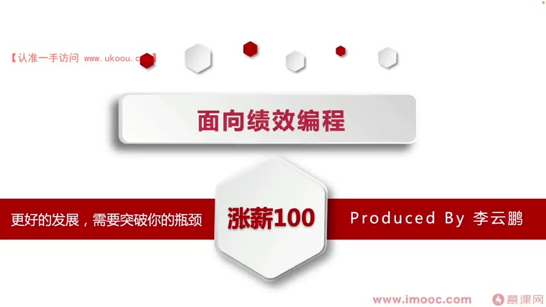
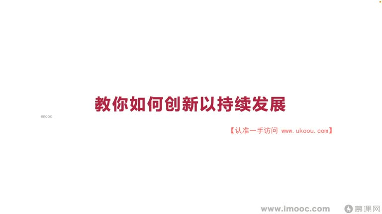
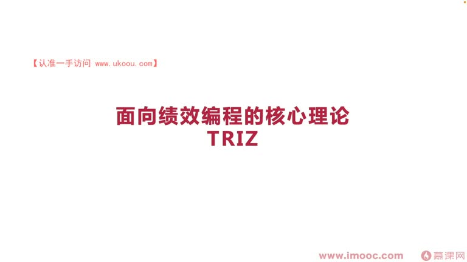
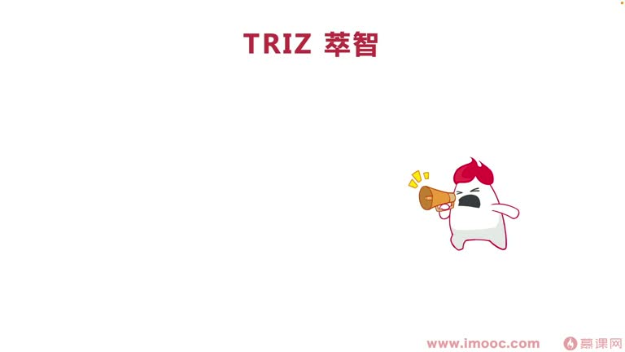
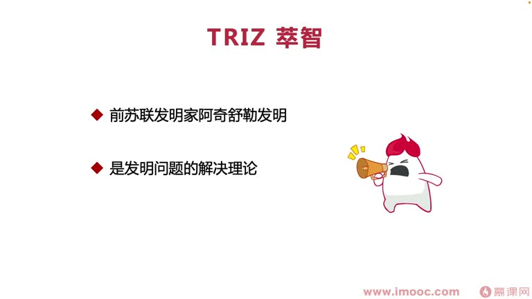
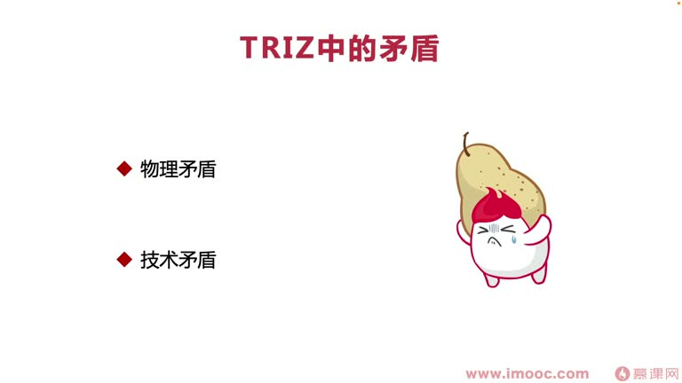
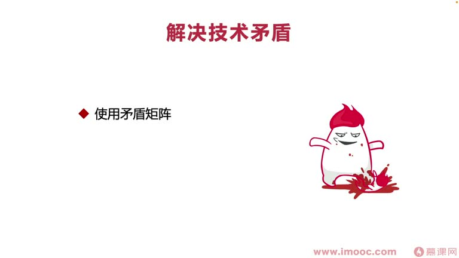

# 7-1 教你如何创新以持续发展

> 来源视频:第7章 / 7-1教你如何创新以持续发展.mp4
> 转写方式:本地 Whisper(small 模型)语音转写,已人工校对("计较编程"→绩效编程、"平静"→瓶颈、"triss/trace/吹子/崔子"→TRIZ(萃智)、"阿奇舒勒"→阿奇舒勒、"防撞粮"→防撞梁、"动作标"→纵坐标 等

## 本节要解决的问题

这一节课围绕“教你如何创新以持续发展”展开。先别急着记结论，大家可以带着一个问题来听：**这件事为什么会影响我们的绩效，以及我能不能把它用到自己的工作里？**
## 本课定位

从本章起进入新课题:**"更好的发展,需要突破你的瓶颈"**。两个核心关键词:**发展**、**瓶颈**。本章所有课程围绕如何帮助大家更好地发展展开,分析可能在什么地方遇到瓶颈,并给出解决方案。

本课探讨:**如何创新以持续发展**。
- 有了创新,才能在企业中不断创造新的价值,而不是像"老白兔"一样在一家企业混、拿固定薪资
- 只有有创新精神,才能让未来变得更有可能性
- 流行语:"有的人二十多岁就死了,七十岁才埋"——熟练运用创新,能避免成为这种人

## 一、TRIZ(萃智)的背景

- 本节围绕面向绩效编程的核心理论:**TRIZ**(triss/trace/吹子/崔子)
- TRIZ 翻译成中文叫"**萃智**",可理解成"萃取的智慧"——看到这个词就能感受到它能带来创新的想法
- **什么是 TRIZ**:俄文缩写,直译是"**发明问题的解决理论**"
- **谁发明的**:由**前苏联发明家阿奇舒勒**发明(他不仅是发明家,也是教育家),他和研究团队经过很长时间、多套体系框架和理论的总结发明了 TRIZ
- **怎么总结的**:通过分析大量专利和创新案例总结出来
- **丰功伟绩**:成功揭示了创造发明的**内在规律和原理**
- **有什么用**:
  - 应用 TRIZ 理论可以**非常快速地加快生产/创造发明的进程**,快速得到高质量的创新产品
  - 标准 TRIZ 一般有 **40 个发明原理**
  - 能让我们在创新路上产生**更多样化的思路**(像写作领域有"作家的写作宝典"这类书一样,翻看就有很多激发灵感的思路)

### 经典案例:组合原理
- 铅笔和橡皮原本是两种分开的物品,写错字想擦却找不到橡皮
- 用**组合原理**把铅笔和橡皮组合到一起,让铅笔大卖——这就是发明的一种方法

## 二、TRIZ 的矛盾体系

TRIZ 第一个核心体系:**矛盾的体系**,分为两种:**物理矛盾**和**技术矛盾**。

### 1. 技术矛盾(不同参数之间的矛盾)
**定义**:一个参数的改善会引起另一个参数的恶化。

**例子(汽车防撞梁)**:
- 想增加防撞梁的强度 → 需要增加金属板材厚度 → 整个零件重量增加 → 汽车油耗上升
- 这就是一个矛盾:**防撞梁厚度(改善) vs 汽车油耗(恶化)**——不同参数之间的矛盾

**例子(婆媳吵架)**:
- 母亲和媳妇吵架,儿子夹在中间:偏向母亲,媳妇不高兴;偏向媳妇,母亲不高兴
- 就像"我和你妈妈掉到河里,你先救谁"——不同参数(对母亲好 vs 对媳妇好)之间的矛盾

**TRIZ 如何解决技术矛盾**:
- TRIZ 把技术方面比较常见的"异性矛盾"(典型矛盾)总结成 **39 个参数**(如形状、功率、可靠性、温度等)
- 使用**矛盾矩阵**解决:把 39 个要素分别以横坐标、纵坐标展开
  - 纵(竖)着的是**优化的参数**,横着的是**恶化的参数**
  - 当矛盾双方两个参数确定后,交叉的格子里会列出几个数字,代表 TRIZ 给出的**解决冲突的建议**(一般有 40 个建议)
  - 解决技术矛盾**就像查字典**:先确定"偏旁部首"(两个参数),就能找到解决矛盾的思路

### 2. 物理矛盾(同一个参数之间的矛盾)
**定义**:同一个参数具有相反的并且合情合理(合理)的需求。

**例子(水杯)**:
- 很渴时希望水杯大一些多装水;不想喝水/要放进背包时希望它小一些、轻一些
- 水杯没办法一会儿变大一会儿变小(不是孙悟空的金箍棒)
- 这就是物理矛盾:**同一个参数(尺寸)的矛盾**
- 可伸缩水杯就是基于 TRIZ 原理创新发明的,解决了物理矛盾

**如何解决物理矛盾(矛盾分离法)**:在**时间、空间、条件、系统**四个维度上做分离:

| 分离维度 | 含义 | 生活案例 |
|---------|------|---------|
| **时间分离** | 对同一个参数的不同要求,在不同时间段实现 | 可折叠餐桌:用的时候打开变大,不用时折叠变小 |
| **空间分离** | 对同一个参数的不同要求,在不同空间实现 | 斧头:刀刃锋利 + 手柄好拿,刀与柄空间分离 |
| **条件分离** | 同一参数的不同要求,在不同条件下实现 | 变色眼镜:不同光强条件下呈现不同颜色 |
| **系统分离** | 同一参数的不同要求,在不同系统级别上实现 | 有线电话→手机:有线技术进化到无线技术(TRIZ 超系统概念) |

## 三、本课总结

了解 TRIZ 的基本理论,让我们对 TRIZ 有一个**全貌的初步了解**:
- **技术矛盾**(不同参数之间):用**矛盾矩阵**解决
- **物理矛盾**(同一参数之间):用**矛盾分离**(时间/空间/条件/系统)解决
- 掌握创新原理,就能在工作中**更容易产生专利、更容易提升个人影响力**

## 整理者补充：可以马上做什么

这部分不是老师原话，是为了方便复习而加的行动提示：

1. 回到正文，圈出一个与你当前工作最相关的观点。
2. 用这个观点检查最近一次项目、汇报或绩效记录，找出一个可以改进的地方。
3. 把改进动作写成一句具体的话，并安排在今天或本绩效周期内完成。
