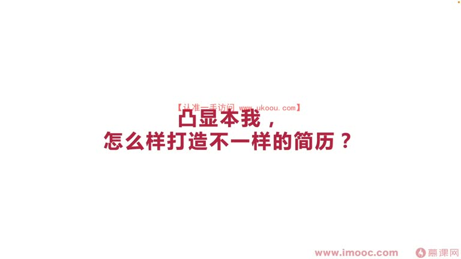
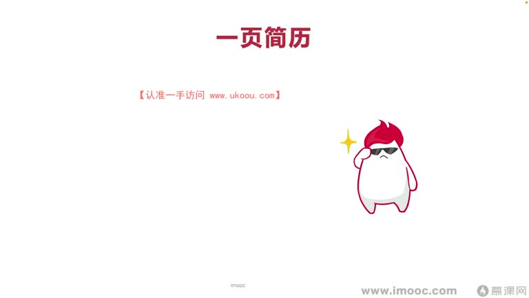
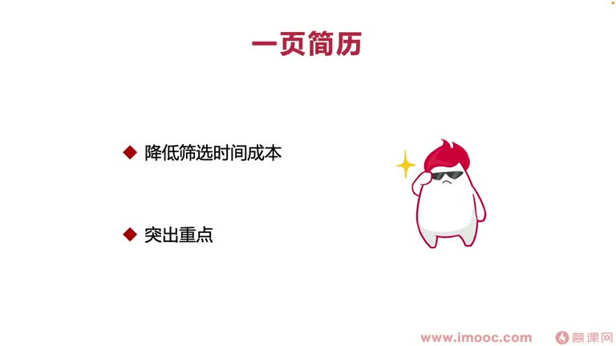
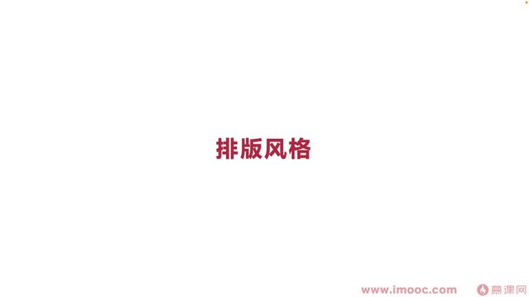
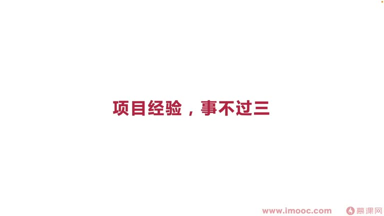

# 7-2 凸显本我,怎么样打造不一样的简历?

> 来源视频:第7章 / 7-2凸显本我，怎么样打造不一样的简历？.mp4
> 转写方式:本地 Whisper(small 模型)语音转写,已人工校对("面相机教编程"→面向绩效编程、"突显本武"→凸显本我、"鸣起"→名企、"平静"→瓶颈、"期保线"→起跑线、"麦麦"→脉脉 等

## 本节要解决的问题

这一节课围绕“凸显本我,怎么样打造不一样的简历?”展开。先别急着记结论，大家可以带着一个问题来听：**这件事为什么会影响我们的绩效，以及我能不能把它用到自己的工作里？**
## 本课定位

围绕如何提升自身水平、突破瓶颈:
- 应届生同学刚步入职场,没办法面到一家"名企"
- 或者职场中遇到面向绩效编程的瓶颈,想跳槽、准备简历
- 真正面临跳槽时,需要重新整理简历

**痛点**:简历投给新公司被 pass 掉,很难收到关于简历的建议;找猎头帮忙,猎头也不一定说太多简历问题。

本课:李老师分享自己投简历遇到的坑,以及如何打造不一样的简历风格。

## 一、李老师的简历故事("一页简历")

### 背景
- 大学时期比较"能折腾":参加很多社团活动、很多竞赛
- 有固定的比赛团队(四五人),合作默契度高,起跑线比临时组队的新团队高
- 大学三年总共拿到 **70 多个奖状/比赛证书**
- 参加学校演讲活动时,把 70 个证书全部列到个人介绍里,主持人念个人介绍要念两分钟(男女主持人轮流念 30 多遍)

### 踩坑经历
- 毕业后投民企,把 70 多个证书经历全部列出,简历光是证书名就列了四五页
- 投了几十家公司,**没有收到一个回复**
- 后来投到国外外企的"殖民"(志)公司,碰到一位**好心的华人 HR**,回 Email 列出很多简历改善意见

### HR 的核心建议:一页简历
- **好的简历,一张纸就够了**,完全能突出你的要点
- 一页简历的优点:
  1. **降低 HR 和面试官的筛选时间成本**:快速通过一页简历判断是否符合用人条件
  2. **突出你的重点/亮点**:突出简历与别人不一样的地方
- 注意场景:投民企时竞争者很多都选一页简历;投较小公司或创业公司,可能有些同学喜欢复杂的多页简历——**根据工作场景灵活应对**

### 如何优化证书部分
- 70 多个证书全部留简历上**占空间**,给面试官感觉"什么细节都要写出来",而且面试官没时间一项项看
- 优化方法:**把证书全部转换成数字**:
  - "大学期间获奖共 76 项,其中国家级奖项 12 项、省级奖项 30 项、校级奖项多少项、区级奖项多少项"
- 数字对面试官**一目了然、更精简**,也能拉开与其他人的差距
- 当面试官对证书数字存疑时,把准备的证书名称 + 电子版**以打包形式发给面试官**,证明清白

## 二、排版风格

### 关于贴照片
- 很多同学喜欢在简历上贴照片,但这在简历培训课程中是**非常大的反例**
- **尽量不要贴照片**(除非很帅/很美,但遇到面试官也可能觉得你太好看会带来压力)
- 没有特殊情况/职位特殊要求,尽量不贴——贴照片很影响简历空间,总共就一页纸,要充分利用

### 色彩风格统一
- 字一会儿大一会儿小、一会儿这个颜色那个颜色、带超链接(打印出来带下划线)等,会显得**风格不统一**
- 浅色字体打印出来偏浅,看起来简历感觉"很地摊"
- **一定不要给面试官"松散地摊"的感觉**,要给"非常精致"的感觉
- 也可以找电销(专业)网站的专业人员帮你改简历——价格不贵、建议专业、更从自身情况出发

## 三、项目经验:事不过三

- 简历里都有项目经验,要强调**"事不过三"**:项目经验三个足够,最多不超过四个
- 少于三个:面试官觉得项目经验太少、知识领域太单一,对你不信任
- 多于三个:简历看起来"优种"(臃肿);四个也能接受,但面试官手上的简历非常多,没时间一个一个看每个项目写的具体文字

## 四、隐藏弱点,亮点靠前

- **把亮点靠前,弱点靠后**:
  - 例:毕业学校是普通二本,投民企时很多民企 HR 会因为学校卡人(希望要 985)
  - 做法:把教育经历放到简历比较靠后的位置,把突出的亮点放到尽量靠前的位置
- **反面操作**:看到脉脉上很多二本三本毕业的同学,把学校翻译成英文名写在脉脉上,乍一看像"海龟"(留学背景),高大上
  - **这种操作不适合用在简历中**:面试官感兴趣时会去查英文学校名,发现是把国内二本三本翻译成英文伪装海龟,会觉得**你这个人很不实在**

## 本课总结

打造不一样的简历:
- **一页简历**,证书用数字量化
- **排版风格统一**,尽量不贴照片
- **项目经验事不过三**
- **亮点靠前、隐藏弱点**,诚实不伪装

根据实际情况出发,让自己的简历**变得与众不同**。

## 整理者补充：可以马上做什么

这部分不是老师原话，是为了方便复习而加的行动提示：

1. 回到正文，圈出一个与你当前工作最相关的观点。
2. 用这个观点检查最近一次项目、汇报或绩效记录，找出一个可以改进的地方。
3. 把改进动作写成一句具体的话，并安排在今天或本绩效周期内完成。
