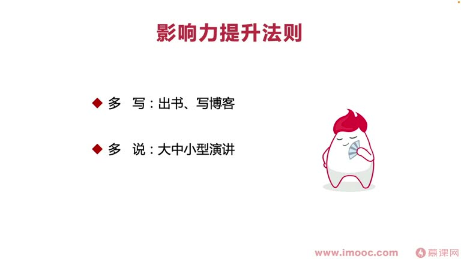
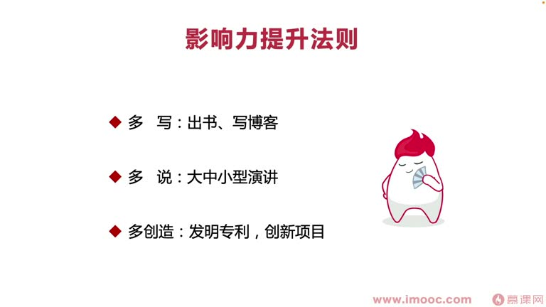

# 7-3 如何提升个人的影响力?最关键因素有哪些?

> 来源视频:第7章 / 7-3如何提升个人的影响力？最关键因素有哪些？.mp4
> 转写方式:本地 Whisper(small 模型)语音转写,已人工校对("面向及小边程/面向计校编程"→面向绩效编程、"平静"→瓶颈、"北辣清华"→北大清华、"自屈力"→自驱力、"胡适"→胡适 等

## 本节要解决的问题

这一节课围绕“如何提升个人的影响力?最关键因素有哪些?”展开。先别急着记结论，大家可以带着一个问题来听：**这件事为什么会影响我们的绩效，以及我能不能把它用到自己的工作里？**
## 本课定位

围绕如何提升自己的能力、突破能力瓶颈。李老师分享这几年提升个人影响力的经验。

> 同学们自身情况不一样,无法完全复制李老师的经验;但可以讲他**如何复制榜样的经验**。

## 一、你有五年规划吗?

- 上大学时看清华学霸的日程表/课程表(当时流行的 App:**课程格子**,可以把每天的工作排满,以 45 分钟为维度清晰安排)
- **五年规划**:
  - 五年中每一年设计一个规划,每一年的每个月也设计一个规划
  - 五年规划最多精确到**每月**;第一年可精确到**每周**;近期一个月可简单列到**每天的每一周**(逐层细化)
- 李老师**从大一就有五年规划**,毕业后又重新列,前两年又重新列了一个
- 有的规划没做到(如西班牙语学习——后来发现应用场景没想象那么多,放弃了)
- 但**进公司、薪资规划基本超额完成,出书、演讲的规划也基本超额完成**

> 一定要敢于给自己一个清晰的规划,才能不断编制(鞭策)自己前进。

### 为什么想到列五年规划?(学霸的故事)
- 高中面临高考时,学校请来考上北大清华的学霸演讲,触动很深
- 学霸背景:非常普通的高中、学习也不是非常好
- 做法:**盯上班里第一名,每天偷偷跟着他,看他这个时间做什么,不断模仿他**,把他的时间、日常全部"记录抄袭"成自己的日常,再不断改进优化
- 渐渐让自己变得非常有自驱力(不模仿可能效率低、松散、涣散;跟踪后变得有动力、有激情、自驱力强)
- 李老师大一也找了很多人课程表、日常安排信息,不断模仿

### 名言:胡适
> **"凡富于创造性的人,必敏于模仿;凡不善于模仿的人,绝不能创造"**(语音识别"凡赋于创造性的人必为于模仿")
- 模仿对创造很重要:像写代码时找 demo/case 看别人怎么写、模仿着写——对很多同学都是最快的上手方法

## 二、李老师职场中提升影响力的路径

### 通过模仿 GitHub 案例
- 刚入职场,通过模仿开源 GitHub 案例实现重要功能
- 模仿一个案例时,发现一个开源项目 star 非常多 → 点开这个人的 GitHub 主页 → 看到他有非常多演讲经历、出书经历、提升个人影响力的经历 → **follow 这个人**
- 根据名字、邮箱在百度/Google 找到他的微博 → 微博里找到微信 → 加微信
- 根据他微博、微信朋友圈信息,整理出**他近五年每年都做了什么**、如何发展成如今的影响力

### 榜样的关键转折点
- 真正改变他的是**一条微博**:他的职场前辈告诉他"一定要在职场中注意打造个人品牌",从那天起他开始打造个人品牌
- 做法:不断把别人的项目集合到自己的项目中 → 加工整理成非常全面的项目发到 GitHub → 拿到非常多 star → 不断用这种方式发更多项目,变得非常有名气 → 各方活动主办方找他演讲 → 把项目相关内容整理出书 → 变得非常有名气

### 李老师的复制规划
按榜样步骤做的规划:
1. 先进行**技术项目提升**,积累一些经验
2. 然后**出书**
3. 出书后参加一些**演讲**(参加了 **QCon**,软件领域知名度较高的演讲)
4. 通过演讲经历和技术积累,成为 **Google 开发者专家(GDE)**
5. 近期出席比较多演讲,让影响力越来越高(因环境因素很多演讲变成线上,比较可惜;未来可更多参与线下演讲、认识更多牛人)

## 三、影响力提升法则(总结)

1. **多写**:多写博客、出书,把思想分享给别人
2. **多说**:锻炼自己的语言表达能力,参与**大中小型演讲**(公司内部演讲、周末小活动、大型技术论坛)
3. **多创造**:多写发明专利、多做创新项目

## 四、什么是个人影响力?

- 指我们**影响别人的能力**:如何"同领"(统领)别人去做一件事情
- 影响力某种程度上包含了**权威度**
- 当有了出版物、博客、网络粉丝,参与非常多演讲,在技术论坛获得认可,在媒体有曝光,在公司写出非常多发明专利、做了非常多创新项目——讨论问题时**经常有话语权、更有说服力**,影响力就比较高

## 五、影响力的重要性

- 影响力提升促进**面向绩效编程**:让领导觉得你在职场中更有发展潜力、可以做到更高位置
- 做到高位时别人都会信服你
- 影响力能帮助:
  - 面向绩效编程
  - 拿到好绩效
  - 在职场中晋升、站到高位

## 整理者补充：可以马上做什么

这部分不是老师原话，是为了方便复习而加的行动提示：

1. 回到正文，圈出一个与你当前工作最相关的观点。
2. 用这个观点检查最近一次项目、汇报或绩效记录，找出一个可以改进的地方。
3. 把改进动作写成一句具体的话，并安排在今天或本绩效周期内完成。
