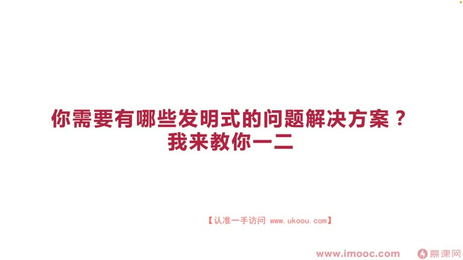
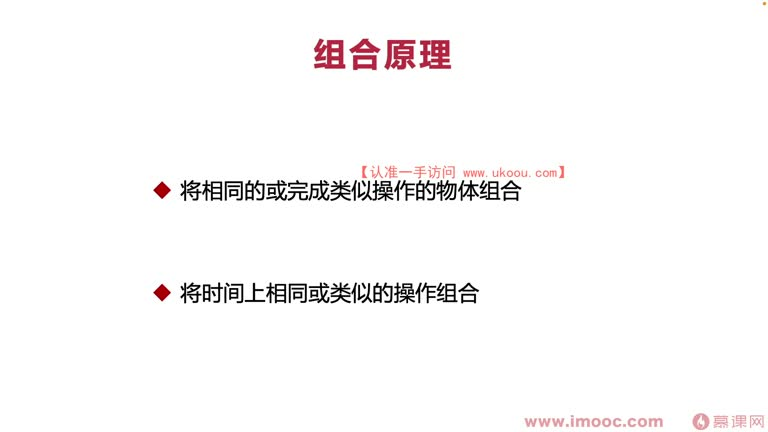
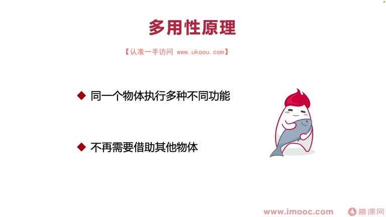
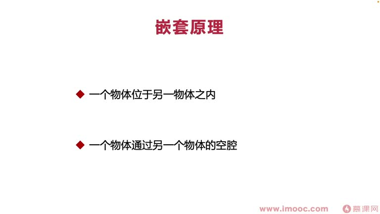
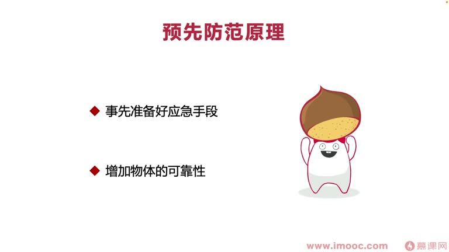
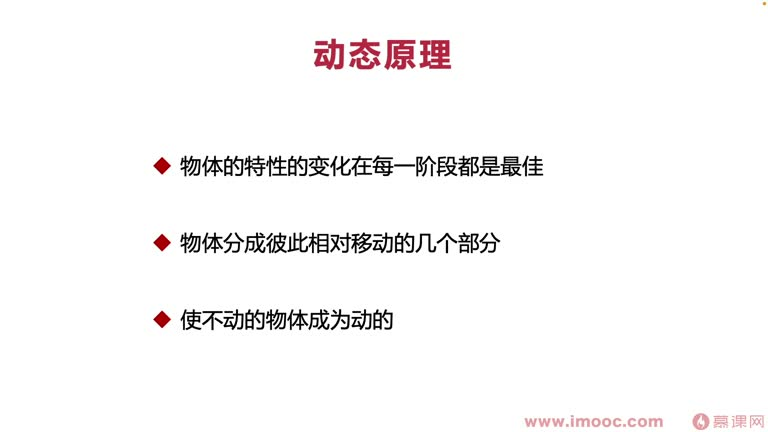
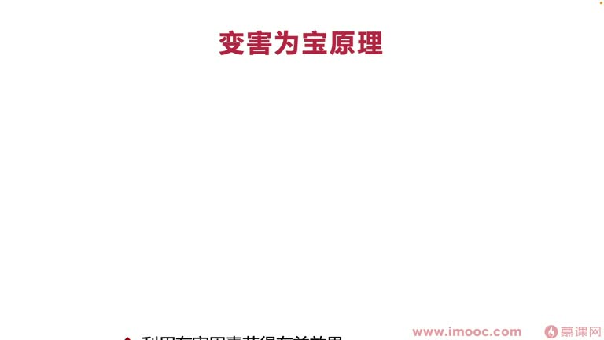
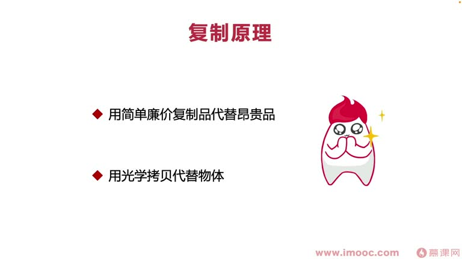

# 7-4 你需要有哪些发明式的问题解决方案?我来教你一二

> 来源视频:第7章 / 7-4你需要有哪些发明式的问题解决方案？我来教你一二.mp4
> 转写方式:本地 Whisper(small 模型)语音转写,已人工校对("TREASE"→TRIZ、"嵌透原理"→嵌套原理、"辩害维保/变害维保"→变害为利(有害因素转有益)、"圆宇宙"→元宇宙、"Carbon 2"→Cardboard(Google VR) 等

## 本节要解决的问题

这一节课围绕“你需要有哪些发明式的问题解决方案?我来教你一二”展开。先别急着记结论，大家可以带着一个问题来听：**这件事为什么会影响我们的绩效，以及我能不能把它用到自己的工作里？**
## 本课定位

前面课程探讨了 TRIZ 带来的发明创造思想,包括**矛盾体系**(技术矛盾和物理矛盾)。本课分享 TRIZ 提供的**矛盾解决方案**,覆盖一些比较流行的原理和 case,帮助大家获得更多解决问题的思路,认识到 TRIZ 的重要性。

> 以下都是**使用频率比较高**的 TRIZ 原理。

## 一、组合原理(两种)

1. **将相同的或完成类似操作的物体一起组合**
   - 例:**集成电路板**:手机上的电路板个头不大,却集成了非常多电器元件,让电路板拥有很多功能——把相同/类似操作的物体相互组合
2. **将时间上相同或类似的操作相组合**
   - 例:**水龙头**:酒店的水龙头向左转出热水、向右转出冷水,把不同时间的冷热需求组合到一起,变成放冷热水的功能

## 二、多用性原理

- 使同一个物体执行不同的功能,不再需要借助其他物体
- 例:**折叠柜子/柜梯**:打开柜子还能变成梯子,踩着取物品、挂衣服、从顶层拿封藏多年的酒——一个物体实现多种功能(多用性)

## 三、嵌套原理(语音识别"嵌透原理")

- 把一个物体放到另一个物体之内,或让一个物体通过另一个物体的**空销(空隙/空腔)**
- 例 1(物体在物体内):**套娃/嵌套盒**——一层盒子套一层盒子,如流行的生日礼物包装,属于嵌套原理产生的创新小物件
- 例 2(物体通过另一个物体的空腔):**可伸缩教鞭**——黑板大、老师手够不到时,用两节伸缩组成的教鞭指;**可伸缩电视天线**——让电视机收到更多频道

## 四、预先防范原理

- 事先准备好应急手段,增加物体的可靠性
- 例 1:**汽车安全气囊**——发生紧急事故时自动弹出,降低事故影响,预先安装安全气囊增加汽车可靠性
- 例 2:**飞机安全演示**——起飞前乘务员讲解安全装置,让乘客在突发场景能快速使用安全装置,增加坐飞机的可靠性

> 注意:这些原理之间也会有一些交叉。

## 五、动态原理

- 物体的特性变化在每个阶段都是最佳的,物体分成彼此相对移动的几个部分;也可使不动的物体成为动的
- 例 1:**笔记本电脑**——屏幕与键盘可以相对移动、折叠
- 例 2:**可弯曲饮料吸管**——夏天沙滩上躺着,弯曲吸管避免弯腰/弯杯子洒出饮料,也能吸到饮料——让吸管变成"动的"
- 例(不动变动):**不倒翁**——看着不动,但可以让它动起来

## 六、变害为利原理(语音识别"辩害维保")

- 利用有害因素获得有益效果
- 也可通过有害因素之间的组合消除有害性
- 也可利用可见光的复制品转化为红外线

**三个方面及案例:**
1. **利用有害因素获得有益效果**:污水回收系统、农村废坑——把污水循环利用,变害为利
2. **通过有害因素之间的组合消除有害性**:武打片"以毒攻毒"(利用毒来消毒)
   - 例:治疗中毒时医院采取切除手臂避免毒素蔓延;森林着火时提前烧掉未烧到的草木阻止火势蔓延
3. **利用可见光的复制品转化为红外线**:如 X 射线等

## 七、复制原理

- 用简单廉价的复制品代替"王贵"(昂贵)物品;也可用光学"烤杯"(拷贝/投影)代替物体
- 例 1(廉价复制品):**模拟试卷**——可以理解成简单廉价的复制品,代替成本非常高的高考(不可能高考一次又复读,成本高)
- 例 2(光学拷贝代替物体):**元宇宙**、AR 眼镜、虚拟现实、Google 的 Cardboard(语音识别"Carbon 2")——通过视觉在眼前成像,用光学拷贝代替物体

## 本课总结

分享的这些原理:组合、多用性、嵌套、预先防范、动态、变害为利、复制——希望能给大家打开一些创新思路,在职场中**应用到技术中,产生更多创新 idea**。

## 整理者补充：可以马上做什么

这部分不是老师原话，是为了方便复习而加的行动提示：

1. 回到正文，圈出一个与你当前工作最相关的观点。
2. 用这个观点检查最近一次项目、汇报或绩效记录，找出一个可以改进的地方。
3. 把改进动作写成一句具体的话，并安排在今天或本绩效周期内完成。
