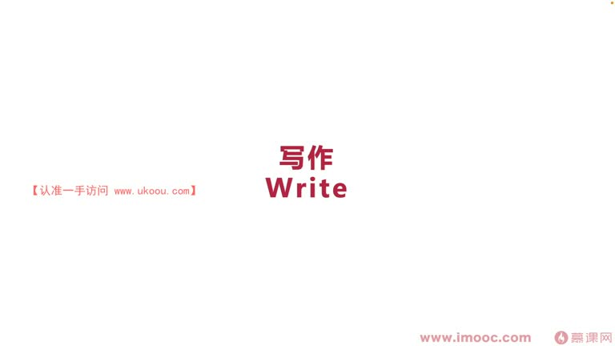

# 7-5 如何将你的想法写下来,来向世界去分享

> 来源视频:第7章 / 7-5如何将你的想法写下来，来向世界去分享.mp4
> 转写方式:本地 Whisper(small 模型)语音转写,已人工校对("面向击消/面向计校编程"→面向绩效编程、"蝙蝠"→篇幅、"绝筋/减书"→掘金/简书、"补课"→博客、"唱销书"→畅销书 等

## 本节要解决的问题

这一节课围绕“如何将你的想法写下来,来向世界去分享”展开。先别急着记结论，大家可以带着一个问题来听：**这件事为什么会影响我们的绩效，以及我能不能把它用到自己的工作里？**
## 本课定位

标题拆解:**(1) 怎么样把想法写下来;(2) 怎么样把想法分享到实际(世界)**。
- 希望通过本课知道**分享想法的重要性**,把更多想法向世界去分享,打开自己的圈子,收到更多意见

## 一、写作(李老师的亲身经历)

### 早年经历
- 大概 9 岁开始写小说,第一本小说 15 岁出版,上了家乡知名报纸的头版(报纸用一整页篇幅报道)
- 从这时起对写作比较有信心
- 后来从事互联网行业:技术是特长,写作是爱好,两者没有冲突(不存在技术矛盾/物理矛盾)
- 从事技术方面也利用了自己的写作特长

### 如何"免费出书"
- 在公司工作两年多时筹备写作,思考**怎么样免费出书、让编辑注意到**
- 咨询出过书的"进(前)辈大佬",发现他们基本是"写活课"(写技术书),由电子工业出版社的编辑和老师找到他们
- 李老师的第一步:**写博客**
- 写了一篇文章《在 Java 中如何优雅地判空》,在**掘金、简书**发表:
  - 掘金连续几周霸占"周热榜"前三名
  - 被很多公众号/自媒体不断转载(转载后出处不一而足)
- 最大影响:**成功吸引出版社编辑**,主动找李老师谈稿,免费帮忙出书
- 筹划写一本市场上没有的书——《移动开发架构设计实战》
  - 因为市场上没有移动开发架构方面的书籍;当想进行企业架构重构时非常"急击手"(棘手)

### 出书的好处
- 打开社交圈子、打开知名度,让更多人了解自己
- 出书成为**身份的标签**
- 把想法展示给更多人
- 李老师出书后在书(信息页)里留了**博客征集信息**,把 blog 提上去,后来 blog 流量翻倍增长,很多人去 blog 提"刊物"(勘误)信息(如书籍第几页有问题),这也是**交流成长的过程**
- 可以选择出更多书,与更多同学交流增长

### 出书的注意事项
- 能否写出畅销书/传世经典,一方面靠书本身和市场价值,另一方面靠自身运气(身处大环境)
- **不要功利性太强**:出书主要是从一点出发,把想法写出来,向全世界分享
- **把出书当成造福别人的举动,把自己当成一个慈善家**
  - 出书很难拿到功利的金钱提升,不如面向绩效编程直接,相对曲折
  - 但**一旦出书,长期影响价值比较高**
  - **越早免费出书,获得的认可度/名片、打开社交圈的能力就越好**

### 博客(Blog)
- 出书吸引编辑正是因为写了 blog;平时不仅写技术 blog,业余还是**美食探店博主**
- 写 blog 的好处:如餐厅吃饭发生纠纷时,因为常写 blog,写出的东西影响力比普通消费者高,**餐厅会变得非常主动、热情、友好**——利于提升社交圈子/影响力
- blog 能让你**吸引到更多机会**:
  - 有人看到 blog 好,可能有项目单子找上门
  - 可能有演讲机会、出书机会
- **写作不是为了让写作赚钱**(写博客、出书都很难赚钱),出发点一定是**把自己的想法写出来、向世界分享、给别人带来礼物(价值)**
- **把自己当成慈善家,写作才能变得更有自驱力,得到更多长远的价值**

## 二、专利(写作能力的另一体现)

- 专利在职场中真的很重要;不是光有发明能力就可以有专利
- 专利很多时候希望我们写一个**技术交底书**,锻炼的也是**写作能力**——体现"把想法写出来、向世界分享"的能力
- **别看到"专利"就头疼**:
  - "我没有什么发明的想法,怎么可能申请专利?专利像科学家一样的事,门槛会不会特别高?不适合我这种经常摸鱼的员工"
- **一定要敢想**:职场中做的很多技术案例、技术方向、技术方法,换一种实现,对个人来说就是一个新的"冲心"(创新点),可以整理成技术交底书申请专利——**门槛并没有那么高**
- 专利是最终与**功利性挂钩最强**的一点,更适合那些希望"短平快"的同学

## 本课总结

- **写作**(博客、出书):把想法写下来向世界分享,做"慈善家",长期影响价值高
- **专利**:通过技术交底书把技术想法写出来,门槛不高,与功利性挂钩较强
- 写作的出发点:分享想法、造福别人,才能获得长远价值

## 整理者补充：可以马上做什么

这部分不是老师原话，是为了方便复习而加的行动提示：

1. 回到正文，圈出一个与你当前工作最相关的观点。
2. 用这个观点检查最近一次项目、汇报或绩效记录，找出一个可以改进的地方。
3. 把改进动作写成一句具体的话，并安排在今天或本绩效周期内完成。
