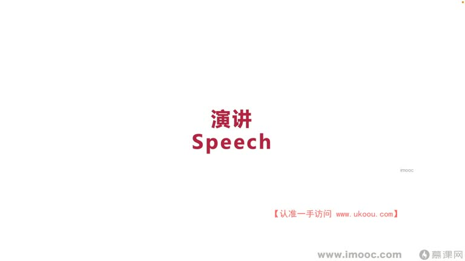
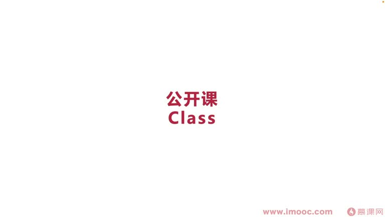

# 7-6 录下你的想法,更易于传播自己

> 来源视频:第7章 / 7-6录下你的想法，更易于传播自己.mp4
> 转写方式:本地 Whisper(small 模型)语音转写,已人工校对("面向机校编程/面向迹效边长"→面向绩效编程、"哄力"→红利、"PVT"→PPT、"急性演讲"→即兴演讲、"Tide"→TED、"dobar/活动型"→豆瓣/活动行、"路播"→录播、"劫持"→结识 等

## 本节要解决的问题

这一节课围绕“录下你的想法,更易于传播自己”展开。先别急着记结论，大家可以带着一个问题来听：**这件事为什么会影响我们的绩效，以及我能不能把它用到自己的工作里？**
## 本课定位

短视频的红利爆发,让我们看到自媒体/多媒体的传播性,很多人通过短视频获得更丰富的视觉体验(体验升级)。**把自己的想法录下来,可以更快打开知名度、提升影响力。**

上一节讲"写下来"分享想法;本节讲"录下来"。"写"与"说"两方面基本不分离,但对很多同学来说**"说"比"写"更有难度**。

## 一、演讲(Speech)

### 两种演讲
1. **精心准备的演讲**:出现在熟知的技术论坛、线上技术分享(有 PPT)
2. **即兴演讲**(语音识别"急性演讲"):在职场/生活中占据非常高频率、非常重要的地位
   - TED 也经常把即兴演讲拿出来分享,把它放在重要地位
   - 例:在公司跟产品同学 battle 时,提出很多想法、产生争论——这就是生活中的即兴演讲 case
   - 即兴演讲很多时候不方便录下来(可在对方允许下录音,便于以后改善自己)
   - 即兴演讲是**为自己准备演讲、筹备演讲的重要手段**,可以提升演讲能力

### 如何获得(正常/正式)演讲机会
- 通过**出书、写博客**打开知名度,让更多人邀请演讲
- 不擅长写作但想获得演讲机会的同学:
  - 需要更多面向绩效编程,在企业站到更高的位置(如总监或更高、更有权威的位置),自然会有各方企业找你
- **刚毕业的同学怎么办?**(不可能一毕业就站到高位)
  - 可以去**活动行**里找周末的活动,一二线城市的咖啡馆周末常做**技能交换**活动(分享美食、烹饪、养宠物技能),咖啡厅会找听众来听
  - 报名是非常好的机会;可在**豆瓣/活动行**上找很多这样的机会锻炼演讲才能
  - 也会有**录播**,可能发到 B 站等,让更多人认识你;其他同学遇到问题时可通过视频联系方式找到你,或有**机会主动找上门**

## 二、直播

### 直播的种类
- 淘宝带货直播等;买商品时商品右侧会出现直播入口,点击能看到产品 360 度全景效果
- 直播给人**更加及时、真实**的感觉,让人觉得"此时此刻",**缩短与人之间的距离**

### 直播 vs 演讲的区别

| | 演讲 | 直播 |
|---|------|------|
| **覆盖人数** | 受限(一次最多几百到上千人;环境受限时线下听众可能不能超过 50 人) | 更广 |
| **互动性** | 低 | 高(B 站弹幕等,可实时交互) |
| **核心价值** | 打开**人脉**,分享经验,结识重量级嘉宾/大佬 | 获得更多**及时反馈**、改进信息,提升对观众的**亲和度** |

- 直播也会有**录播**,便于思路更广泛传播
- **环境受限的当下,直播比线下演讲收获更多**
- **直播门槛低**:在短视频平台注册一下就能开直播(可能有机器人来听,但机器人也是为增加信息);平台不合适可换到对应垂直领域/小众的平台

## 三、公开课

- 大家正在听的课程就属于公开课,是交流自己想法的方式
- 李老师现在就在传播自己关于面向绩效编程的想法,提升职场影响力、让领导觉得自己符合晋升要求、能站到更高位
- **特点**:需要大家在某一垂直领域有更加**体系化的结构**,会有老师找到大家定制课程,有机会把思路再体系化
- 公开课可以理解成**短视频形式的出书**,比短视频展现形式更丰富,但比出书也更有体系
- 公开课 vs 出书的区别:
  - 出书可以通过搜索等功能用文字查询(随便看一页)
  - 公开课更希望大家**把一节课整体听下来**,从中汲取想要的知识

## 本课总结

本节讲了三种"录下想法"的方式:**演讲、直播、公开课**。希望大家在未来生活中主动发掘更多这样的机会,展现自己的想法,让想法**更易于传播**。

## 整理者补充：可以马上做什么

这部分不是老师原话，是为了方便复习而加的行动提示：

1. 回到正文，圈出一个与你当前工作最相关的观点。
2. 用这个观点检查最近一次项目、汇报或绩效记录，找出一个可以改进的地方。
3. 把改进动作写成一句具体的话，并安排在今天或本绩效周期内完成。
