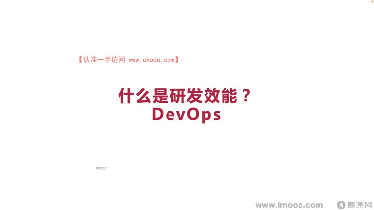
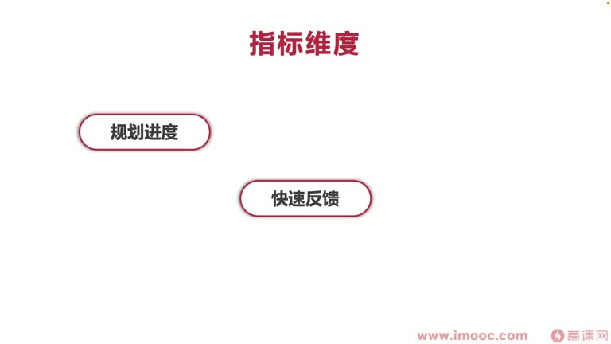
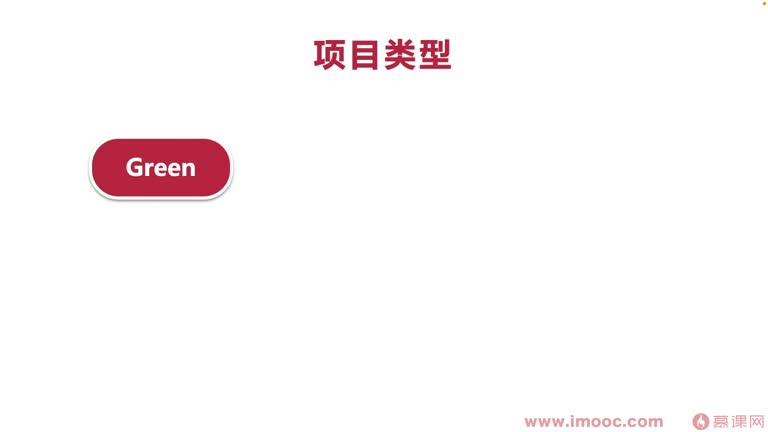
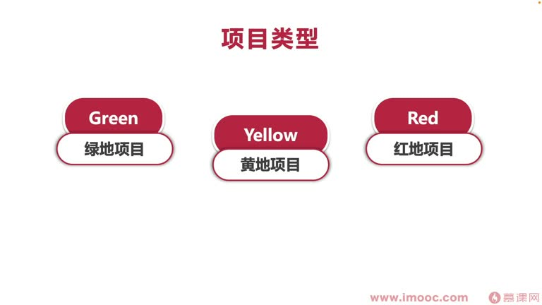
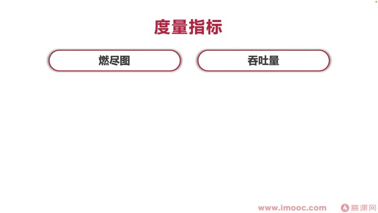
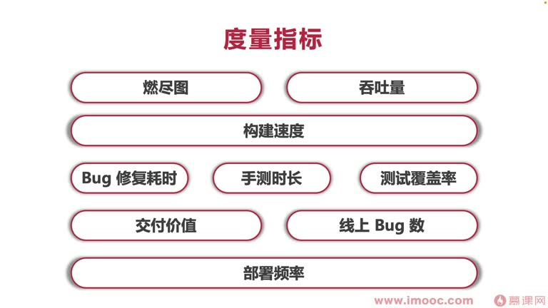

# 7-7 你需要定制的研发效能指标有哪些?

> 来源视频:第7章 / 7-7你需要定制的研发效能指标有哪些？.mp4
> 转写方式:本地 Whisper(small 模型)语音转写,已人工校对("面向计校编程/面向及小边长"→面向绩效编程、"DVOPIS/DEVILOPIS"→DevOps、"EFFECTED"→Effectiveness(有效性)、"苹果进度"→评价/评估进度、"燃镜图"→燃尽图、"grindle"→Gradle、"英雄沙"→英雄杀 等

## 本节要解决的问题

这一节课围绕“你需要定制的研发效能指标有哪些?”展开。先别急着记结论，大家可以带着一个问题来听：**这件事为什么会影响我们的绩效，以及我能不能把它用到自己的工作里？**
## 本课定位

企业的研发效能是用于**面向绩效编程的手段之一**。当在企业中发现没有事情可做时,程序员同学可以从**研发效能**这方面着手,推动企业做一些变革,进而改善自己的绩效表现。

课题:**你需要定制的研发效能指标有哪些**——研发效能指标有非常多种类,如何从中挑选适合你的指标(像从琳琅满目的超市中找到最需要的商品)是本课讨论范围。

> 找到适合自己的研发效能指标,就有手段落实到研发团队中推动改变。无论你是研发团队的管理人员还是施工人员,推动研发效能的改变都会让团队有所受益,进而改善绩效(管理人员还能推动晋升)。

## 一、什么是研发效能?

- 对应英文 DevOps(DVOPIS),在很多软件论坛见过这个词
- **定义**:团队能够持续为用户产生有效价值的**效率**
- **三个维度**:
  1. **有效性**(Effectiveness)
  2. **效率**
  3. **可持续性**
- DevOps 全称是 Development + Operations(研发者 + 操作者),指**开发团队和运维团队两者之间的整体一体化**
- 研发效能也是**通过工具帮助开发完成一部分运维工作**,进而减少成本、更多给公司创造价值
- 运用好研发效能,自己的绩效/成就价值(就成了价值)

### 古德哈特定律
- 经济学家**查尔斯·古德哈特**在 1975 年提出"古德哈特定律":**当一个度量本身成为目标时,它就不再是一个好的度量**
- 该定律不仅适用于经济学,也适用于软件研发领域——**确定一个研发效能指标的度量体系非常重要**

## 二、研发效能指标的实用性维度

一般有:**规划进度、快速反馈、团队转型、辅助决策、工程能力**(一个软件学专家通过《加速》(Accelerate)这本书在 Blog 上提出的):
1. **规划进度**:评估进度获取上下文信息,告诉大家进度什么时候完成,并对进度进行复盘总结
2. **快速反馈**:持续集成、持续部署的时间,让系统运作更快
3. **团队转型**:有特定目标去改变、衡量不同方式的实验,进而改变开发行为;也可给管理层指示哪些事情做得不合理、需要改变
4. **辅助决策**:通过做实验,不断找新的度量指标帮助做更多决策
5. **工程能力**:帮助团队找出工程实验(工程实践)中的弱点

## 三、先确定项目类型(三种)

### 1. 绿地项目(Green)
- 全新的、没有前面遗留系统集成的**新项目**
- 特点:没有"历史包袱",可正常进行架构设计或技术栈选择
- **首选指标**:① 辅助决策 ② 工程能力

### 2. 黄地项目(Yellow)(语音识别"皇帝项目")
- 项目已有遗留软件系统,在此基础上部署新软件系统——任何新软件架构都必须考虑原先遗留代码
- 已上线一段时间、积累不少用户,在原有代码上开发肯定有历史包袱,原有代码也可能开始腐化
- **首选指标**:规划进度 + 工程能力(关注迭代速度、架构能力的改善)
- **很多互联网同学身处的项目一般都是黄地项目**
- 企业想走新赛道、做创新型的创业 App 时,一般会开始一个**绿地项目**

### 3. 红地项目(Red)(语音识别"皇帝项目")
- 软件系统进入**维护期**,不再开发新功能,只修复 bug;维护一段时间后不断被新系统取代
- 上线多年、稳定供给用户,没有再开发新功能只修 bug,不久后还会被取代
- 团队一般不再投入更多资源改善系统,只能修好首要 bug
- **首选指标**:规划进度(保证有良好的 bug 修复量)
- 例:腾讯的《英雄杀》很久没迭代、只负责维护,就属于红地项目;或 Windows 上的一些应用

> 首先要确定自己的项目类型,才能选择比较好的度量指标体系。

## 四、各指标维度的具体指标示例

| 维度 | 具体指标 | 说明 |
|------|---------|------|
| **规划进度** | **燃尽图** | 看项目进度 |
| | **吞吐量** | 看工作效率等信息 |
| **快速反馈** | **构建速度** | 如安卓开发的 Gradle 构建速度,看是否影响自测能力/自测时间 |
| **团队转型** | **Bug 修复耗时** | 关注改 bug 的时间,是否有阻碍影响整体耗时 |
| | **手册时长(手工测试时长)** | 开发测试人员通过普通手工功能测试的时间 |
| | **测试覆盖率** | 看能否全面覆盖代码的每一个 block |
| **辅助决策(浮驻测试)** | **交付价值** | 将一个好的 idea 点快速交付用户的方法 |
| | **线上 Bug 数** | 关注线上产生的 bug 多不多,是否影响系统运作 |
| **工程能力** | **部署频率** | 工程能力主要看部署频率等 |

> 这里只是简单介绍主要度量指标体系,网上有更全面的信息。

## 本课总结

建设团队研发效能时:
1. **先确定团队项目的类型**(绿地/黄地/红地)
2. **再确定指标的维度**(规划进度/快速反馈/团队转型/辅助决策/工程能力)
3. 选择合适的度量指标,**推动团队落实研发效能的改变**,进而实现面向绩效编程

## 整理者补充：可以马上做什么

这部分不是老师原话，是为了方便复习而加的行动提示：

1. 回到正文，圈出一个与你当前工作最相关的观点。
2. 用这个观点检查最近一次项目、汇报或绩效记录，找出一个可以改进的地方。
3. 把改进动作写成一句具体的话，并安排在今天或本绩效周期内完成。
