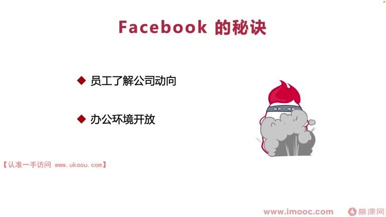
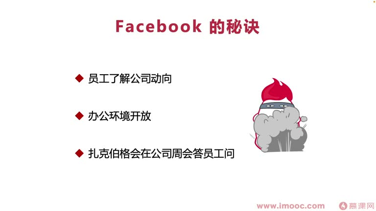
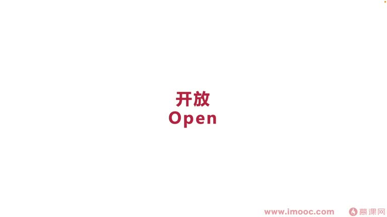

# 7-8 如何改善团队开发氛围?

> 来源视频:第7章 / 7-8如何改善团队开发氛围？.mp4
> 转写方式:本地 Whisper(small 模型)语音转写,已人工校对("面向计较编程"→面向绩效编程、"精神头条"→今日头条、"妈你多"→码(代)牛多、"民政暗斗"→明争暗斗、"坐紧关天"→坐井观天、"申请病/协音"→深井病/谐音 等

## 本节要解决的问题

这一节课围绕“如何改善团队开发氛围?”展开。先别急着记结论，大家可以带着一个问题来听：**这件事为什么会影响我们的绩效，以及我能不能把它用到自己的工作里？**
## 本课定位

如何通过改变团队来**面向绩效编程**。课题很直接:**如何改善团队开发氛围**。

## 开场:Facebook vs 苹果

引入一句话:**"从员工士气角度来讲,Facebook 可能明显完胜苹果"**——前苹果软件工程师、现任 Facebook 工程师在一个国外问答网站上的回答。

### 工程师的观点(仅供参考)
- 事实证明 **Facebook 工作环境的确比苹果好很多**
- 原因:
  - **苹果**向来十分推崇信息的**保密性**,不信任任何一个人,绝不让人提前知道新产品的具体信息
  - **Facebook** 开放很多:鼓励员工彼此之间相互讨论事情,信任员工不会泄漏重要机密
- 很多开发人员(包括国外的)都觉得 Facebook 是编程人员最向往的地方:
  - **开发驱动文化**
  - Facebook 充分给员工权利
  - 鼓励发散思维、分享向利(相互分享)的环境
  - **不扼杀创新**

### 国内软件工程师向往的公司
- 有人说**今日头条**(码农多、技术牛)
- 很多人说**腾讯**(综合水准比较高)
- 也有一部分说**网易**(不加班、生活幸福感高)
- 这些公司或多或少都有一些 **Facebook 的精神**

## 二、Facebook 改善团队开发氛围的秘诀(三点)

那位软件工程师说在 Facebook 的好处一般有**三点**:
1. **员工在第一时间知道公司的整个大方向**:让员工了解公司的具体动向
2. **办公环境十分开放**
3. **公司在"美洲"(周会)问答会**上,马克·扎克伯格会回答员工的一些问题

## 三、职场"深井病"(申请病)

- 职场中有一个病叫**"深井病"**(语音识别"申请病"),指在小企业/组织中:
  - 规模较大时,不同部门身(员)工好像在**一个个深深的井里**,大家没什么接触
  - 甚至为争取资源还**明争暗斗**,眼里只能看到"坐井观天"、自己部门的那一片天空
  - 缺少部门与部门之间的相互协作,**信息共享基本没有**
- **很多公司因为"深井病"导致整个研发效能降低**
- 外部如此,**内部也存在"深井病"**——这是职场分裂(分立)的一种病(谐音"深井病")

## 四、核心关键词:开放

根据 Facebook 工程师列出的三个特点,可以理解**改善团队开发氛围,围绕一个核心关键词就够了:开放**:
- Facebook 工作环境整体比苹果开放很多
- 公司特别信任员工,员工有信任感
- 这样员工的开发氛围、开发效率都会进一步提升

## 本课总结

改善团队开发氛围的秘诀是**开放**——打破"深井病",信任员工、让员工了解大方向、开放沟通,从而提升开发氛围与效率,助力面向绩效编程。

## 整理者补充：可以马上做什么

这部分不是老师原话，是为了方便复习而加的行动提示：

1. 回到正文，圈出一个与你当前工作最相关的观点。
2. 用这个观点检查最近一次项目、汇报或绩效记录，找出一个可以改进的地方。
3. 把改进动作写成一句具体的话，并安排在今天或本绩效周期内完成。
