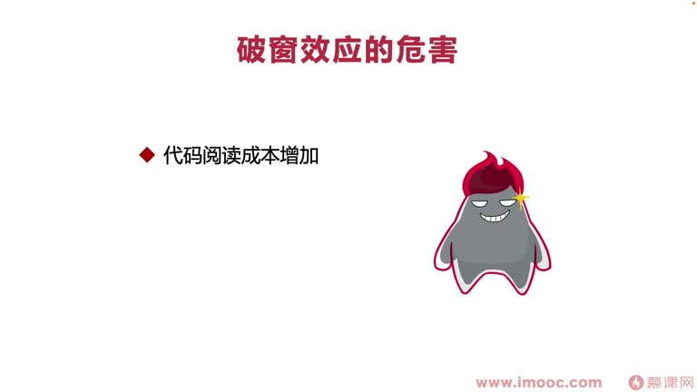
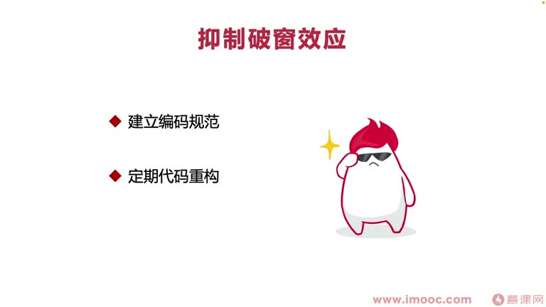

# 7-9 如何抑制破窗效应?

> 来源视频:第7章 / 7-9如何抑制破窗效应？.mp4
> 转写方式:本地 Whisper(small 模型)语音转写,已人工校对("破窗效应/破装校园"→破窗效应、"伤增"→熵增、"李葵李鬼"→李逵李鬼、"杨群效应/屈众心理"→羊群效应/从众心理、"coast style"→CheckStyle 等

## 本节要解决的问题

这一节课围绕“如何抑制破窗效应?”展开。先别急着记结论，大家可以带着一个问题来听：**这件事为什么会影响我们的绩效，以及我能不能把它用到自己的工作里？**
## 本课定位

按惯例探讨:如何通过改善团队里存在的一些问题,推动自己实现**面向绩效编程**。本课讲**破窗效应**。

李老师外部演讲涉及软件重构相关话题时,基本都喜欢用破窗效应作为引子——因为它直接揭示了:
- 为什么代码会变得十分混乱
- 工程为什么变得越来越混沌、难以维护
- 为什么"秉杰"(敏捷)编程变得越来越困难、迭代成本越来越高

## 一、什么是破窗效应?

- 理论最早由**政治学家和犯罪学家**提出
- **内容**:如果有人打坏了一扇建筑物的窗户玻璃,而这些玻璃没有得到及时维修,别人就可能受这些窗户玻璃的引导/示范,**纵容他们去打烂更多窗户**;久而久之,破窗户给人造成**破乱无序**的感觉
- **直接影响**:可能带来"熵增"两次(熵增状态),让整个系统不断熵增、越来越混乱

### 生活中的例子
- 只有整洁的代码才会让人更在意、舍不得破坏其整洁性
- 例:拿一个空瓶子,周围没有垃圾桶,如果地面全是垃圾、很长时间没人打扫(但不是垃圾堆),很多同学会选择把瓶子直接扔地上——"反正已经这么埋汰了,扔不扔无所谓"
- 如果草坪上一片垃圾都没有,就舍不得把瓶子扔到草丛上
- 例:有的城市地面上遍地都是"弹"(痰),有的城市一个都没有;有的城市满地宠物排泄物,有的很难找到——这都是**破窗效应带来的熵增、混乱、不整洁**
- 软件体系、生活环境中都能看到破窗效应的影响

> **警示**:任何不良现象都会传递信息,导致不良现象无限扩展。看到这些信息要**高度警觉**那些"看起来偶然"的信息,不要不闻不问、熟视无睹。这就是**"勿以善小而不为,勿以恶小而为之"**——不能纵容更多人打烂更多窗户,否则可能演变成**"千里之堤,溃于蚁穴"**。

## 二、破窗效应在软件体系中的危害(三点)

### 1. 代码阅读成本增加
- 例:想快速实现一个功能,把代码 copy 出来直接粘贴到同类里;这代码是实现工具类的功能,应该放到工具类里(或新开工具类),降低整个类的大小、让代码更整洁
- 但看到这个类已经两三千行,发现大家都是直接扔进去,就很难有信息(信心)/动力把代码放到该有的位置
- 于是类从 2000 行变 3000、4000、甚至 5000 行——**在这个类里找一个方法,犹如大海捞针**

### 2. 代码质量降低
- 类非常大时,看到两个方法比较相似,调用时不小心调错("一个李逵一个李鬼",难分真假美猴王)
- 代码一运行,测试没测出来,直接上线就出现故障——影响代码质量

### 3. 代码维护成本增加
- 类变得越来越臃肿,后面想重构这个类、或删减增加东西都非常困难

## 三、破窗效应的本质:从众心理(羊群效应)

- 破窗效应背后存在一个本质现象,四个字概括:**从众心理**
- 从众心理(羊群效应)常用于经济学,描述经济个体从众、跟风的心理
- **羊群效应**:人们都有从众心理,很容易导致盲目跟从,陷入骗局或失败
- 破窗效应中,从众心理让人**盲目跟从别人,丧失代码整洁度**:
  - 例:从一家混乱的公司跳到要求代码整洁的新公司,可能观念不变:"我们上一家公司代码也这么混乱,但也能实现很多功能"——走入错误的跑道
- **羊群效应的道理**:对他人的信息**不能全信,也不可不信,需要有自己的判断**
  - 不能看到别人代码混乱,就让自己的代码也随意堆砌、变得混乱
  - **要打破集体意识,勇于站出来重构这些代码**,推动实现面向绩效编程

## 四、如何抑制破窗效应(三点)

1. **建立代码编码规范**
   - 用阿里的 **p3c 插件**、或 **CheckStyle**(语音识别"coast style")约束开发者,在代码规范上做改变
   - p3c 插件可做**定制化改造**(都是开源的):
     - 加入 git 的限制
     - 代码注释方面的定制化限制(如注释必须加上作者信息、公司信息、修改时间信息等)
2. **定期代码重构**
   - 看到模块非常混乱,就按前面讲过的**代码重构方案流程**,推动团队进行代码重构、改变
3. **建立严格的 CR 机制(Code Review)**
   - 自己写的代码对自己的要求可能比较低,但代码要让别人 review、review 通过才能合并到主干分支——**别人对你的要求会更高**
   - **为什么是"严格"的 CR 机制**:
     - 有些公司觉得 CR 浪费时间,别人让你 review 直接一合并就结束——这是**松懈的 CR 机制**,完全为应付机制而应付
     - 李老师待过松散 CR 机制的团队,也待过严格 CR 机制的团队:**严格 CR 机制的团队,真的能让整个团队的代码变得非常整洁**

## 本课总结

抑制破窗效应可以从**编码规范(p3c/CheckStyle)、定期代码重构、严格 CR 机制**三方面入手——每一方面都可以"有的放矢",在团队中进行更多改变,让自己变得非常突出,实现面向绩效编程。

## 整理者补充：可以马上做什么

这部分不是老师原话，是为了方便复习而加的行动提示：

1. 回到正文，圈出一个与你当前工作最相关的观点。
2. 用这个观点检查最近一次项目、汇报或绩效记录，找出一个可以改进的地方。
3. 把改进动作写成一句具体的话，并安排在今天或本绩效周期内完成。
