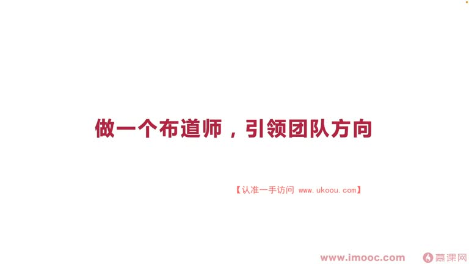
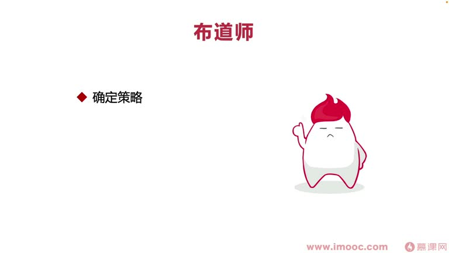
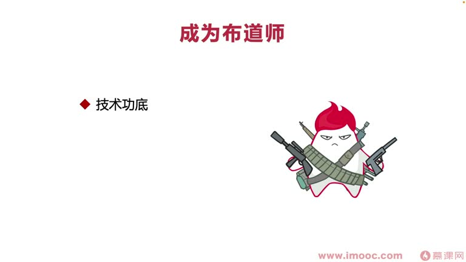
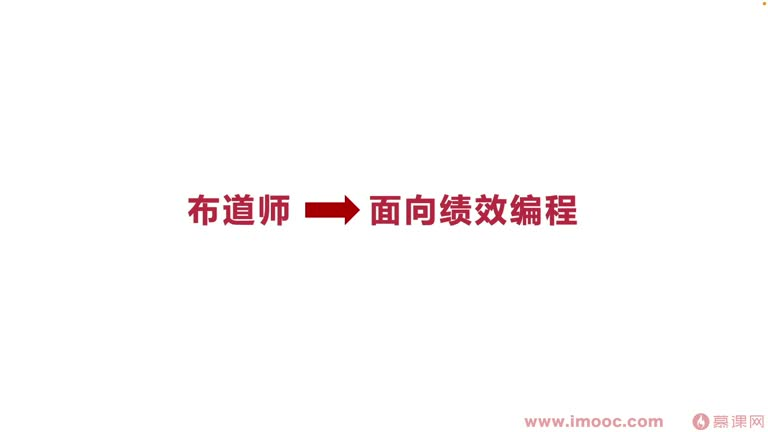

# 8-1 做一个布道师,引领团队方向

> 来源视频:第8章 / 8-1做一个布道师，引领团队方向.mp4
> 转写方式:本地 Whisper(small 模型)语音转写,已人工校对("面向计较编程/面向即小变产"→面向绩效编程、"杜仁杜吉"→渡人渡己、"机销/极效/迹象"→绩效、"步道师"→布道师、"div-relation"→Developer Relations、"延讲者"→演讲者、"胜利/victory"→Android Weekly 等

## 本节要解决的问题

这一节课围绕“做一个布道师,引领团队方向”展开。先别急着记结论，大家可以带着一个问题来听：**这件事为什么会影响我们的绩效，以及我能不能把它用到自己的工作里？**
## 本课定位

从本章开始,把核心聚焦于**如何通过我们自身的努力,提高团队整体的绩效水平**。课题:**渡人渡己,提高团队绩效**。

- 学这门课的同学有企业管理者、应届生、正在向资深工程师/管理者进阶的同学
- **不是只针对企业管理者**:很多管理者已经掌握提高团队绩效的方法;这门课对应届生或正在冲击管理者的同学**更为重要**
- 原因:很多大公司的绩效考核中都有一点跟**团队相关**(团队建设、个人成长如何影响团队)
  - 即使现在绩效指标中没有这个维度,后续**也要为这个维度做一些铺垫和努力**
- 本章聚焦:**通过自己去"渡人渡己",让别人因为我们而受到影响、变得成功**,让领导看到我们在团队中的价值、认可我们的水准,后续把更多机会交给我们

## 一、三个关键词:布道师、团队、方向

### 什么是布道师?
- 布道师概念已流行很长时间,英文翻译为 **Developer Relations**(开发者关系,div-relation)
- **定义**:优先考虑和开发者合作、跟开发者建立关系的一种**营销策略**
- 李老师是 **Google 安卓开发者专家(GDE)**,代表他需要通过很多次布道、演讲,把 Google 安卓的技术传递给全球开发者
- 主要形式:**写文章、出版书、演讲、线上直播、参加大型技术论坛、企业活动中交流**
  - 例:Google 定期举办比赛,邀请很多企业工程师,布道师参与其中给团队进行指导
- 这些方式都是为了把 Google 的技术或负责的一项技术**推广给各位开发者**
- 布道师也是李老师毕业之后**五年规划中明确的一个重要方向**

### 布道师的来源
- 布道师最早源于**宗教**:像伊斯兰教中的先知**穆罕默德**、中国佛教禅宗起源的**达摩**,他们在古代都是类似布道师的角色
- 今天互联网演化之后,布道师需要有对新技术**热情、痴迷**,以及自身对技术的**信仰**

## 二、作为布道师需要做哪几件事情

1. **确定策略**
   - 知道用户/开发者的核心心声,定制策略为开发者表达心声
   - **调研一线开发者**——这是布道最开始的点,确定策略后才能布道
2. **实施环节**(最重要的实施环节,也最活跃、最能让大家看到)
   - 向目标人群演讲、说服,针对目标公司进行企业活动等
   - 这部分主要是**渗透**:把自己渗透到开发者之中,充满很多"时间"(实地)的环节
3. **提高权威**
   - 技术布道的最终目的之一:让目标开发者**相信我们这个市场、相信我们布道的技术拥有足够的权威力**

### 布道师的方向
- 有的更注重**策略**:了解市场,了解哪些技术更活跃
- 有的更注重**实践**:有比较强的技术背景(或大厂背景),通过代码使用的方式让开发者了解代码如何使用
- 两种方向掌握任何一种,都能去引领、提高团队的绩效,引领团队方向

## 三、布道师的重要性

- 包括 Google 也有专门的**职业全职技术推广工程师**
- **为什么重要**:最开始一些公司为开发人员设计了很多技术框架,但开发人员不知道这些框架,框架无法交付给目标开发人员
  - 导致技术框架开发后很多人没用,公司营销策略没到开发人员那边,技术认可度、使用广泛度越来越低
- **布道师作为中间环节非常重要**,所以布道师又可以是**技术推广工程师**

## 四、如何成为出色的布道师

1. **非常高的技术功底**
   - 面试成为 Google 技术推广工程师,要求**至少十年经验**
   - 看似"技术推广工程师"像运营、偏离技术,其实不然——需要非常厚的技术底蕴、技术背景
   - 推出新技术能快速学习、掌握使用,并了解**怎样把复杂的新技术用更简单的方法给别人讲出来**
   - **"把简单的事情说复杂很容易,把复杂的事情说简单就不那么容易了"**——需要充足技术功底
2. **领导力**
   - "我是技术推广工程师,又不管理团队,为什么要领导力?"
   - **"任何一个优秀的演讲者,基本上都是一位优秀的领导者"**(如元首们引导变革,都是因为发布了重要演讲)
   - 通过演讲把自己的"机型"(激情)传递给听众,听众感受到热情,才能跟着你一起去实践
   - 需要通过领导力表现自己的**个人魅力、煽动力、引导力**
3. **演讲的口才**
   - 对内向的同学比较困难,需要通过大量书籍、大量实践不断练习
   - 有前两点时,即使没演讲口才,**也可以先走出去**:先参加活动、在团队内部实践、在小型规模中自告奋勇,站出来让别人看到闪光点
   - **不要错过发言的机会,并且主动为自己创造更多发言机会**

## 五、布道师的议题(引领团队绩效进步讲什么)

1. **技术领域的风向标**
   - 如安卓有 **Android Weekly**(语音识别"victory")网站,每周发布安卓与开发者热点内容
   - GitHub 上有很多开源项目排名
   - 通过 blog、GitHub 开源社区了解内容文章,把这些技术**携带上自己的理解**,做成**简约风格的 PPT**(一页图、少量文字),展示给大家
   - PPT 成本不高,主动组织会议,花时间做好 PPT 给大家布道讲新技术
   - **领导会觉得你特别积极、特别活跃,越来越认可你**
2. **研发效能**(前面讲过)
   - 确定项目组负责的是绿地/黄地/红地项目
   - 确定后有很多指标维度,发起讨论、布道这些指标,让团队更加**标准化**
3. **发现问题并改进问题**
   - 通过 **TRIZ 发明原理**可以产生很多发明专利
   - 多去团队中发现问题、通过团队内部调研发现可改进的问题,用 TRIZ 产生改进方案,为大家布道、**引领团队变革**

## 六、本课总结:从布道师到面向绩效编程

1. **确定策略**:确定市场方向
2. **最重要的一点——主动走出来**:
   - 主动去开会、主动做 PPT、主动向团队布道
   - 这样领导才能看到你的闪光点
   - **职场中并不是"是金子总会自己发光"——你首先需要站出来,别人才看到你的闪光点**
3. **提高权威**:提高你在团队中的认可度,提高以后在企业中的发展瓶颈(空间),让领导更早让你晋升到高位

> 听了这些,我们是不是觉得自己有很多想跟团队分享的话题?**必须自己走出来**,才能让领导看到闪光点、拿到比较好的绩效。

## 整理者补充：可以马上做什么

这部分不是老师原话，是为了方便复习而加的行动提示：

1. 回到正文，圈出一个与你当前工作最相关的观点。
2. 用这个观点检查最近一次项目、汇报或绩效记录，找出一个可以改进的地方。
3. 把改进动作写成一句具体的话，并安排在今天或本绩效周期内完成。
