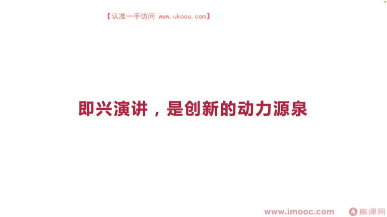
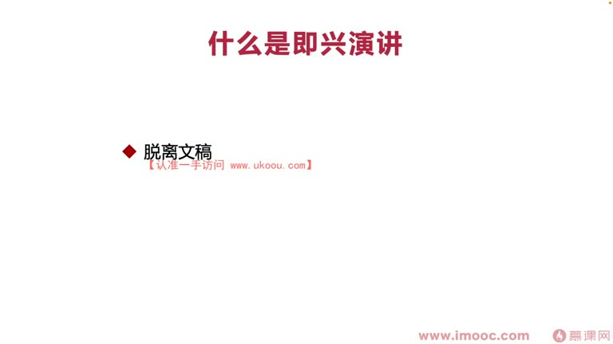
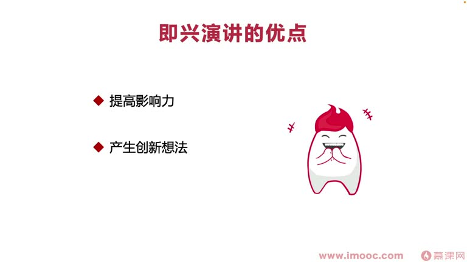
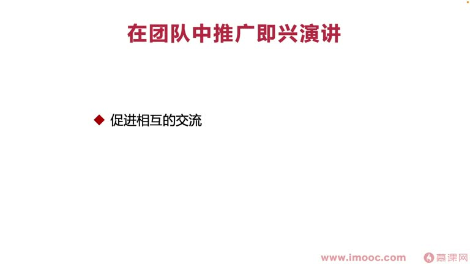
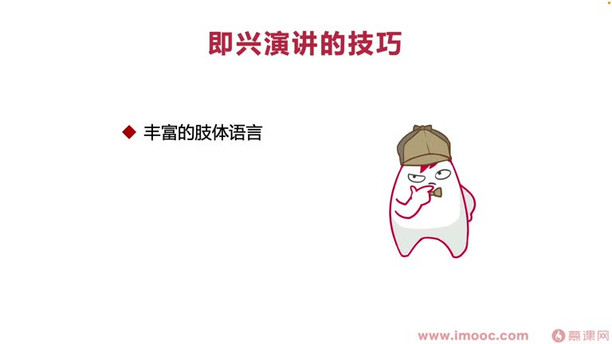
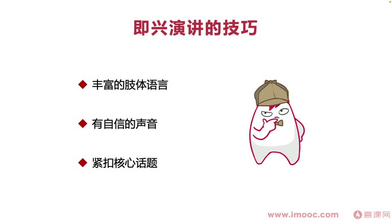
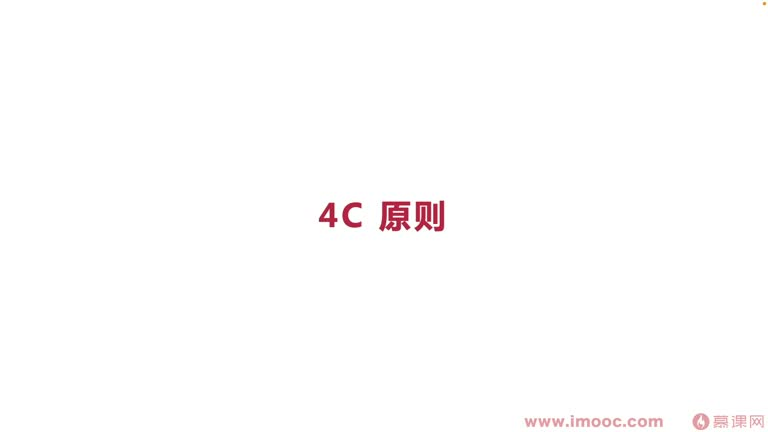
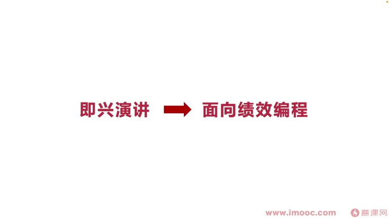

# 8-2 即兴演讲,是创新的动力源泉

> 来源视频:第8章 / 8-2即兴演讲，是创新的动力源泉.mp4
> 转写方式:本地 Whisper(small 模型)语音转写,已人工校对("面向介绍编程/面向计较编程/面向极小编程"→面向绩效编程、"急性演讲/极限人讲/激减讲"→即兴演讲、"前恶业/前国业/前额业体制层"→前额叶皮层、"性人和"→杏仁核、"马哈吐温"→马克·吐温 等

## 本节要解决的问题

这一节课围绕“即兴演讲,是创新的动力源泉”展开。先别急着记结论，大家可以带着一个问题来听：**这件事为什么会影响我们的绩效，以及我能不能把它用到自己的工作里？**
## 本课定位

课题:**即兴演讲是创新的动力源泉**。

**为什么即兴演讲能激发创新?**
- 人没做好充分准备、直接站到讲台发言时,第一个感觉是**紧张**
- 紧张时,大脑的"三体脑"(爬行脑)会**关闭我们的前额叶皮层**,让我们失去分析判断、理性思考的过程
- 这时"杏仁核"(性人和)开始作用,让我们产生很多自己也没想到的内容,**直接脱口而出**——这促进我们产生创新

> 如果被团队邀请站到讲台讲技术理念、讲思考,要争取成为"技术布道者",把看过的技术方向、思考过的技术内容,"关闭前额叶皮层"后**天马行空**讲出来,让别人看到你的更多 idea。
> 即兴演讲也是**提高个人魅力、提高个人影响力**的过程。
> 程序员常面临与产品经理 battle 的场景——每一次 battle 都是一次小型的即兴演讲,要**充分训练即兴演讲的才能、敢于站出来**,才能赢得每次 battle。

## 一、什么是即兴演讲?(两个特点)

1. **必须脱离文稿**:即使没准备但秘书准备了文稿、照读一字不差,基本等于别人替你准备——**不能激发创新想法**(除非别出心裁加自己的新概念等特殊方式)
2. **立即进行的**:不是先思考 10-20 分钟再上台复述——那样内容已充分思考过,没有"站到台上关闭前额叶皮层、再次阐述天马行空想法"的过程

## 二、即兴演讲的优点

1. **提高自身影响力**:让团队内部同学看到你身上的亮点
2. **激发更多新想法**:面临即兴演讲时非常紧张 → 关闭前额叶皮层 → 杏仁核调整作用 → 激发你说出更多没准备过的新想法,很多创新 idea 由此产生
3. **给你带来机会**:
   - 产生的创新 idea 可能开辟一条新路
   - 别人看到你即兴演讲的个人魅力/闪光点,会把更多场合交给你
   - **前提**:要掌控好自己的即兴演讲,而不是发挥失败、说出不该说的话

## 三、即兴演讲与面向绩效编程

- 最终目的:让即兴演讲**面向绩效编程**——通过它提高领导对我们的认可、提高绩效成绩
- **注意领导是否在场**:
  - 领导不在场时,要思考有没有工具能在演讲后让领导知道
  - 需要在场同学**为你记录即兴演讲过程**,或自己记录
  - 最后以**工作汇报**等形式展现给领导
- **不能太刻意**:演讲完直接发给领导,领导会觉得你"轻浮"、内容不多、没看到创新 idea,像是**来找我要绩效、来邀功**的感觉
- **要创造机会**让领导知道这件事(巧妙一些)

## 四、在团队中推广即兴演讲(渡人渡己、提高团队绩效)

1. **促进团队内部相互交流**:让大家更熟识
   - 作为领导者,能让大家看到你的领导魅力,更愿意与你交流、把更多上下文信息交给你,有利于后面做更多规划
2. **提高个人的团队建设能力**:
   - 很多企业不管你当前是不是领导者,都要看团队建设能力
   - "殊途同归":大厂同学最后都可能涉及管理层——做技术要带技术团队,做架构师可能带其他架构师,**永远逃不开团队建设能力这个话题**
   - 在团队推广即兴演讲可提升个人团队建设能力,让别人认可

## 五、即兴演讲的技巧

1. **丰富的肢体语言**:更有"打斗"(打动)人、煽动力、感染力——外国大佬或 TED 演讲都会加入非常多的肢体语言(外国人喜好的特色)
2. **声音必须自信**:
   - 刚开始即兴演讲声音"颤颤巍巍"可以理解,需要通过大量练习获得自信
   - **为什么害怕**:核心原因怕别人不认可/不喜欢我们讲的内容
   - **真正有效的方法**:把每次演讲当成**馈赠大家的礼物**——不用管别人喜不喜欢,只管把礼物抛出来;"他们要或不要、喜欢不喜欢是他们的事情,你送不送是你的事情"
3. **紧扣核心话题**:
   - 即兴演讲是激发创新的过程,很容易跑偏
   - 自始至终记住核心要讲的话题,**不要跑偏**,才能发挥应有作用

### 4C 原则

PPT 将演讲表达原则归纳为四个 C:

- **Clarity**：清晰表达
- **Conversation**：口语化表达
- **Confidence**：自信表达
- **Collaboration**：合作性表达

引用马克·吐温:"正确的语言和差不多正确的语言之间的区别,就像闪电和萤火虫之间的区别"(区别非常大):

| 4C | 含义 | 要点 |
|----|------|------|
| **Clarity(清晰表达)** | 清晰表达 | 更少使用"病句"(并句),更多思考让观众更易理解的语言 |
| **Conversation(口语化表达)** | 口语化 | 不要像读文稿那样官方刻板、没激情 |
| **Confidence(自信)** | 自信 | 颤颤巍巍不要紧,通过多练多表达渐渐克服;可借助语言技巧 |
| **Collaboration(合作性表达)** | 合作性 | 演讲时少说"我",会让大家跳脱演讲、"出戏";要针对组织讲内容(如"你做了什么事"换成"你们做成了什么事") |

## 本课总结

即兴演讲最终目的就是**面向绩效编程**:它是提升个人魅力、个人影响力的过程;带领团队即兴演讲也是提升个人团队建设能力的过程。发生即兴演讲时,**注意让领导看到(通过恰到的手段、不要太刻意)**,最后实现自己的面向绩效编程,为团队建设的环节加分。

## 整理者补充：可以马上做什么

这部分不是老师原话，是为了方便复习而加的行动提示：

1. 回到正文，圈出一个与你当前工作最相关的观点。
2. 用这个观点检查最近一次项目、汇报或绩效记录，找出一个可以改进的地方。
3. 把改进动作写成一句具体的话，并安排在今天或本绩效周期内完成。
