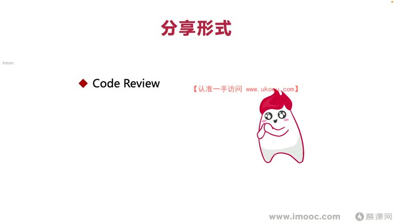
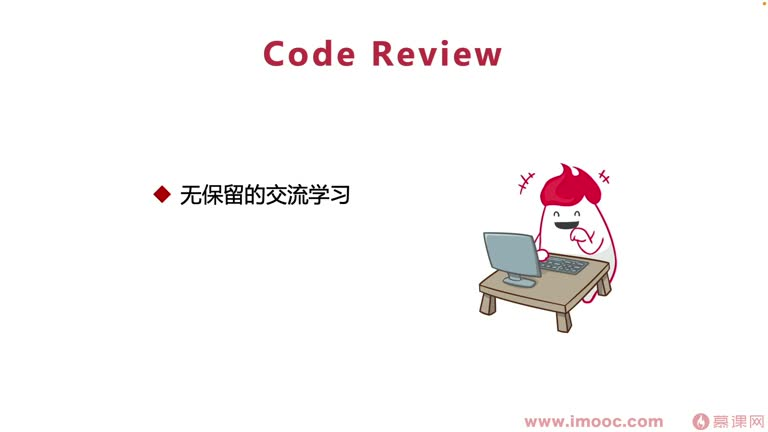

# 8-3 互帮互助,在团队分享你的经验

> 来源视频:第8章 / 8-3互帮互助，在团队分享你的经验.mp4
> 转写方式:本地 Whisper(small 模型)语音转写,已人工校对("面向介绍编程/面向计小编程/面向继续要编程"→面向绩效编程、"步道师"→布道师、"Cold Review/CoderView"→Code Review、"电纸书/minibook"→电子书/mini书、"买点"→埋点、"迹效/机校"→绩效、"土地"→徒弟 等

## 本节要解决的问题

这一节课围绕“互帮互助,在团队分享你的经验”展开。先别急着记结论，大家可以带着一个问题来听：**这件事为什么会影响我们的绩效，以及我能不能把它用到自己的工作里？**
## 本课定位

课题:**互帮互助,在团队分享你的经验**。

**与前面"布道师"课程的区别**:
- 前面成为布道师的主要目的:提升**个人影响力**;团队提"新"(即兴)演讲主要提高**个人魅力、团队建设能力**
- 本节核心:提高自己在团队的**技术认可度、专业能力认可度**,让更多同事认可我们的团队(技术)水准——这样领导、同事会觉得你更专业

## 一、分享经验的形式(三种)

### 1. Code Review
- 技术同学写完代码**很难发现自己代码中的错误**:很多同学过于自信,觉得写的东西一般不会有问题(写的过程中也注意了)
- 做完项目都需要通过**测试同学**测试保障上线质量(小公司/创业公司可能没有测试,因为对项目质量要求没那么苛刻;大公司 App 崩溃率要保持在 0.01%)
- **Code Review 的角度**:
  - 给同事指出他们代码中写的缺点、架构形式不合理的地方,帮助他们优化——**提升别人对你的认可度**
  - 讨论形式:在工作群里(让领导看到)、或领导在"公卫"(工位)时直接找同事讨论
  - 没让领导看到也没关系——这也是与别人相互交流学习的过程

### 2. 电子书(mini 书/文档)
- 电纸书这几年比较流行,"无纸化"概念推进越来越快
- 不只是 mini book,**也可以是我们写的一些文档**:把文档汇总成"红皮书、白皮书、黑皮书"之类的 mini book,通过**邮件**向团队内部宣传推广
- 例(李老师亲身案例):负责**埋点(买点)相关项目**
  - 很多同事对埋点的 **Device ID 生成规则、启动赛(塞)沈计算逻辑**不清楚
  - 李老师每天工作遇到大量重复问题,大家不断通过工作软件重复问
  - 后来把所有 QA 问题**分门别类**总结成 mini book(约 12 页),叫**《埋点黑皮书》**
  - 发布后受到很多同事欢迎,同事基本以黑皮书为准;李老师经常维护
  - **结果**:拿到比较好的绩效,也没很多同事重复来问,脱离了"客服"职责

### 3. 技术分享
- 与前面"布道师"分享非常相似
- 有的同学会担心:"把我技术内容都告诉别人,岂不是**教会徒弟、饿死师傅**?"
- **核心要记住**:核心是面向绩效编程、让领导认可我们自己
  - "教会徒弟饿死师傅"可能性有,但教会徒弟的过程中,**也让领导看到了我们自己**——需要有所取舍

## 二、三种形式的具体展开

### Code Review
- **无保留地交流学习**:这个过程能让我们相互促进成长——很多同事 Code Review 时不会保留,把对代码的建议无保留告诉你,充分让自己的知识得到"鉴定"(巩固)
- **学习他人经验**:通过 Code Review 了解**优雅的代码应该怎么写**
- 如果团队没有 Code Review 环节:**借此机会推动团队变革,产生 Code Review 流程**
  - Code Review 流程不光保证代码质量,更是为了提升我们自己、为自己服务
  - 也是让我们**通过建设这个过程,获得面向绩效编程的手段**

### 电子书
- 李老师的经验可以复制:
  - 先作为**先驱**,把自己项目中看到的疑问点、频繁被提问的 QA 内容主动整理成电子书
  - 例:负责广告业务——大家会问"七飞串(奇偶串?)规则、这个规则那个规则怎么弄"
  - 例:搜索业务——大家想了解"电商 App 搜索出的产品按什么优先级排序、怎么把广告插入进去"
  - 把这些问题统一整理,列出**清晰的结构化目录**,分享给同事
- 同事看到后会**相继模仿**,让团队的电子书越来越厚实——**领导非常认可这个过程**(觉得你是先驱、带动了大家)
- 李老师整理电子书后**收到领导的感谢**:领导特别感谢你给团队同学带来新方向、引领团队产生更多变化

### 技术分享
- 前面布道师时讲过:一种是**以策略为主**(把新技术方向推广给大家),一种是**以技术使用角度为方向**
- **定期做技术分享**,把自己了解的(如安卓有 Java 虚拟机、"安兆尔"虚拟机等)技术知识**体系化整理**后分享给大家
- 效果:
  - 让大家更认可你自身的技术水准
  - 让领导觉得你能把更多自己的创新点子带给大家、能**影响团队进步**
- **核心主旨**:一定要**定期举办**,而不是"诈一下"(偶尔)举办
  - 把技术分享形成**定期过程**,就是建立了**属于自己的功勋**,很大程度推动自己实现面向绩效编程

## 本课总结

在团队互帮互助、分享经验的三条路径:
1. **Code Review**:无保留交流、帮助同事优化,提升认可度,推动团队建立 CR 流程
2. **电子书**:整理 QA 成 mini 书/文档,成为"先驱",带动团队积累
3. **技术分享**:定期体系化分享技术,展示技术水准与创新,建立个人功勋

三者都指向同一目标:**让领导与同事认可你的专业水准,实现面向绩效编程**。

## 整理者补充：可以马上做什么

这部分不是老师原话，是为了方便复习而加的行动提示：

1. 回到正文，圈出一个与你当前工作最相关的观点。
2. 用这个观点检查最近一次项目、汇报或绩效记录，找出一个可以改进的地方。
3. 把改进动作写成一句具体的话，并安排在今天或本绩效周期内完成。
