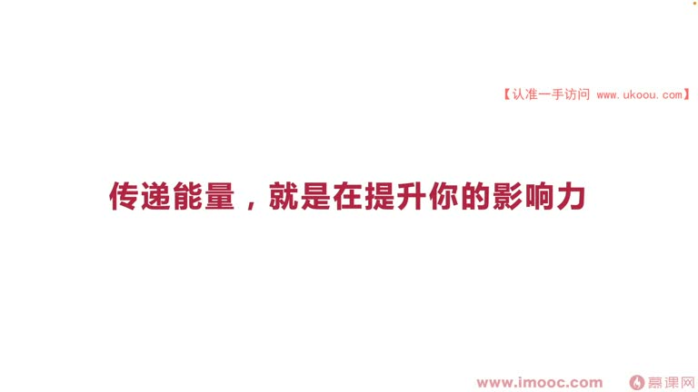
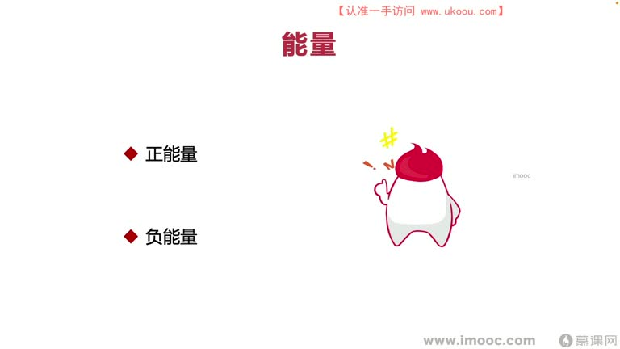
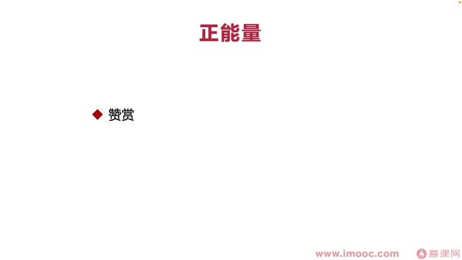
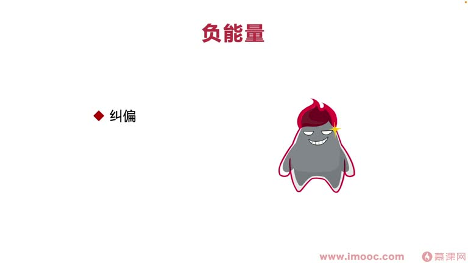

# 8-4 传递能量,就是在提升你的影响力

> 来源视频:第8章 / 8-4传递能量，就是在提升你的影响力.mp4
> 转写方式:本地 Whisper(small 模型)语音转写,已人工校对("面相介绍编程/面向机架兵程"→面向绩效编程、"卫争"→魏征、"余番/故庸"→虞翻/顾雍、"禁建"→进谏、"击消/迹效"→绩效、"9篇/揪篇"→纠偏 等

## 本节要解决的问题

这一节课围绕“传递能量,就是在提升你的影响力”展开。先别急着记结论，大家可以带着一个问题来听：**这件事为什么会影响我们的绩效，以及我能不能把它用到自己的工作里？**
## 本课定位

课题:**传递能量,就是在提升你的影响力**。

### 内向 vs 外向
- 每个人自身富含的能量不一样:
  - **内向的人**:能量比较内敛,需要自己一个人安静独处、"避世",获得更多内部能量的沉淀
  - **外向的人**:喜欢社交,与不同人交往,碰撞更多思维火花
- 内向与外向的差别本质:**大脑结构、思考处理问题的方式不一样**
- 在团队内传递能量,更像以**外向的方式**思考做事——传递能量过程中也在提升自己的影响力,用能量影响整个团队、带动团队进步,让领导更认可自己、实现面向绩效编程

## 一、正能量 vs 负能量

| | 正能量的人 | 负能量的人 |
|---|-----------|-----------|
| **对变化** | 喜欢新的机会 | 担心产生改变/变化(打破舒适圈) |
| **看人** | 常看到别人优点并赞赏 | 更多看别人缺点,deas/diss 别人 |
| **助人** | 看到有人需要帮助主动伸出援手 | 觉得"自己还没人帮助",世界应更多帮助自己 |
| **对他人** | 希望通过自己努力帮助他人获得成功 | 可能希望别人失败 |

### 本课要传递的能量:不仅是正能量,还包括一定程度的负能量
- **原因**:正能量/负能量的定义很多时候源于我们自己对现有事情的认知,但这些认知并不完全完整
  - 当我们向团队提出**建设性意见**,很多人眼中也像是负能量
  - 团队做了不好的方向,其他同事都赞同、只有你一个人反对时,别人也会觉得你是负能量的人

### 历史案例:如何根据领导者传递能量
- **魏征**(语音识别"卫争"):敢于向唐太宗进谏、直言,所以唐太宗特别喜欢他、喜欢向他提想法
- **三国·孙权**:手下两个重要官员:
  - **虞翻**(语音识别"余番"):敢于直言、进谏,什么都敢说 → **最后遭贬**
  - **顾雍**(语音识别"故庸"):相对圆润,基本只用面色告诉孙权事情,不直言冲撞 → **最后超过张昭,成为吴国重要丞相**
- **启示**:要根据自己管理者的具体情况发挥能量:
  - 管理者更喜欢正能量 → 多发挥正能量
  - 管理者像唐太宗一样**明见**(开明)→ 可在团队中多多发挥负能量,反而让管理者更认同
- **正能量和负能量不是狭义、定死的概念**

## 二、正能量包括哪些

### 1. 赞赏
- 例:在 Google 提出想法时,领导者经常说"**Nice**"——你提任何 idea 都会积极鼓励,很少反对,鼓励做更多事
- 效果:你会觉得自己获得非常大认可,突然对事情变得非常有能量、非常积极去做,也会变得喜欢对你说 Nice 的人
- **观察管理者喜欢什么类型**;当团队有成员提建议时,即使与他存在绩效上的利益冲突:
  - **"最值得尊敬的对手是能够赞赏你的对手"**
  - 应**毫无保留地赞赏同事**,让领导对自己更加刮目相看

### 2. 推进作用
- 团队中项目止步不前、很久没动态时,发挥正能量**推动项目前进**
- 从自己角度出发,把推动的进展**汇报给直属领导**——让领导真切看到我们在团队中发挥正能量、影响团队进展,提升个人影响力

## 三、负能量包括哪些(需要谨慎传递)

### 1. 纠偏(语音识别"9篇/揪篇")
- 例:团队很多人一意孤行,觉得点子不错就埋头苦干、必须把工程推进下去,即使中间产生很多问题
- 这时你纠偏,一定会被视作负能量
- **但如果你纠偏是正确的**:项目持续进展一段时间后再回头看,一定会发现你的纠偏和牺牲是有意义的
- **需要看领导**:是不是一个"喜欢上进"的人、能接受不同人意见的人

### 2. 严格(负能量的"翻筹"/反面)
- 例:Code Review 时同事提出很多建议让你改,你可能会想"这个人好负面,为什么不能夸一下我?""为什么你就说我是错的?"
  - 可能存在沟通表达方式的问题
  - 但也是同事帮助我们了解/学习更多内容、让代码更优雅的过程
- **做法**:
  - 可以针对不同同事的情况传递"严格"这个特性
  - 过程中**不要直接太强烈否定别人,而要更柔和地提出建议**——传递"带引号的正能量"(负能量的柔和版)
  - 这样别人更认可我们,提升影响力,进而提升绩效成绩

## 本课总结

传递能量(包括正能量与适度的负能量)就是提升影响力:
- 观察管理者的偏好,选择正能量/负能量的侧重
- 正能量:**赞赏**(包括赞赏"对手")、**推进**(推动项目并汇报给领导)
- 负能量:**纠偏**(正确的反对)、**严格**(柔和地提建议)
- 最终目标:让领导认可自己,实现**面向绩效编程**

## 整理者补充：可以马上做什么

这部分不是老师原话，是为了方便复习而加的行动提示：

1. 回到正文，圈出一个与你当前工作最相关的观点。
2. 用这个观点检查最近一次项目、汇报或绩效记录，找出一个可以改进的地方。
3. 把改进动作写成一句具体的话，并安排在今天或本绩效周期内完成。
