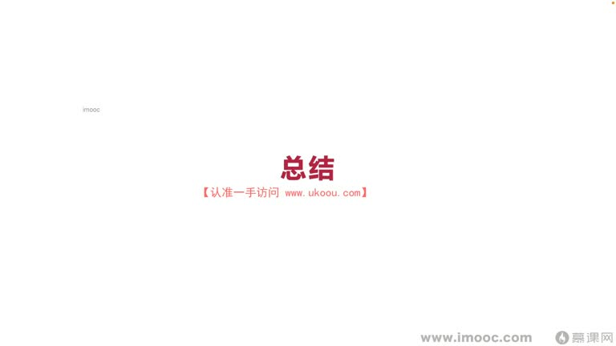
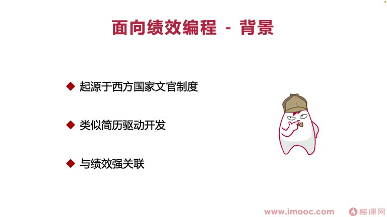
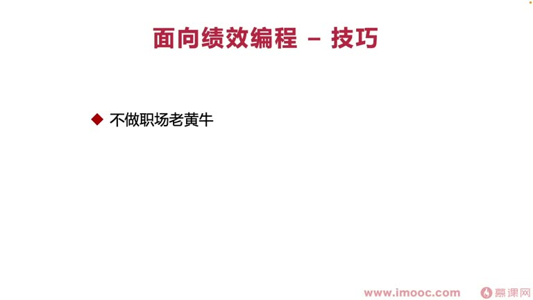
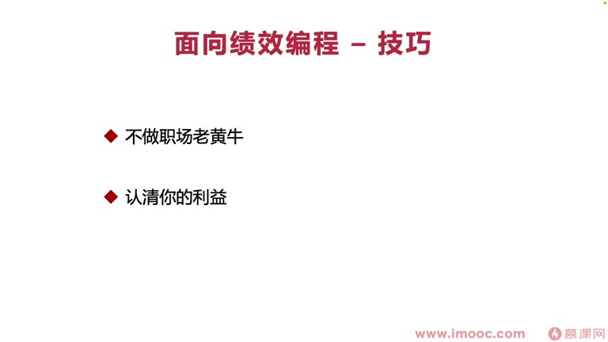
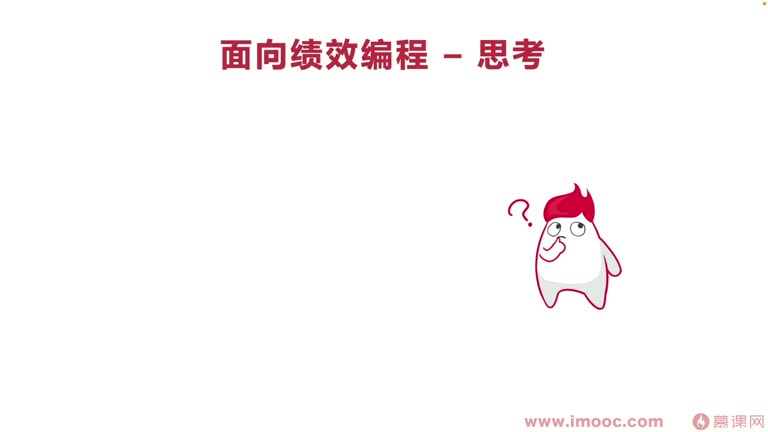
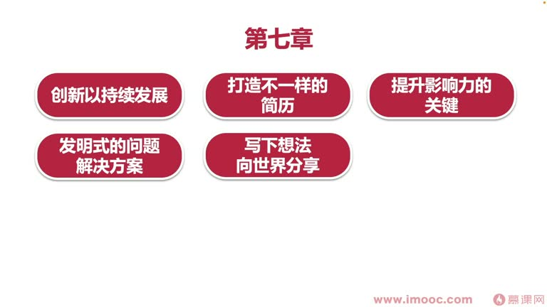

# 9-1 面向绩效编程——课程总结

> 来源视频:第9章 / 9-1面向绩效编程--课程总结.mp4
> 转写方式:本地 Whisper(small 模型)语音转写,已人工校对("面向绩效编成/面向技校变成"→面向绩效编程、"掌心"→涨薪、"吹子"→TRIZ、"疯狂/封控"→风控、"减力"→简历、"杜仁杜锦"→渡人渡己、"计小成绩"→绩效成绩 等

## 本节要解决的问题

这一节课围绕“面向绩效编程——课程总结”展开。先别急着记结论，大家可以带着一个问题来听：**这件事为什么会影响我们的绩效，以及我能不能把它用到自己的工作里？**
## 本课定位(课程谢幕)

这是整个课程的最后一章(谢幕),主要包含两块:
1. **带大家回顾整个课程学过的知识点**、每章最需要记住的关键知识点——对课程全貌有总体认知和回顾
   - 回顾有利于整理大脑中零散的思绪、加深对各层的记忆、重塑"积蓄线"(知识结构)
2. **对未来的一些展望**,奉上祝福

> 希望大家在职场中每次面临绩效考核都能"有的放矢",出奇制胜、超越其他同事,拿到一直渴望的好绩效。

## 课程整体结构回顾(九章)

| 章 | 主题 | 核心关键词 |
|----|------|-----------|
| **第1章** | 课程介绍与学习指南(导学) | 导学 |
| **第2章** | 你还没听说过面向绩效编程? | **背景** |
| **第3章** | 用绩效点石成金的秘密 | **技巧** |
| **第4章** | 你的绩效为什么不好? | **思考** |
| **第5章** | 勇攀高峰:改善你的绩效 | **进取** |
| **第6章** | 可进可退:为你的绩效上保险 | **风控** |
| **第7章** | 更好的发展,需要突破你的瓶颈 | **发展** |
| **第8章** | 渡人渡己,提高团队绩效 | **团队** |
| **第9章** | 课程谢幕(本课) | 总结 |

## 第2章:背景(3 小节,层层递进)

- 面向绩效编程的历史背景 → 意义是什么 → 成功案例有哪些
- 历史背景从**红帽集团 HR 的调研**展开:很多同事投简历/招聘时都是**简历驱动开发**(为了简历学技能)
- 意义主要从**企业管理方面**探讨
- 成功案例探讨了**心理效应**(近因效应等)和绩效考核可用的技巧

**必须记住**:
- **绩效起源于西方国家的文官制度**,逐渐演变到今天企业方面的广泛运用
- 面向绩效编程类似于**简历驱动开发**(从红帽调研与历史发展变革总结出来)
- 面向绩效编程一定与**绩效强关联**,必须明白绩效的组成内容、历史地位

## 第3章:技巧(用绩效点石成金)

课程内容:金钱带来的生活困境 → 解决绩效不突出带来的薪资瓶颈 → 好绩效打开涨薪之门的案例 → 与老板谈薪资的资本 → 百万年薪的组成成分 → 李老师的涨薪秘诀(一年涨薪三次)

**必须记住三点**:
1. **不要做职场的老黄牛**:付出很多努力时要及时展现给领导和同事,而不是默默耕耘;不能一味埋头苦干不看方向对不对——**方向比努力更重要**(避免走错方向没拿到好成绩)
2. **认清哪些利益真实属于我们**:职场"抢功"现象常有,要**保住属于自己的那一份**,不让它莫名其妙消失
3. **注意扩大交际圈子**:交际圈子影响其他同事对我们的评论、决定我们能得到的机会多少——**你的交际圈子决定了你的上限**,也决定面向绩效编程最终的成绩

## 第4章:思考(你的绩效为什么不好)

课程内容:跳出"把绩效当考试"的泥潭 → 不单一考虑自己绩效(多考虑领导、领导的领导、同事的绩效) → 发散思维 → 一味埋头苦干的后果 → 解决"为了加班而加班" → 实战(小明的绩效分析)

**必须记住三点**:
1. **不要把绩效当成一场考试**:不要用学校的应试思维对待绩效成绩
   - 把绩效当考试,拿不到好成绩时心理负担很大、产生负面影响,而且**难以拿到好绩效**(一定程度上说明你可能一味埋头苦干)
2. **不要一味埋头苦干**:多看看身边同事的绩效、领导的绩效、整个公司的绩效,多思考**怎么样帮助领导/公司绩效更上一层楼**——才能实现自己的绩效提升
3. **善用发散思维**:多思考相关问题,推动绩效发生改变

## 第5章:进取(勇攀高峰:改善你的绩效)

课程内容:从哪些维度了解公司绩效体系(有渠道) → 收买老员工拯救自己的秘密之道 → 改善绩效的必杀技 → 代码重构让绩效快速增长 → 分析汇报方式的问题 → 实战(重构你的绩效,"码"上添花)

**必须记住三点**:
1. **充分了解自己公司的绩效体系**:通过渠道了解,才能"有的放矢"定制进取方案
2. **善用心理效应**:近因效应、晕轮效应等,影响绩效考核的最终成绩(进取的技巧之一)
3. **提升自己的汇报水平**:
   - 做了很多事情却说不出来,基本等于白做(跳到其他公司也很难讲出来)
   - **汇报水平贯穿整个职场生涯,可能最终决定了面向绩效编程的成绩**
   - 有的同学"做的少但说得多",绩效成绩反而特别好

## 第6章:风控(可进可退:为你的绩效上保险)

课程内容:正确道歉降低突发事故负面效应 → 绩效达到瓶颈时如何正确跳槽 → 填写绩效考核表的注意事项 → 实战(将绩效表细节化,打造风控绩效表)

**必须记住三点**:
1. **怎么样正确道歉**:正确道歉可提升个人魅力,降低自己造成的突发事故带来的影响
2. **什么时候应该跳槽**:正确跳槽时机、如何判断现在是否适合跳槽(避免在一家公司"扎死"一直拿不到好绩效)
3. **打造"风控能力"的绩效考核表**:避免产生问题时拿到不好的绩效成绩
- 风控在一定程度上是围绕**拯救自己**出发,避免因为一些问题导致不可计量的后果

## 第7章:发展(更好的发展,需要突破你的瓶颈)

课程内容:如何创新 → 跳槽时打造有亮点的简历 → 提升个人影响力 → TRIZ 解决生活问题 → 写下来分享想法 → 录下来传播自己 → 研发效能流行指标 → Facebook 团队氛围案例 → 抑制破窗效应 → 实战(分析项目中研发低效问题)

**必须记住**:
- **用 TRIZ 解决问题**:用 TRIZ 的矛盾矩阵解决生活/工作中遇到的问题,产生发明专利
- **写下想法向世界分享**:写书、写博客、写发明专利——都提升个人影响力
- **录下想法**:通过线上直播、演讲把想法录下来,让自己有更大影响力,建设属于自己的**个人品牌**

## 第8章:团队(渡人渡己,提高团队绩效)

课程内容:什么是布道师(源自何方) → 即兴演讲 → 在团队分享个人经验(Code Review 等) → 正能量和负能量

**必须记住三点**:
1. **团队布道**:努力往"布道师"方向不断成长
2. **帮助别人也是在帮助自己**:度人就是度己;在团队互帮互助,在 Code Review 时提意见,互相提升专业能力
3. **传递正能量和负能量**:传递之前需要研判领导究竟是什么样的水平、喜好(负能量并不完全都该被抵制,正面的事情也可能被称作负能量)

## 本课总结

- 每一章命题后面,李老师都总结了**三点重要内容**——希望大家通过每一点逐步回忆每章学过的内容,加深对本门课程的印象
- 在职场中、绩效考核评估时,能更加拥有属于**自己的那一个技巧**

> 期待大家在职场中真正做到**面向绩效编程,出奇制胜**,拿到属于自己的好绩效!

## 整理者补充：可以马上做什么

这部分不是老师原话，是为了方便复习而加的行动提示：

1. 回到正文，圈出一个与你当前工作最相关的观点。
2. 用这个观点检查最近一次项目、汇报或绩效记录，找出一个可以改进的地方。
3. 把改进动作写成一句具体的话，并安排在今天或本绩效周期内完成。
