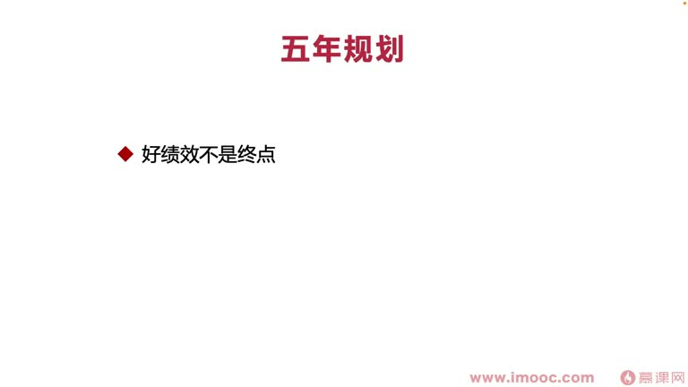
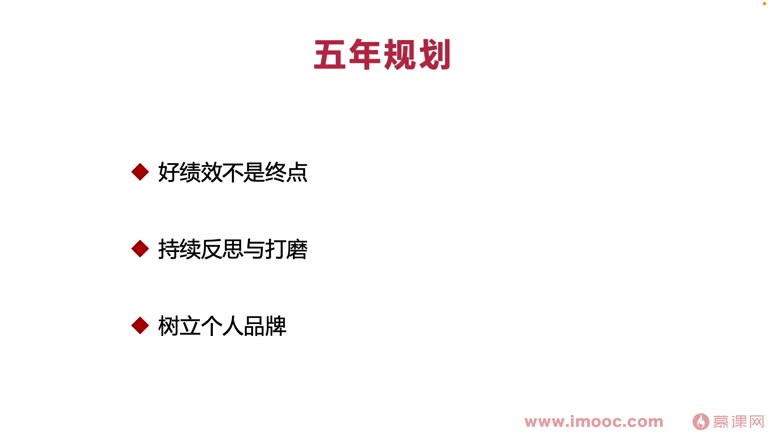
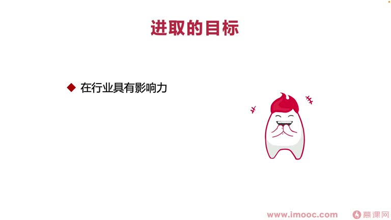
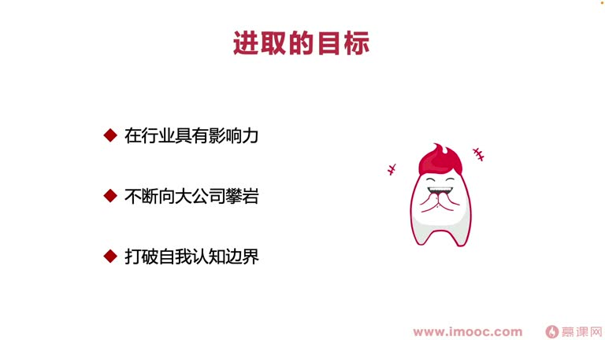

# 9-2 展望未来

> 来源视频:第9章 / 9-2展望未来.mp4
> 转写方式:本地 Whisper(small 模型)语音转写,已人工校对("面向介绍编程/面向基教编程/面向技巧编程/面向极小边场"→面向绩效编程、"逆商/保罗"→逆商(保罗·史托兹)、"扎营者/批演者/扎演者"→扎营者/攀登者、"基金号壳"→绩效考核、"扳言"→搬迁、"郭琳"→郭霖 等

## 本节要解决的问题

这一节课围绕“展望未来”展开。先别急着记结论，大家可以带着一个问题来听：**这件事为什么会影响我们的绩效，以及我能不能把它用到自己的工作里？**
## 本课定位

探讨如何应对未来可能面临的问题,展望未来。
- 前面课程核心探讨了职场中面向绩效编程的经验与技巧(围绕真实 case)
- 如有疑点可回顾之前课程,每一小节都有对应要点,可反复看、巩固印象
- 本课**预测未来可能遇到的问题,以及遇到问题时如何灵活处理,避免"崩盘"**

## 一、认清自己是哪一类人(三类"登山人")

网课内容一般是**标准化的、针对大众的**,但每个人自身情况不一样——**一定要认清自己是属于哪一种人**。就像前面课程分门别类:不同人群、不同学生遇到的问题要灵活处理;方案不是一下就能碰到每个人头上,认清自己属于哪一类,才能选到最有效的方案。

**通往成功的过程中一般有三类人**(来自畅销书《逆商》,作者保罗·史托兹;按遇到逆境的角度分类):

### 1. 放弃者(约占人群 10%)
- 爬山时遇到困难选择了放弃,没有再继续往上爬
- **一定不能成为放弃者**:面临绩效考核必定会遇到各种刁钻古怪的问题,可能让我们打退堂鼓
- 面对问题要及时**调整心态**,使用各种技巧绕过问题,继续向前走下去

### 2. 扎营者(约占人群 80%,占比最多)
- 攀岩过程中获得了一些成绩、攀到一定高度就停下来了,尤其是遇到困境时停下、扎个营基本不动
- 就像那句"有的人二十岁死了,八十岁才埋"——大学毕业以后就不学习了(甚至上大学就不学习)
- **一定不能让自己成为扎营者**

### 3. 攀登者/攀岩者(约占人群 10%,最少的那类之一,与放弃者占比差不多)
- 特点:一直不断**驱动自己向前攀岩,不断往前探索、成长**
- 选择面向绩效编程这门课,说明大家都有**进取的心**:希望能改变现状,或者现状已很好、甚至好到到达瓶颈,想继续突破绩效瓶颈
- 李老师相信在听这门课的每一位同学**都可以成为一位攀登者,并且一直坚持做这样的攀登者,永不放弃**

## 二、面向绩效编程的未来之路

### 1. 不断设立五年规划
- 设立五年规划是为了**有正确的好的方向**——"**方向比努力更重要**"
- 拿到一个好绩效**并不是终点**,还有下一次面向绩效编程
- 要不断打磨五年规划,让自己不断转换方向、走到正确道路上
- 否则"一条船开到底",最后可能变成"泰坦尼克号"
- 要**持续反思与打磨规划**:发散考虑问题、以更全面角度看问题,才能有更多想法、了解范围更广泛、找到更多自身存在的问题点

### 2. 持续树立个人品牌 / 打磨影响力(课程始终强调的关键词)
- 持续树立个人品牌、打磨影响力,让自己**发光发热**
- **职场中并不是"是金子就一定会发光"**——是金子却没发光的案例不胜枚举
- 只能**自己不断努力发光**,才能让更多人看到,而不是埋头苦干
- **时时刻刻都要记住:树立打造属于自己的一套个人品牌**

## 三、未来进取的方向(五年规划可定制的方向)

1. **个人品牌**:有个人品牌,代表在行业内具有一定影响力
   - 例:安卓出书《第一行代码》的**郭霖**老师——做安卓的同学基本都认识他;这类出书的/行业先驱都是行业有影响力的代表案例,是学习榜样
2. **不断向大公司搬迁(扳言)**:
   - 在创业型公司 → 努力向大厂(别贴/大厂)进取
   - 已在大厂 → 努力向全球巨头进取
   - 已在全球巨头 → 可回到创业型公司/更低级别公司,让自己**站到更高的位置、有更大的决策权**
3. **策划创业方向**:对这些都不感兴趣时,可不断策划创业,让自己"扭转"成为创业者,去投资人那里拉投资,过上不一样的职场生涯——**自己决定自己的绩效成绩,并且可以决定他人的绩效成绩**

## 四、最重要的一点:心态

- **始终要不断打破自我认知边界**:
  - 现象:不看书觉得好像自己什么都会了;越看书越觉得自己不会的东西越来越多
  - 这是**不断打破自我认知边界**的过程,逐步让眼光更开阔、视野更广阔,才能看到更多未来发展的可能性
- **面向绩效编程的未来,最重要的一点是"心态"两个字**:
  - 像**海伦·凯勒**:虽然是残疾人,但保持好心态,写出永垂不朽的著作,影响一代又一代人,让很多不可能的事变成可能
  - 奥运会/重要体育活动中,运动员之间较量的**往往不是技巧、不是体力,而是心态**——心态决定你在赛场上发挥稳不稳
  - 我们绩效考核时也会被心态作用:**心态决定这一次绩效成绩是否稳定**
  - 没拿到好绩效时,是否会丧气、失去继续奋斗的动力、由攀登者变成扎营者?——那样对未来的损失非常大

## 五、本课总结:永不放弃

- 无论任何时候、发生什么,**一定要保持积极进取的心态,保持让自己成为一个攀登者**,不断打磨、向上攀登,才能笑到最后
- 奉劝大家四个字:**永不放弃(永不"延气")**
  - 无论今后遇到什么困难、无论这次面向绩效编程是否失败,**一定不要放弃,大不了从头再来**
  - 失败时从自身角度考虑:看自己是"到点"(到底)什么样的人格、哪方面做得不好,**从自身角度分析**,减少环境方面的影响
  - 从自身角度出发做出改变,让自己更适应所在环境,获得面向绩效编程的好结果
- **最重要的四个字:永不放弃——不要放弃自己的攀登者精神**

## 整理者补充：可以马上做什么

这部分不是老师原话，是为了方便复习而加的行动提示：

1. 回到正文，圈出一个与你当前工作最相关的观点。
2. 用这个观点检查最近一次项目、汇报或绩效记录，找出一个可以改进的地方。
3. 把改进动作写成一句具体的话，并安排在今天或本绩效周期内完成。
